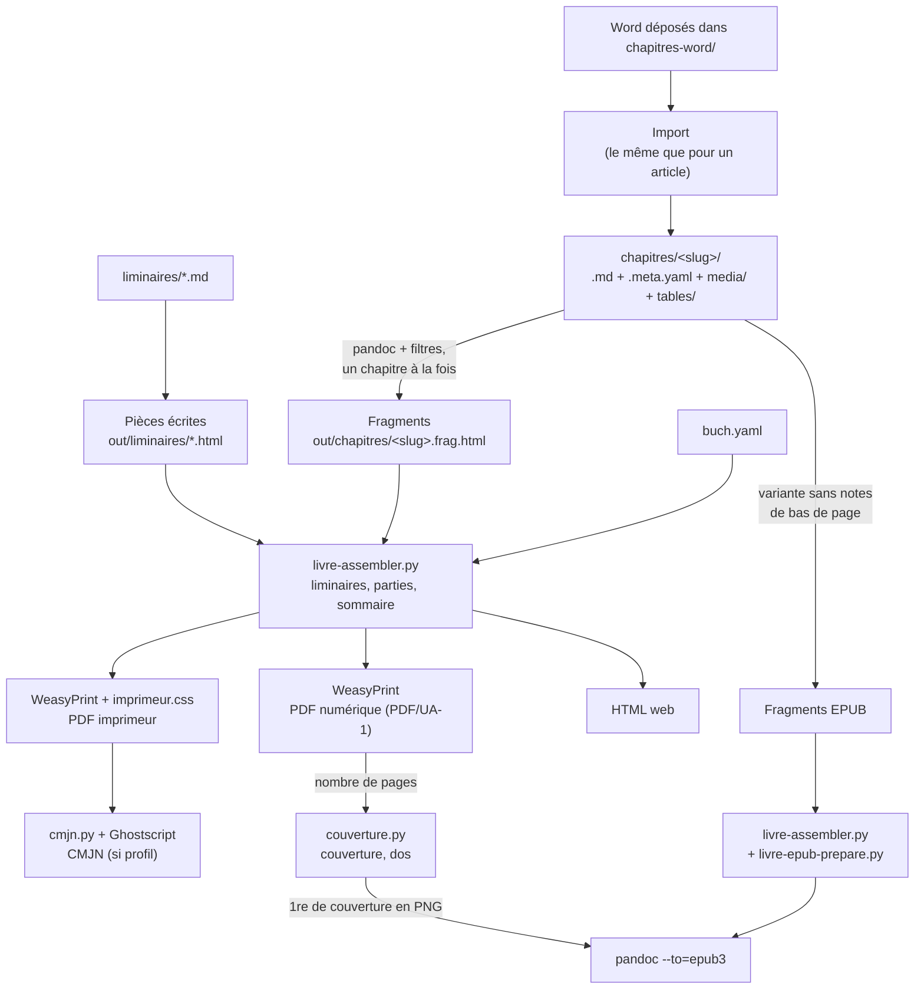

# Le moteur livre

Cette page décrit comment Pronto fabrique un livre : le dossier, la compilation, les sorties,
la couverture, le CMJN et les deux maquettes. Elle suppose lu
[`ARCHITECTURE.md`](ARCHITECTURE.md), qui situe le livre à côté de la revue. La pile des
feuilles de style est décrite dans [`SORTIES.md`](SORTIES.md).

## Un livre pour la chaîne

Un livre et un numéro de revue ont la même forme : un dossier avec un fichier de
configuration, une suite ordonnée de textes (chacun avec sa fiche, ses images et ses
tableaux) et un dossier de sorties. L'import Word, le gestionnaire de médias, l'éditeur de
tableaux, la typographie, les portraits, la co-édition, le verrou, les copies en conflit et
le contrôle PDF/UA traitent un chapitre comme un article.

La règle du moteur : **un chapitre se compile comme un article**. Pandoc tourne dans le
dossier du chapitre, avec le même socle de filtres et `--embed-resources`. Seul le gabarit
change : un chapitre produit un fragment HTML, que `livre-assembler.py` insère ensuite dans
le livre.

Un dossier est un livre parce qu'il contient `buch.yaml`. `pipeline/Makefile` inclut alors
`pipeline/profils/livre.mk`, et le cockpit choisit le profil `livre`. Si un dossier contient
à la fois `buch.yaml` et `ausgabe.yaml`, les deux côtés le traitent comme un livre.

## Le trajet d'un livre



## Ce que le livre partage, ce qu'il ajoute

| | Partagé avec la revue | Propre au livre |
|---|---|---|
| Filtres | le socle de `filtres.mk`, dans le même ordre | `szh-livre-titre`, `szh-sauts-uniques`, `szh-livre-sous-titre` (deux fois, avant et après la typographie), `szh-livre-entete-image`, `szh-livre-auteurs`, `szh-livre-entete`, `szh-qr` |
| Filtres absents | | `szh-maquette`, `szh-titre-lignes`, `szh-auteurs`, `szh-ressource`, `szh-rubrique` |
| Filtres au comportement adapté | `szh-niveaux` laisse le `<h1>` du chapitre en place ; `szh-numerotation` numérote en continu sur tout le volume (`SZH_COMPTEURS`) ; `szh-sections` préfixe par le numéro du chapitre | |
| Recettes | l'import Word (`UNITES_DIR`, `WORD_DIR`), `define weasy_ua`, la porte PDF/UA | `profils/livre.mk`, `define contexte_chapitre` |
| Python | `szh_commun.py`, l'import | `livre-assembler.py`, `livre-epub-prepare.py`, `livre-scinder.py`, `livre-migrer-meta.py`, `couverture.py`, `cmjn.py`, `liens-courts.py` |
| Styles | `socle.css`, `partage-filtres.css`, la couleur annuelle | `styles/livre/` : `base.css`, `normal.css`, `falc.css`, `imprimeur.css`, `couverture.css`, `web.css`, `epub.css` |
| Gabarits | | `szh-livre.html`, `szh-livre-chapitre.html`, `szh-livre-liminaire.html`, `szh-couverture.html` |
| Données | | `pipeline/livre/mise-en-page.json` |

Les listes de filtres sont dans `pipeline/filtres.mk` (`CHAINE_CHAPITRE` et ses variantes),
dont l'en-tête explique chaque écart avec la chaîne d'un article. Le style d'un élément posé
par un filtre partagé va dans `partage-filtres.css`, et non dans une feuille du livre.

## Le dossier d'un livre

```
2026-B330-Canonica-Teilhabe/
  buch.yaml                       métadonnées de l'ouvrage
  liens-courts.yaml               cache des liens courts des QR (facultatif)
  chapitres/
    01-einleitung/
      01-einleitung.md            le texte, sans titre
      01-einleitung.meta.yaml     la fiche : titre, sous-titre, auteur·e·s, résumé
      media/                      images, comme pour un article
      tables/                     tableaux extraits, comme pour un article
  chapitres-word/                 les .docx à convertir
  liminaires/
    avant-propos.md               pièces liminaires et pièces de fin écrites à la main
    media/                        leurs images (portraits des notices)
  parties/                        illustrations des parties (facultatif)
  impressum/                      logos de l'impressum (facultatif)
  couverture/
    illustration.jpg              (ou .jpeg, .png, .svg, .webp ; facultative)
    quatrieme.md                  texte de 4e de couverture
  styles/
    livre.css                     feuille propre au livre (facultative)
  out/
    <livre>.pdf                   PDF numérique (RVB, PDF/UA-1, signets)
    <livre>-imprimeur.pdf         PDF imprimeur (fond perdu, traits de coupe, CMJN si profil)
    <livre>-couverture-impression.pdf  couverture à plat 4e + dos + 1re (PDF/X-4, CMJN)
    <livre>-couverture.pdf        1re puis 4e, pour l'écran (RVB, PDF/UA-1)
    <livre>-couverture-1.png      1re de couverture, 300 dpi (aussi l'image de l'EPUB)
    <livre>-couverture-4.png      4e de couverture, 300 dpi
    <livre>-dos.json              le dos : pages lues, mm, grammage, origine du chiffre
    <livre>.epub                  EPUB 3
    chapitres/<slug>.pdf          un chapitre seul
    chapitres/<slug>.apercu.html  l'aperçu cliquable d'un chapitre
    web/<livre>.html              HTML pour l'écran
```

`<livre>` est le nom du dossier du livre. Ce nom ne doit pas contenir d'espace, ni celui
d'un dossier de `chapitres/` : `verifie-livre` (dans `profils/livre.mk`) refuse ces cas.

`chapitres/<slug>/<slug>.md` a la même forme qu'`articles/<slug>/<slug>.md`. C'est ce qui
permet aux médias, à l'éditeur de tableaux, à l'import et aux filtres de fonctionner sans
code propre au livre. À l'import, un Word qui contient au moins deux titres de niveau 1 est
découpé par `livre-scinder.py`, un chapitre par titre. Un dossier de chapitre dont le nom
commence par `_` est une pièce de
travail (par exemple ce que `livre-scinder.py` n'a pas su rattacher) : il n'est pas imprimé,
et la compilation le signale.

### `buch.yaml`

Le modèle d'un livre neuf est `livre-template/buch.yaml`. Les clés :

```yaml
titre: "Berufliche Teilhabe von Erwachsenen mit dem Asperger-Syndrom"
sous-titre: "Strategien von Arbeitnehmer:innen und Arbeitgeber:innen"
ouvrage: monographie       # monographie | collectif : décide où vivent les auteur·e·s
lang: de                   # langue du texte, lue par szh-contexte.lua
maquette: normal           # normal | falc
format: standard           # standard (155 × 225) | a4 (210 × 297, FALC seulement)
collection: "Sonderpädagogische Forschung in der Schweiz"
tome: "6"
annee: 2025
isbn-print: "978-3-905890-96-9"
isbn-ebook: "978-3-905890-95-2"
doi: "10.57161/b327"
licence: cc-by-nc-nd-4.0
couleur: "#5F9FBC"          # couleur numérique (PDF écran, EPUB, web)
couleur-impression: bleu-acier  # clé de styles/couleurs-reference.json : couverture
couverture:
  modele: classique        # falc | classique | recherche | prospectrum ; vide : selon la maquette
  fond: bleu-acier         # clé de couleurs-reference.json ; vide : celle du modèle
  fond-teinte: 9           # % de cette couleur ; vide : celle du modèle
  illustration-plein:      # classique : true = illustration plein cadre en bas de la 1re
  titre-2:                 # prospectrum : titre dans la langue voisine (fr ↔ de)
  sous-titre-2:
  illustration-x-mm: 0     # décalage de couverture/illustration.*, + vers la droite
  illustration-y-mm: 0     # + vers le bas ; coupé au fond perdu du plat de 1re
auteurs: []                # monographie : ici ; collectif : dans chaque chapitre
editeurs: []               # collectif : « Prénom Nom, … (Hrsg.) » sur le demi-titre et la page de titre
mention-editeurs:          # remplace « (Hrsg.) », « (éd.) », « (a cura di) »
ordre-chapitres: []        # vide : l'ordre alphabétique des dossiers
liminaires: [demi-titre, impressum, page-titre, dedicace, sommaire, avant-propos.md]
dedicace: "Für A, B, C,//D und E"   # « // » = saut de ligne
parties:                   # maquette normal ; absent : pas de parties
- titre: "Grundlagen"      # « // » = saut de ligne
  numero: "1"              # texte libre ("1", "III"), ou absent
  chapitres: [01-a, 02-b]  # une suite contiguë de l'ordre des chapitres
  page-seule: oui          # oui (défaut) : page de partie sur un recto, verso blanc ;
                           # non : le titre ouvre la page du premier chapitre
  numeroter: oui           # avec numeros-chapitres: partie, « 1.1 », « 1.2 »… (défaut non)
  illustration: parties/x.png   # page seule seulement ; illustration-alt facultatif
pieces-fin: [autorinnen.md]  # .md de liminaires/, après le dernier chapitre, au sommaire
impressum:                 # maquette normal, chaque sous-clé facultative
  logo-soutien: impressum/fondation.svg
  logo-soutien-alt: "Logo de la fondation"   # sans -alt : image décorative
  logo-soutien-hauteur-mm: 8.7   # de 4 à 30 mm ; absente : 15,6 mm
  soutien: "Avec le soutien de …"
  credits: "Layout: …//Lektorat: …"
  responsabilite: oui      # la phrase standard de la langue (de, fr, it)
  reserve: "…"
  imprimeur: "…"
  logos-imprimeur: [impressum/a.svg, impressum/b.svg]   # logos-imprimeur-alt : liste
mise-en-page:              # maquette normal, voir « La maquette normale »
  sommaire-page: verso
impression:
  grammage: 90             # g/m² du papier intérieur
  main: 1.27               # volume du papier intérieur
  couverture-volume: 1.3
  couverture-grammage:     # vide : 250 sous 20 mm de dos, 300 au-delà
  colle-mm: 0
  dos-mm:                  # imposé par l'imprimeur : gagne toujours
  fond-perdu-mm: 3         # couverture seulement (voir « Le CMJN »)
  traits-de-coupe: true    # couverture seulement
  profil-cmjn: "PSOuncoated_v3_FOGRA52.icc"   # dans /opt/icc/ de l'image
locked: false
archived: false
version-toolkit: ""
```

Dans `liminaires`, les mots `demi-titre`, `impressum` (ou `colophon`), `page-titre`,
`dedicace` et `sommaire` sont composés par l'assembleur ; un nom de fichier `.md` désigne une
pièce écrite à la main dans `liminaires/`.

Le cockpit édite ces clés dans le formulaire « Métadonnées du livre »
(`media/metadata-book.*`), réglages d'impression compris ; le dos calculé y est affiché en
lecture seule.

**Monographie ou ouvrage collectif.** La clé s'appelle `ouvrage` et non `type`, parce que
`type` est la rubrique d'un article : pandoc fusionne les métadonnées en laissant gagner la
dernière, et le `type: article` d'un chapitre importé effacerait celui du livre. En
monographie, les auteur·e·s sont dans `buch.yaml` et s'impriment sur la couverture et la
page de titre. En ouvrage collectif, chaque fiche de chapitre porte les siens (clé `author`,
le schéma d'auteur des articles) et ils s'impriment sous le titre du chapitre. Un chapitre
n'hérite pas des `auteurs` du livre : `szh-livre-auteurs.lua` ne lit que `author`.

**Le titre et les auteur·e·s d'un chapitre sont dans sa fiche.** `<slug>.meta.yaml` porte
`title`, `subtitle` et `author`. `szh-livre-titre.lua`, en tête de chaîne, pose le `<h1>`
comme si le texte commençait par `# Titre`. `szh-livre-sous-titre.lua` et
`szh-livre-auteurs.lua` ajoutent ensuite, dans l'ordre, le sous-titre, les auteur·e·s et
l'encadré `falc-header`. Un `.md` qui commence encore par `# Titre` le garde, sans doublon.
`livre-migrer-meta.py <livre> [--simuler]` déplace le titre et les auteur·e·s d'un ancien
chapitre vers sa fiche, sans écraser une valeur existante. L'import Word d'un chapitre et
`livre-scinder.py` les rangent de la même façon.

**Clés de fiche propres au chapitre :**

- `sommaire: non` retire le chapitre du sommaire : ni pastille numérotée, ni marque de
  tranche, ni entrée. Le chapitre est quand même compilé à sa place : sa pagination, ses
  compteurs et son rang ne changent pas. Les autres chapitres sont numérotés sans trou, et
  l'index à pouce se répartit entre eux.
- `picto-entete: ecouter` pose un picto de lecture audio au coin extérieur de chaque page du
  chapitre, par le même élément courant que l'onglet de tranche (`szh-livre-chapitre.html`,
  `styles/livre/base.css`).

#### L'encadré `falc-header`

L'encadré « cette histoire existe aussi en audio » s'imprime sur la première page du
chapitre, sous le titre et les auteur·e·s, quelle que soit sa place dans le fichier. Filtre :
`szh-livre-entete.lua`.

```
:::: falc-header
Diese Geschichte gibt es auch zum Hören.

1. Scannen Sie den QR-Code.
2. Hören Sie zu.


::: qr-link
https://link.szh-csps.ch/BuchLS_03_audio
:::
::::
```

Tout y est facultatif :

- le texte : chaque ligne écrite est une ligne imprimée ;
- les étapes : une liste numérotée devient un `<ol>` dont chaque numéro s'imprime en blanc
  dans une pastille ronde, au cran 800 de la couleur du chapitre (`PALETTE_CHAPITRE_FONCE`
  dans `profils/livre.mk`) ; le texte qui précède la liste devient son intitulé, en
  demi-gras, après le picto d'écoute ;
- l'image : son texte alternatif est obligatoire, sans lui l'image est omise avec un
  avertissement ;
- le bloc `qr-link`.

Un encadré vide n'imprime rien. Si un chapitre en contient deux, seul le premier compte. Ces
deux cas sont signalés.

#### Le QR cliquable `qr-link`

Un QR cliquable, seul ou dans un `falc-header` :

```
::: {.qr-link tracked=false background=transparent color=#000000 size=25mm title="…"}
https://exemple.ch/page
:::
```

- `tracked` (défaut `true`) : le QR encode le lien court Shlink lu dans
  `liens-courts.yaml`. Ce cache est rempli avant la compilation par `liens-courts.py`, si
  les variables d'environnement `SZH_SHLINK_URL` et `SZH_SHLINK_CLE` sont posées. Sinon
  l'URL d'origine est encodée, avec un avertissement par livre.
- `background`, `color` et `size` règlent le dessin.
- `title` est le nom accessible (défaut « Lien vers : url »).

La forme courte `[texte](url){.qr}` est aussi acceptée. Avertissements : contraste sous 3:1
entre `color` et `background`, couleur autre que le noir dans le PDF imprimeur. Filtres :
`szh-qr.lua`, avec la construction dans `szh-qr-commun.lua`.

### Calcul du dos

La formule est celle du tableur de l'imprimeur (`Buchrueckenberechnung_2022_250_300_gm21.xlsx`,
feuille « Buchrückenberechnung Softcover ») :

```
dos (mm) = 4 × g_couv/2000 × vol_couv  +  pages × g_int/2000 × vol_int  +  colle
```

- `pages` est lu dans le PDF numérique juste avant de composer la couverture, et jamais
  saisi : c'est pourquoi la couverture dépend du PDF intérieur ;
- `g_int`, `vol_int` : le papier intérieur, par défaut 90 g/m² et volume 1,27 ;
- `g_couv`, `vol_couv` : la couverture, volume 1,3, en 250 ou 300 g/m² ;
- `colle` : l'épaisseur de colle au dos, 0 par défaut.

**Règle 250/300 g.** Le dos se calcule d'abord avec une couverture de 250 g. S'il atteint
20 mm, la couverture passe en 300 g et le dos se recalcule. Quand l'imprimeur impose le dos,
`impression.dos-mm` l'emporte, et le grammage suit la même règle, sauf si
`couverture-grammage` est donné. `out/<livre>-dos.json` écrit le résultat et son origine.

Le code est `calculer_dos()` dans `pipeline/couverture.py`, testé par
`test/couverture-dos.test.py`. Le tableur écrit un volume intérieur de 1,25 dans son bloc
300 g et de 1,27 dans son bloc 250 g : Pronto prend 1,27 dans les deux cas.

## La compilation

### L'assemblage par fragments

Une seule invocation de pandoc ne peut pas compiler tout le livre : elle n'a qu'un dossier
courant, alors que chaque chapitre a ses propres `media/` et `tables/` (avec des noms comme
`table-01.html` dans chaque chapitre). Le moteur procède donc en trois temps :

1. chaque chapitre est compilé comme un article, avec `--standalone --embed-resources` et un
   gabarit qui ne sort que le corps. Le fragment est autonome : les images y sont incorporées ;
2. `livre-assembler.py` relève les titres des fragments, compose les liminaires automatiques
   (demi-titre, impressum, page de titre, dédicace, sommaire), place les parties et les pièces
   de fin, construit le sommaire en liens internes et remplit le gabarit `szh-livre.html` ;
3. WeasyPrint met le tout en page, par `define weasy_ua`.

La compilation reste incrémentale par chapitre. Quelques fichiers de `out/` servent à make :

| Fichier | Rôle |
|---|---|
| `out/.szh-ordre-chapitres` | l'ordre des chapitres. Retirer un chapitre recompile les suivants, dont le rang, la couleur et l'onglet changent |
| `out/.szh-sommaire-chapitres` | les chapitres présents au sommaire. Un changement redistribue l'index à pouce |
| `out/.szh-compteurs/<rang>.txt` | la numérotation des figures et des tableaux reportée d'un chapitre au suivant ; `epub/` et `apercu/` pour les deux autres variantes, qui ne se mélangent pas |
| `out/~<fichier>.pdf.weasyprint.err` | le journal WeasyPrint de chaque PDF |

Les chapitres se compilent dans l'ordre, chacun dépendant du précédent, parce que la
numérotation des figures continue d'un chapitre à l'autre.

L'ordre des chapitres : les slugs de `ordre-chapitres` d'abord, puis les autres par ordre
alphabétique. Un slug de `ordre-chapitres` qui n'existe pas est signalé.

Les images que l'assembleur incorpore (impressum, illustrations de partie, bouton de
licence, logo de la page de titre) sont des prérequis de l'assemblage : l'assembleur en
donne la liste (`--fichiers-images`). De même, `liminaires/media/` est un prérequis des
pièces écrites et `pipeline/media/fonds/` de la couverture. Remplacer une image sous le
même nom recompile donc le livre.

### Les sorties

| Cible make | Produit | Comment |
|---|---|---|
| `livre` (`Ctrl+S`) | PDF numérique et aperçus des chapitres | `livre-pdf` plus les `.apercu.html` |
| `livre-pdf` | PDF numérique | RVB, PDF/UA-1, signets, liens actifs, sans fond perdu. C'est le seul PDF du livre contrôlé par la porte PDF/UA |
| `livre-imprimeur` | PDF imprimeur | la même pile de styles plus `imprimeur.css` (fond perdu, traits de coupe), puis la conversion CMJN (voir [Le CMJN](#le-cmjn)) |
| `livre-couverture` | couverture | à plat (largeur × 2 + dos) en PDF/X-4 CMJN ; 1re et 4e en PDF/UA-1 et en PNG ; `-dos.json`. Demande `couverture/quatrieme.md` |
| `livre-html-web` | HTML pour l'écran | un seul fichier, `web.css` et polices incorporées |
| `livre-epub` | EPUB 3 | voir [L'EPUB](#lepub). Compile aussi la couverture, dont il prend la 1re en PNG |
| `livre-chapitre-pdf CHAPITRE=<slug>` | un chapitre seul | même chaîne, même rang, même couleur ; sans liminaires ; folios à partir de 1 |

Un chapitre seul garde la numérotation des figures du dernier livre complet : les autres
chapitres ne sont pas recompilés. Codes de sortie de `livre-chapitre-pdf` : 0 PDF écrit,
1 compilation en échec, 2 `CHAPITRE` absent ou inconnu.

Ces cibles sont appelées par les tâches VSCodium « Livre : … »
(`vscodium-user/tasks.json`), par le panneau Export du cockpit et par le clic sur un
chapitre. Ce que chaque sortie garantit est résumé dans
[`SORTIES.md`](SORTIES.md#ce-que-produit-un-livre).

### Le CMJN

#### La couverture

`couverture.py` compose la couverture directement en CMJN, sans Ghostscript ni `cmjn.py` :

- le HTML d'impression ne contient que des `device-cmyk()` tirés de
  `couleurs-reference.json` (le CMJN fourni par le graphiste ; une teinte vaut t % de chaque
  encre). La version écran n'en contient que les RVB. Aucune des deux valeurs n'est calculée
  depuis l'autre ;
- WeasyPrint écrit le CMJN tel quel, y compris dans un SVG. `device-cmyk(0 0 0 1)` donne un
  noir K seul. Avec `--pdf-variant pdf/x-4` et un `@color-profile` (dont `components` est
  obligatoire), il pose un OutputIntent `/GTS_PDFX` ;
- les traits de coupe et de pli sont des éléments CSS en `device-cmyk(1 1 1 1)`, placés hors
  du fond perdu. `marks: crop` n'est pas utilisé, car WeasyPrint le trace en RVB ;
- l'illustration matricielle est convertie en JPEG CMJN par Pillow ImageCms (de sRGB vers le
  profil d'impression, rendu relatif colorimétrique, compensation du point noir). Une
  illustration transparente est aplatie après la conversion, sur le CMJN exact du fond ;
- les bandeaux translucides du modèle `recherche` sont des `device-cmyk(… / α)`, admis en
  PDF/X-4 ;
- WeasyPrint limite la `BleedBox` à 10 pt : `couverture.py` la remet à la valeur du fond
  perdu de `buch.yaml`, et refuse de livrer s'il reste une couleur ou une image RVB ;
- les PNG sont rendus par Ghostscript (`png16m`, 300 dpi) depuis la version écran.

**Les modèles de couverture.** `couverture.modele` choisit la mise en page de la couverture,
indépendamment de la maquette de l'intérieur. Sans valeur, un livre FALC prend `falc` et les
autres `classique`. Chaque modèle reproduit une couverture de référence :

| Modèle | Référence | Ce qui le distingue |
|---|---|---|
| `falc` | *Créer ensemble…* (FALC), 2025 | picto, bandeau à la couleur d'impression |
| `classique` | *Teil- und Reintegration als Einzelfall?*, 2026 | aplat pâle, titre et filet à la couleur d'impression, dos et bandes rouges, illustration détourée (ou plein cadre avec `illustration-plein`) |
| `recherche` | *Menschen mit Lernschwierigkeiten auf Partnersuche* (Sonderpädagogische Forschung in der Schweiz), 2023 | illustration plein cadre, bandeau de titre à la couleur d'impression à 68 %, bandeau de collection capucine à 85 %, collection en petites capitales |
| `prospectrum` | *Die BRK in der Schweiz / La CDPH en Suisse*, 2024 | fond arc-en-ciel (`pipeline/media/fonds/prospectrum.jpg`), panneaux à la couleur d'impression (`sapin`), second titre dans la langue voisine |

Toutes les couleurs viennent de `couleurs-reference.json`. Le rouge du dos et le capucine du
bandeau de collection sont fixés par le modèle. Pour le `sapin`, le CMJN est celui de la
référence et le RVB sa conversion FOGRA52 vers sRGB. Le fond ProSpectrum est livré en JPEG
CMJN 300 dpi ; les sorties écran le convertissent en sRGB par le profil.

Un intertitre de 4e de couverture s'écrit au niveau 1 (`# Zum Buch`) : un `##` sans `#`
avant lui fait échouer le PDF écran en PDF/UA (règle 7.4.2-1).

Les cotes de `couverture.css` sont relevées sur les couvertures de référence. Les petites
capitales de collection sont composées à 70 % par `petites_capitales()`. Écart connu : la
couverture de Pelgrims (2021) utilise Frutiger et Celeste, que Pronto ne livre pas.

#### L'intérieur

Le PDF imprimeur est d'abord produit en RVB, puis converti par `pipeline/cmjn.py` en deux
étapes, si `impression.profil-cmjn` est rempli :

1. une passe sur le flux de contenu : le texte courant (un `rg` neutre et sombre suivi de
   `BT`) devient `0 0 0 1 k`, les couleurs de la maison leur CMJN chiffré, le blanc
   `0 0 0 0 k` ;
2. Ghostscript convertit le reste vers le profil (`-sColorConversionStrategy=CMYK`, qui ne
   touche pas ce qui est déjà en `DeviceCMYK`). L'option `--permit-file-read=<profil>.icc`
   est indispensable : sans elle, Ghostscript (en mode SAFER) refuse de lire le profil et
   échoue avec « /undefined in --runpdf-- », un message qui fait croire à un PDF corrompu.

Sans la première étape, le noir du texte sortirait en quadrichromie
(`0.89 0.655 0.325 0.824 k`). Aucune imprimerie n'accepte un texte de 10 pt en quatre
couleurs : au moindre défaut de repérage, les lettres frangent.

- `test/cmjn-check.py` vérifie le texte en K seul, les couleurs de la maison et l'absence de
  RVB. `test/build-render.sh` le lance sur une copie du banc avec un profil, et le saute si
  Ghostscript ou le profil manquent.
- Une couleur qui n'est ni un neutre sombre de texte, ni une couleur de la maison, ni le
  blanc passe par la conversion ICC générique.
- Le profil installé dans l'image est PSO Uncoated v3 (FOGRA52, papier non couché,
  ISO 12647-2:2013). Pour en changer, on modifie les lignes `ARG ICC_*` de
  `image/Containerfile`.
- Sans `profil-cmjn`, le PDF imprimeur reste en RVB, avec fond perdu et traits de coupe. Si
  le profil nommé est absent de l'image, la cible s'arrête au lieu de livrer un RVB.
- Le fond perdu de l'intérieur vaut 3 mm, écrit dans `imprimeur.css` (`--fond-perdu`) ;
  `impression.fond-perdu-mm` ne règle que la couverture.

### Le tableau qui décroche le balisage

WeasyPrint met un `<table>` porteur d'une `<caption>` dans une boîte enveloppe anonyme.
Quand cette boîte se coupe entre la légende et le tableau, le baliseur s'arrête
(`ValueError: Table wrapper without a table`) et la cascade de `define weasy_ua` livre un PDF
non balisé. Pour l'éviter, `szh-tableau-boite.lua` enveloppe chaque tableau dans un `<div>`,
et `.szh-tableau-boite { break-inside: avoid; }` (dans `partage-filtres.css`) empêche cette
coupure, pour la revue comme pour le livre. `test/build-render.sh` refuse un PDF du banc
livre sorti non balisé.

### L'EPUB

`profils/livre.mk` compile chaque chapitre une seconde fois en fragment EPUB
(`CHAINE_CHAPITRE_EPUB`, le socle sans `szh-notes.lua`). Le writer `epub3` de pandoc produit
alors de vraies notes de fin, liées, au lieu de notes placées en CSS qui se liraient au
milieu de la phrase. `livre-assembler.py` colle les fragments et écrit les métadonnées
(`--metadonnees-epub`). `livre-epub-prepare.py` prépare ensuite le HTML pour
`pandoc --to=epub3 --split-level=1`, qui découpe aux `<h1>` :

- il retire les `<section class="szh-chapitre">` et `<section class="szh-partie">`, utiles
  au PDF mais qui empêchent le découpage ; le titre d'une partie devient un document de
  l'archive ;
- il retire l'onglet et la pastille de tête de chapitre (`szh-onglet`, `szh-pastille`), que
  le découpage rangerait dans le fichier du chapitre précédent ;
- il place sous le `<h1>` la ligne d'auteur·e·s posée au-dessus (`auteurs-chapitre: dessus`),
  pour la même raison ;
- il transforme en attributs `style=` le fond des images décoratives, écrit dans un `<style>`
  que pandoc viderait ;
- il préfixe par le slug l'identifiant des descriptions longues de tableau, numérotées par
  chapitre, pour qu'il reste unique.

L'archive contient :

- les tableaux avec leur description longue et leurs `scope` ;
- la bibliographie et ses ancres ;
- les images, extraites dans `EPUB/media/` ;
- un `nav.xhtml` qui mène à chaque chapitre ;
- l'OPF avec titre, langue et identifiant (l'ISBN e-book) ;
- la 1re de couverture en image de couverture ;
- dans l'ordre : le socle sans ses `@font-face` (`out/.szh-socle-epub.css`, les polices
  n'étant pas dans l'archive), `epub.css` et la couleur annuelle. Chaque `var(--x)` y a sa
  définition (`test/js/epub-jetons.test.js`).

`test/epub-check.py` contrôle la structure sans dépendance : mimetype, `container.xml`,
manifeste, XHTML bien formés, liens et images résolus, chaque document du *spine* atteint
par `nav.xhtml`. Il ne remplace pas `epubcheck`, absent de l'image.

## Les deux maquettes

`maquette:` de `buch.yaml` choisit la feuille empilée après `base.css` : `normal.css` ou
`falc.css`. Une valeur inconnue arrête la compilation.

### La maquette normale

Elle reproduit la collection de l'Edition SZH (référence : Hofer/Buholzer, 2026). Une
seconde collection (HfH-Reihe, 2024) s'obtient par le bloc `mise-en-page:`.

- 155 × 225 mm, pages en vis-à-vis ; justification de 115 mm (marges de 20 mm à l'intérieur
  et à l'extérieur) ; grille de 13,5 pt, première ligne de base à 20 mm du haut, 39 lignes ;
- Open Sans SemiCondensed 10/13,5, la police de la revue, sans approche ; notes 8/10,
  légendes 10 pt, citations 8,5/12,25, impressum 7/9,6 ;
- texte justifié, césure active (au moins 2 lettres avant le tiret et 3 après), alinéa sauf
  après un titre ;
- un intertitre ou une figure en tête de page perd sa marge du dessus, même après une
  coupure forcée (`margin-break: discard`) ;
- légende : le crédit « (© X | source) » sur sa propre ligne ; un indice ou un exposant
  n'écarte pas l'interligne ;
- page de titre : le titre à 48,6 mm ; impressum calé sur le bas de la page ;
- pas de titre courant : le folio seul, Bold 8, ligne de base à 10 mm du bas, en pied de page
  extérieur ;
- chapitres ouverts sur une page de droite ;
- notes de bas de page numérotées par chapitre (`.szh-chapitre { counter-reset: footnote }`) ;
- liminaires : demi-titre, impressum, page de titre, dédicace, sommaire, pièces écrites.

**Le bloc `mise-en-page:`.** Ce qui distingue deux collections se règle dans `buch.yaml`.
Les clés, leurs valeurs, leurs défauts et les messages de refus sont dans un seul fichier,
`pipeline/livre/mise-en-page.json`. `livre-assembler.py` le lit pour valider le bloc et poser
des attributs `data-*` et des propriétés sur `<html>` ; `szh-commun.lua` le lit
(`mise_en_page()`) pour `szh-sections`, `szh-numerotation` et `szh-livre-auteurs`. Les règles
CSS sont dans `normal.css`, sous `html[data-<clé>="<valeur>"]`. Une clé ou une valeur
inconnue arrête le livre, avec un message en français et en allemand. Une maquette `falc`
ignore le bloc. Le tableau ci-dessous résume le JSON, qui fait foi.

| Clé | Valeurs (défaut en gras) | Effet |
|---|---|---|
| `folio` | **`sur-total`**, `seul` | « Seite 12 von 15 » ou « 12 » |
| `alinea-mm` | **4**, de 0 à 15 | alinéa des paragraphes |
| `liste-retrait-mm` | **4**, de 0 à 15 | position de la puce depuis la marge |
| `titre-chapitre` | **`grand`**, `courant` | Bold 16/21, ou Bold 10 en haut de page |
| `auteurs-chapitre` | **`dessus`**, `dessous` | auteur·e·s du chapitre avant ou après le titre |
| `numeros-chapitres` | **`aucun`**, `continu`, `partie` | sans numéro, « 1 », ou « 1.1 » par partie |
| `numeros-sections` | **`aucun`**, `chapitre` | sans numéro, ou « 2.1 » |
| `intertitres` | **`gras`**, `demi-gras` | graisse des h2 à h4 |
| `citation` | **`italique`**, `romain` | style des citations détachées |
| `legende` | **`dessus`**, `dessous` | place de la légende des figures |
| `numeros-figures` | **`volume`**, `chapitre`, `aucun` | numérotation des figures et des tableaux |
| `cadre-figure` | **`aucun`**, `filets` | filets et aplat gris autour de l'image |
| `tableaux` | **`editeur`**, `zebre` | réglages de l'éditeur de tableaux, ou tête bleue et rangées alternées |
| `sommaire` | **`plat`**, `hierarchique` | graisses seules, ou retraits, numéros et auteur·e·s |
| `sommaire-page` | **`recto`**, `verso` | le sommaire s'ouvre sur une page impaire ou paire |
| `sommaire-niveaux` | **`1`**, `2` | chapitres seuls, ou aussi leurs intertitres de niveau 2 ; vaut pour tout le livre |
| `titre-partie` | **`intercalaire`**, `titre` | ExtraBold 20 sans numéro, ou Bold 16/23 numéroté |
| `logo-page-titre` | **`oui`**, `non` | logo de l'éditeur en bas de la page de titre |

En maquette normale, le séparateur de légende est le deux-points (« Abbildung 1: Titel »).
Le sommaire hiérarchique utilise la police « SZH Condensed » (Open Sans Condensed,
`pipeline/fonts/SZHCondensed-*.ttf`).

**La structure.**

- *Parties* (`parties:`) : chaque partie est une `<section class="szh-partie">` au même
  niveau que les chapitres, avec un `<h1>` pour titre. Ses chapitres portent `data-partie`
  et passent au niveau 2 des signets. `page-seule: oui` place la partie sur une page de
  droite suivie d'une page blanche ; `non` la place en tête de la page de son premier
  chapitre. Les chapitres d'une partie doivent se suivre dans l'ordre du livre, sinon le livre
  est refusé. Un chapitre sans `title` n'a ni numéro ni entrée au sommaire. Le numéro
  « 1.1 » est calculé une fois par `livre-assembler.py --numeros-chapitres`, que
  `profils/livre.mk` appelle et passe à chaque chapitre dans `SZH_NUMERO_CHAPITRE` ;
  `szh-sections.lua` l'écrit.
- *Sommaire* : les parties au niveau 0, les chapitres au niveau 1, leurs intertitres au
  niveau 2 avec `sommaire-niveaux: 2`. La bibliographie n'y figure pas. Une pièce écrite qui
  suit le sommaire et chaque pièce de fin y figurent, sans numéro. Le numéro de page d'une
  entrée de plusieurs lignes se place sur sa première ligne, dans une colonne de 10 mm que le
  titre ne franchit pas (`livre/base.css`), en maquette normale comme en FALC.
- *Pièces de fin* (`pieces-fin:`) : compilées comme les liminaires, chacune sur une page de
  droite. Deux mises en page de notices biographiques s'écrivent dans le `.md` :
  `::: notices` (un paragraphe par notice, le nom en `**Nom Prénom (Dr.):**`) et
  `::: {.notices .portraits}` (des `##` de groupe, puis des blocs `::: notice` contenant
  `{.szh-hors-figure alt="…"}`, le nom en gras, la fonction, le courriel), en
  grille de trois colonnes. Dans cette grille, un titre de groupe resté seul en bas de page
  se repousse à la main par un bloc `::: {.szh-saut} :::`. Des notices peuvent aussi
  s'écrire comme un chapitre sans titre dans une partie (`page-seule: non`).
- *Dédicace* (`dedicace:` et le mot `dedicace` dans `liminaires`) : centrée, sur une page de
  droite. Avant le sommaire, elle n'a pas de folio, comme tout liminaire qui le précède.
- *Demi-titre* : le titre y tient sur une ligne, ses « // » ne coupent que la page de
  titre ; le sous-titre se coupe au même endroit sur les deux pages.
- *Impressum* (`impressum:`) : l'ordre des blocs est fixe. `logo-soutien-hauteur-mm` règle la
  hauteur du logo de soutien (refusée hors de 4 à 30 mm). Une image sans `<clé>-alt` est
  décorative et rendue en fond CSS, car une `/Figure` sans `/Alt` n'est pas conforme PDF/UA.
  Il en va de même du logo de l'éditeur sur la page de titre, dont le nom est déjà écrit à
  l'impressum.
- *Licence* : sous la phrase de `licence:`, le bouton Creative Commons officiel
  (`media/logos/cc-*.svg`, 12,6 mm de haut, provenance dans `media/logos/README.md`) se pose
  de lui-même. Une licence connue sans bouton livré est refusée (`licence-badge-absent`). Le
  bouton est un lien vide à `aria-label` vers l'acte de la licence (`ACTES_LICENCE` dans
  `livre-assembler.py`), et la phrase imprime l'adresse de cet acte sans « https:// » :
  la *Trademark Policy* de Creative Commons exige cette adresse à côté du bouton. En FALC, la
  phrase et l'adresse sont imprimées, sans bouton.
- *Éditeurs* : en ouvrage collectif, le demi-titre et la page de titre portent les
  `editeurs` suivis de « (Hrsg.) », « (éd.) » ou « (a cura di) », ou de `mention-editeurs`.
  C'est la même ligne que sur la couverture (`MENTION_EDITEURS` dans `couverture.py`).

**Une feuille propre au livre.** Si le dossier du livre contient `styles/livre.css`, elle
est empilée après `normal.css` et `partage-filtres.css`, avant la couleur, dans le PDF
numérique et le PDF imprimeur. C'est là qu'on écrit les blocs propres à un livre (sections à
saut de page, encadrés teintés, dialogues d'entretien), avec une classe pandoc dans le `.md`.
Le HTML web et l'EPUB ne lisent pas cette feuille.

**Limites.**

- La fidélité aux livres de référence est approchée : WeasyPrint n'a pas de grille de ligne
  de base, et ses coupures ne sont pas celles d'InDesign. Ce qui varie d'un livre à l'autre
  (bandeaux de personnages en marge, par exemple) n'est pas traité.
- Notes de bas de page. WeasyPrint 70, tel que publié, a deux défauts que corrigent deux
  patchs de l'image (`image/patches/weasyprint-70.0/`, dossiers de
  `image/patches/amont/`) :
  - `55-notes-reportees.patch` : pour loger une ligne d'un paragraphe à court d'`orphans`,
    WeasyPrint reportait à la page suivante une note appelée plus haut, loin de son appel.
    Avec le patch, seules les notes du paragraphe en cours peuvent être reportées ; sinon le
    début du paragraphe passe à la page suivante. Le cas touche aussi la revue ;
  - `50-notes-doublon.patch` : quand un `target-counter` (le sommaire) fait repaginer, une
    note reportée pouvait s'imprimer deux fois. Avec le patch, la liste des notes reportées
    fait partie de l'état de chaque page.

### La maquette FALC

FALC signifie « facile à lire et à comprendre ». Le modèle est le livre Prospectrum FALC
(155 × 225 mm, Open Sans) ; les styles du manuscrit Word « Créer ensemble » donnent le
vocabulaire des blocs.

| | FALC standard | FALC A4 |
|---|---|---|
| Format | 155 × 225 mm | 210 × 297 mm |
| Marges | 15 mm | 25 mm |
| Corps | 13 pt Light | 14 pt Light |
| Interligne | 1,64 | 1,77 |
| Espace après un paragraphe | 18 pt | 18 pt |
| Titres | noirs, demi-gras, 18 / 16 / 14 pt | idem |

Le format A4 se choisit par `format: a4` dans `buch.yaml` (classe `.szh-a4` sur `<html>`).
La couleur `#252B46` est la couleur d'accent par défaut, quand `buch.yaml` n'en donne pas.

Traits de la charte :

- numéro de chapitre dans une pastille ronde à la couleur du chapitre, répété au coin
  extérieur de chaque page ;
- onglet de couleur au bord extérieur, qui descend de chapitre en chapitre (index à pouce) ;
- encadré gris de résumé en tête de chapitre ;
- sommaire à filets, avec la pastille de chaque chapitre ;
- une phrase par ligne : le lecteur pandoc est en `markdown+hard_line_breaks`, et le texte
  est au fer à gauche, sans césure ;
- gras sur les mots-clés, listes numérotées courtes.

La couleur de chaque chapitre suit un cycle de six teintes (`PALETTE_CHAPITRE` dans
`profils/livre.mk`), chacune au cran le plus clair qui garde un contraste de 3:1 sur le
blanc. Elle est posée par rang dans le Makefile, et non en CSS par `:nth-of-type`, qui
compterait aussi les liminaires.

L'import ne reconnaît pas les styles du manuscrit FALC. On les transcrit dans le `.md` ainsi :

| Style Word | Écriture dans le `.md` | Rendu |
|---|---|---|
| `Titre1..4` | `title` de la fiche ; `##`, `###`, `####` dans le `.md` | titres, pastille sur celui du chapitre |
| `InfoBox` | `::: {.falc-resume}` | encadré gris de tête de chapitre |
| `InfoBox2` | `::: {.falc-encadre}` | encadré à filet |
| `Mis en évidence` | `::: {.falc-cle}` | paragraphe gras détaché |
| `Légende_Photo` | légende de figure | `szh-numerotation.lua` |
| `Liste étapes` | `::: {.falc-etapes}` | liste numérotée espacée |
| `Nom auteurs` | `author:` de la fiche (`livre-migrer-meta.py` le range) | ligne d'auteur·e·s sous le titre |
| `Soustitre Projet` | `## …` + `{.falc-projet}` | sous-titre de projet |

## Le livre dans le cockpit

Le cockpit est une seule extension pour la revue et le livre. Le profil `livre` de
`lib/profil.js` nomme `buch.yaml`, `chapitres/`, `chapitres-word/`, la clé
`ordre-chapitres`, la vue `szh.vueChapitres` et la cible `livre`. Ses capacités propres :

- `horsSommaire` : la case « hors sommaire » d'un chapitre ;
- `titreEnLignes` : le « // » d'un titre montré en lignes ;
- `sortiesLivre` : PDF imprimeur, couverture, EPUB, HTML web ;
- `paletteLivre` : l'en-tête FALC et le QR dans la mise en forme.

Il n'a pas les capacités de la revue (DOI, OJS, traductions, Documentation, pagination,
réimport, envoi aux auteur·e·s…). Les libellés passent par `TP()`, qui prend la variante
`.livre` d'une clé quand elle existe.

Côté livre, le cockpit offre : l'arbre des chapitres, le formulaire de l'ouvrage
(`media/metadata-book.*`), les fiches de chapitre, l'aperçu HTML par chapitre, le PDF d'un
chapitre au clic, les quatre sorties dans le panneau Export, la palette FALC et QR, et le
badge « déjà converti » sur un Word déposé une seconde fois.

On crée un livre depuis l'Accueil, qui appelle `windows/new-livre.ps1`. Les livres vivent
dans `Books\` et `_Archive\Books\` ([`EMPLACEMENTS.md`](EMPLACEMENTS.md)).

## Ce que le moteur ne fait pas

- **MOBI.** Amazon n'accepte plus ce format. L'EPUB 3 suffit ; un `.azw3` se fabrique depuis
  lui, hors de Pronto.
- **Un éditeur visuel de couverture.** La couverture se compose en CSS depuis `couverture/`
  et se relit en PDF.
- **L'export OJS et le suivi de traduction d'un livre.** OJS publie des revues ; la
  traduction d'un livre est un autre livre, avec son ISBN.
- **Le réimport d'un chapitre corrigé.** `reimporter.py` est propre aux articles ; le badge
  « déjà converti » signale un Word déposé une seconde fois, qui ne sera pas relu.
- **Les images EMF et WMF.** `szh-metafichier.lua` les remplace par un repère visible ; il
  faut les convertir à la main.
- **Un Makefile unique paramétré revue/livre**, ou la fusion de `print.css` et des feuilles
  du livre : le partage passe par le socle de filtres et de styles.
