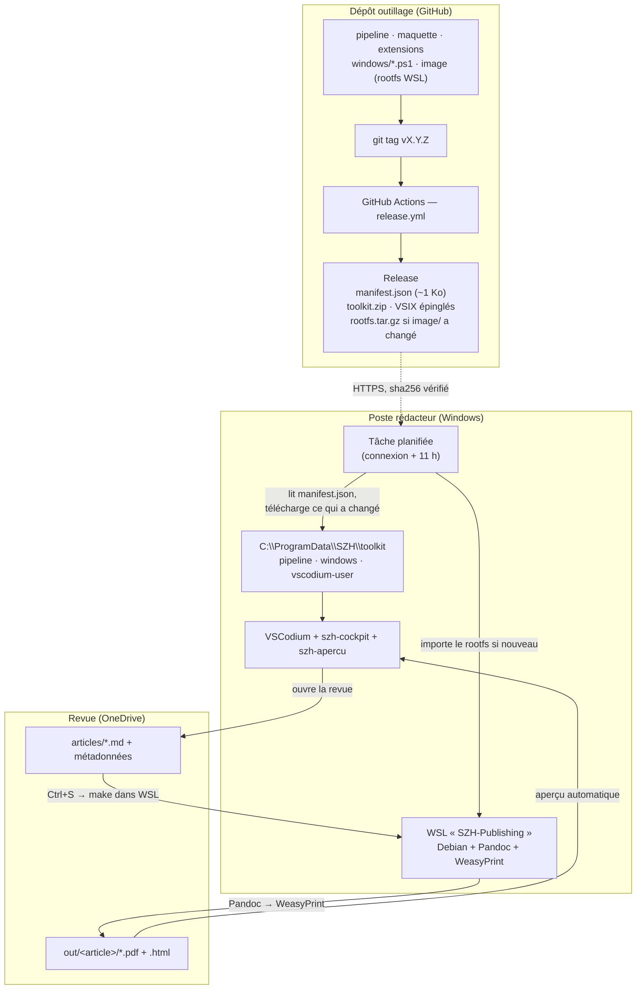

# Architecture

## En une phrase

Les rédacteurs écrivent en Markdown dans VSCodium ; à chaque enregistrement, une chaîne
Pandoc → WeasyPrint isolée dans WSL produit le PDF mis en page. Tout l'outillage est construit
par GitHub Actions et déployé silencieusement sur les postes ; les revues, elles, vivent sur
OneDrive.

## Les trois mondes

| Monde | Où | Contenu | Qui le gère |
|---|---|---|---|
| Dépôt outillage | GitHub | pipeline, maquette, extensions, scripts de déploiement, image WSL | le mainteneur |
| Poste rédacteur (×10) | Windows | VSCodium + distro `SZH-Publishing` + toolkit dans `C:\ProgramData\SZH` | mise à jour automatique |
| Revues | OneDrive / SharePoint | uniquement le contenu : articles, métadonnées, PDF | les rédacteurs |

Le principe central est qu'il n'y a **qu'une source de vérité, et aucune copie par revue**. Le
pipeline et la configuration vivent dans le toolkit du poste. Corriger un style ou un bug, c'est
une release, pas N dossiers à retoucher.

## Schéma

## La chaîne de compilation

Un dossier de revue tient dans `ausgabe.yaml` (métadonnées du numéro) et
`articles/<slug>/<slug>.md`. Le champ `profil:` d'`ausgabe.yaml` décide de ce que produit le
dossier : absent ou `article`, un PDF et un HTML par article ; `book`, différé ; clé présente et
vide, aucun document — un choix explicite, pas une panne.

À l'import d'un Word, trois scripts Python le lisent séparément : `docx-meta.py` en tire les
métadonnées et les blocs à consommer — y compris l'appariement des photos du tableau des auteurs
à la bonne personne, `docx-tables.py` extrait les tableaux en HTML autonome, `docx-titres.py`
reconstruit la hiérarchie des titres. Pandoc convertit ensuite le document, une suite de filtres
Lua y réinjecte ce que les scripts ont préparé. La liste de références, elle, n'est pas touchée :
elle reste dans le corps telle que la rédaction l'a écrite, et c'est à la compilation que
`szh-citations.lua` l'ancre et transforme les appels du texte en liens internes. Un dernier
maillon, `import-medias.py`, range les photos d'auteurs dans `portraits/` et les passe au
détourage, retire de `media/` les images qu'aucune insertion du texte ne cite — Word livre tout
ce que le document embarque, pandoc extrait tout — puis renomme ce qui reste en
`<slug>-fig-NN.<ext>`, en réécrivant les références du texte et des tableaux. Les JPEG livrés en
CMJN, que ni les navigateurs ni WeasyPrint n'affichent correctement, sont convertis en RVB par
`cmyk-rgb.py` ; c'est le cockpit qui l'appelle, à l'import et au dépôt d'une image.

À la compilation, Pandoc produit un HTML autonome — images et feuilles de style embarquées en
base64, donc aucun fichier lié — que WeasyPrint transforme en PDF balisé PDF/UA. La même source
donne aussi un aperçu HTML cliquable pour la colonne de droite de l'éditeur, et, à la demande,
un galley DOCX pour l'export OJS.

### Ce que la chaîne relève, et par où cela remonte

La chaîne ne fait pas que produire : elle relève. Appel de citation sans référence, appel
ambigu, référence jamais appelée, tableau importé sans rangée d'en-tête, langue d'article
absente, champ vide dans la langue déclarée, image introuvable, PDF non conforme PDF/UA —
une dizaine de contrôles, tous écrits sur la sortie d'erreur.

Ce chemin de retour est explicite et tient en trois pièces :

1. Les tâches de `vscodium-user/tasks.json` n'appellent plus `make` en direct mais
   `bash -c "set -o pipefail; make … 2>&1 | tee .szh-journal.log"`. Le journal vit à la
   racine du numéro, et non sous `out/`, que `tout-exporter` commence par supprimer.
   `pipefail` conserve le code de sortie de `make` : sans lui ce serait celui de `tee`,
   toujours 0.
2. `lib/journal.js` du cockpit traduit ce fichier en constats — un code, un ton, une clé
   d'i18n, l'article concerné. L'article est nommé par le message lui-même ; les lignes
   `pandoc articles/<slug>/…` ne servent plus que de contexte aux outils étrangers (pandoc,
   WeasyPrint), qui ne connaissent pas nos articles. Une ligne non reconnue est jetée, sauf
   si elle porte « ⚠ » ou « ✗ » sous un préfixe de la maison : le bruit d'outillage n'arrive
   jamais à l'écran, un avertissement neuf y arrive quand même.
3. `extension.js` relit le journal à la fin de chaque tâche suivie (`onDidEndTaskProcess`),
   pose un compteur dans la barre d'état, dit une fois ce qu'il y a à dire, et remplit la
   vue « Contrôles de la compilation » — celle des autres sections, `media/vue-ensemble.*`.

Deux formats de message comptent ici, et ils sont contractuels :

- **Le format à codes**, le seul que le pipeline pose exprès pour l'interface :

      [<source>-<ton>] <code> | <champ> | … | <phrase fr> | [de] <phrase de>

  `<source>` est la famille de contrôle telle que la vue la nomme (`import`, `meta`,
  `citations`…), `<ton>` vaut `blocage` (la compilation s'arrête, code de sortie non nul),
  `avertissement` ou `info` — trois tons, trois préfixes, une seule grammaire. Le deuxième
  champ est un **code stable** d'où viennent le ton et la clé d'i18n ; les champs suivants
  sont **nommés** (`article « <slug> »`, `champ « title »`, `appel « (Sen, 2001) »`) et
  fournissent les substitutions de la phrase, sans dépendre de leur ordre. La prose n'est
  qu'un repli d'affichage : elle se reformule sans rien casser. Jamais de « ⚠ » sur ces
  lignes — `lireRapportImport()` classe « danger » toute ligne qui en porte un, et un
  avertissement non bloquant s'y déguiserait en import raté.
  Émetteurs : `docx-meta.py`, `docx-tables.py`, `reimporter.py` et le `Makefile` sous
  `[import-avertissement]` ; `szh-maquette.lua` sous `[meta-blocage]` / `[meta-avertissement]` ;
  `szh-citations.lua` sous `[citations-avertissement]` / `[citations-info]`.
- `[prefixe] …` en français, `[prefixe] [de] …` en allemand, ou les deux moitiés sur une
  seule ligne séparées par `[de] `. Le pipeline n'a pas de mécanisme de locale, en shell
  comme en Python : il écrit les deux et l'interface choisit. C'est ce qui reste au
  `Makefile`, à `rapport-ua.py` et à `szh-niveaux.lua` ; le cockpit y reconnaît quelques
  phrases, et c'est un **repli** nommé comme tel dans `lib/journal.js`. Reconnaître une
  phrase, c'est promettre de ne jamais la reformuler : les deux filtres qui en dépendaient
  sont passés au format à codes, et `test/js/journal-codes.test.js` interdit le retour en
  arrière.

## Ce qui est géré, donc mis à jour d'un coup

- Le **pipeline** : `Makefile`, filtres Lua, scripts Python d'import, génération de la couleur
  annuelle.
- La **maquette** : `print.css`, `couleurs.css`, gabarit de couverture, polices.
- Les **extensions** : `szh-cockpit` (la barre « Revue SZH ») et `szh-apercu`.
- La **configuration de l'éditeur** : réglages, raccourcis, tâches, snippets.
- Les **scripts de déploiement** et l'**image WSL**.

Le contenu des revues n'est jamais géré ici.

## Comment ça se déploie

1. Un tag déclenche la CI : contrôle des contrats, construction des VSIX, assemblage du toolkit,
   publication d'un `manifest.json`. Le rootfs n'est reconstruit que si `image/` a changé.
2. La préparation d'un poste se fait une fois, en administrateur (`bootstrap.ps1`).
3. Ensuite, une tâche planifiée lit chaque jour le manifest et n'applique que les différences, en
   silence. Le retour en arrière est possible : l'archive précédente est conservée.

## Choix structurants

- **Reproductible et épinglé** : rootfs vérifié par sha256, dépendances Python figées, extensions
  tierces épinglées avec leurs empreintes.
- **Sans administrateur après l'installation** : seul `bootstrap.ps1` en demande.
- **Portable à 80 %** : l'image OCI, le pipeline et la configuration ne dépendent pas de Windows ;
  un passage à macOS ou à un poste Linux ne remplacerait que la couche WSL et les scripts
  PowerShell.

Pour ce qu'il faut surveiller au long cours, voir [`MAINTENANCE.md`](MAINTENANCE.md). Pour le
déploiement de la flotte, [`SECURITE.md`](SECURITE.md).
