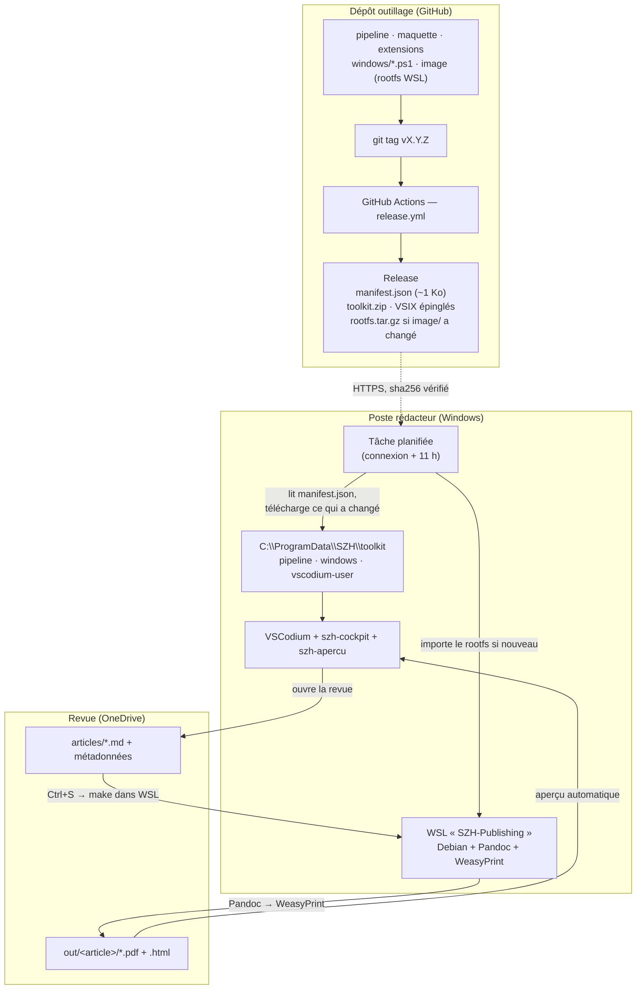

# Architecture

## En une phrase

Les rédacteurs écrivent en Markdown dans VSCodium ; à chaque enregistrement, une chaîne
Pandoc → WeasyPrint isolée dans WSL produit le PDF mis en page. Tout l'outillage est construit
par GitHub Actions et déployé silencieusement sur les postes ; les revues, elles, vivent sur
OneDrive.

## Les trois mondes

| Monde | Où | Contenu | Qui le gère |
|---|---|---|---|
| Dépôt outillage | GitHub | pipeline, maquette, extensions, scripts de déploiement, image WSL | le mainteneur |
| Poste rédacteur (×10) | Windows | VSCodium + distro `SZH-Publishing` + toolkit dans `C:\ProgramData\SZH` | mise à jour automatique |
| Revues | OneDrive / SharePoint | uniquement le contenu : articles, métadonnées, PDF | les rédacteurs |

Le principe central est qu'il n'y a **qu'une source de vérité, et aucune copie par revue**. Le
pipeline et la configuration vivent dans le toolkit du poste. Corriger un style ou un bug, c'est
une release, pas N dossiers à retoucher.

## Schéma

## La chaîne de compilation

Un dossier de revue tient dans `ausgabe.yaml` (métadonnées du numéro) et
`articles/<slug>/<slug>.md`. Le champ `profil:` d'`ausgabe.yaml` décide de ce que produit le
dossier : absent ou `article`, un PDF et un HTML par article ; `book`, différé ; clé présente et
vide, aucun document — un choix explicite, pas une panne.

À l'import d'un Word, trois scripts Python le lisent séparément : `docx-meta.py` en tire les
métadonnées et les blocs à consommer — y compris l'appariement des photos du tableau des auteurs
à la bonne personne, `docx-tables.py` extrait les tableaux en HTML autonome, `docx-titres.py`
reconstruit la hiérarchie des titres. Pandoc convertit ensuite le document, une suite de filtres
Lua y réinjecte ce que les scripts ont préparé, et AnyStyle découpe la bibliographie. Un dernier
maillon, `import-medias.py`, range les photos d'auteurs dans `portraits/` et les passe au
détourage, puis retire de `media/` les images qu'aucune insertion du texte ne cite : Word livre
tout ce que le document embarque, pandoc extrait tout.

À la compilation, Pandoc produit un HTML autonome — images et feuilles de style embarquées en
base64, donc aucun fichier lié — que WeasyPrint transforme en PDF balisé PDF/UA. La même source
donne aussi un aperçu HTML cliquable pour la colonne de droite de l'éditeur, et, à la demande,
un galley DOCX pour l'export OJS.

## Ce qui est géré, donc mis à jour d'un coup

- Le **pipeline** : `Makefile`, filtres Lua, scripts Python d'import, génération de la couleur
  annuelle.
- La **maquette** : `print.css`, `couleurs.css`, gabarit de couverture, polices.
- Les **extensions** : `szh-cockpit` (la barre « Revue SZH ») et `szh-apercu`.
- La **configuration de l'éditeur** : réglages, raccourcis, tâches, snippets.
- Les **scripts de déploiement** et l'**image WSL**.

Le contenu des revues n'est jamais géré ici.

## Comment ça se déploie

1. Un tag déclenche la CI : contrôle des contrats, construction des VSIX, assemblage du toolkit,
   publication d'un `manifest.json`. Le rootfs n'est reconstruit que si `image/` a changé.
2. La préparation d'un poste se fait une fois, en administrateur (`bootstrap.ps1`).
3. Ensuite, une tâche planifiée lit chaque jour le manifest et n'applique que les différences, en
   silence. Le retour en arrière est possible : l'archive précédente est conservée.

## Choix structurants

- **Reproductible et épinglé** : rootfs vérifié par sha256, dépendances Python figées, extensions
  tierces épinglées avec leurs empreintes.
- **Sans administrateur après l'installation** : seul `bootstrap.ps1` en demande.
- **Portable à 80 %** : l'image OCI, le pipeline et la configuration ne dépendent pas de Windows ;
  un passage à macOS ou à un poste Linux ne remplacerait que la couche WSL et les scripts
  PowerShell.

Pour ce qu'il faut surveiller au long cours, voir [`MAINTENANCE.md`](MAINTENANCE.md). Pour le
déploiement de la flotte, [`SECURITE.md`](SECURITE.md).
