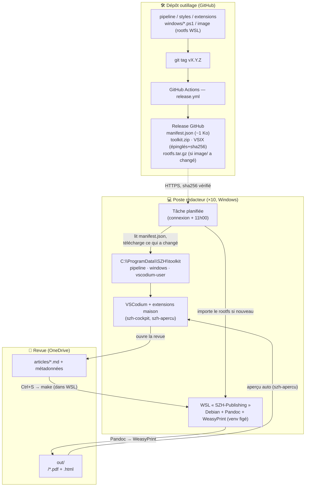

# Architecture — vision globale

> Vue d'ensemble du fonctionnement et du déploiement de la chaîne de publication
> SZH/CSPS. La documentation détaillée des **styles/compilateur** et de **VSCodium**
> viendra dans un second temps. Décisions d'architecture : [`PLANIFICATION.md`](../PLANIFICATION.md).

## En une phrase

Les rédacteurs écrivent en **Markdown** dans **VSCodium** ; à chaque sauvegarde, une
chaîne **Pandoc → WeasyPrint** isolée dans **WSL** produit le **PDF** mis en page. Tout
l'outillage est **construit par GitHub Actions** et **déployé silencieusement** sur les
postes ; les revues, elles, vivent sur **OneDrive**.

## Les trois mondes

| Monde | Où | Contenu | Qui le gère |
|---|---|---|---|
| **Dépôt outillage** (ce repo) | GitHub | pipeline, styles, extensions, scripts de déploiement, image WSL | Robin (mainteneur) |
| **Poste rédacteur** (×10) | Windows | VSCodium + WSL `SZH-Publishing` + toolkit dans `C:\ProgramData\SZH` | auto (mise à jour silencieuse) |
| **Revues** | OneDrive/SharePoint | uniquement le contenu (articles, métadonnées, PDF) | rédacteurs |

**Principe central : une seule source de vérité, zéro copie par revue.** Le pipeline et
la config vivent dans le *toolkit* du poste, pas dans chaque dossier de revue. Corriger un
style ou un bug = **une release**, pas N dossiers à retoucher.

## Schéma général

## Ce qui est « géré » (et donc mis à jour d'un coup)

- **Le pipeline** (`pipeline/Makefile`, `docx-tables.py`, filtres Lua, `accent-css.py`) —
  la logique de conversion et d'assemblage.
- **La maquette** (`pipeline/styles/print.css`, `couleurs.css`, `templates/`, polices) —
  l'identité visuelle (couverture, coupures, styles de blocs, tableaux).
- **Les extensions VSCodium maison** (`szh-cockpit` : la barre « Revue SZH » ; `szh-apercu` :
  l'aperçu PDF auto) — l'expérience « 0 technique ».
- **La config éditeur** (`vscodium-user/` : réglages, raccourcis, snippets).
- **Les scripts de déploiement** (`windows/`) et **l'image WSL** (`image/`).

Le **contenu des revues n'est jamais géré ici** : il reste sur OneDrive, épuré (le rédacteur
ne voit que ses articles, ses métadonnées et ses PDF).

## Comment ça se déploie

1. **Fabrication (CI).** Un `git tag vX` déclenche `release.yml` : construction des VSIX
   (épinglés + empreintes sha256), assemblage du `toolkit.zip`, publication d'un `manifest.json`.
   Le **rootfs WSL** (lourd) n'est reconstruit **que si `image/` a changé** — une retouche de
   style = une release de quelques Ko.
2. **Préparation d'un poste (1× en admin).** `windows/bootstrap.ps1` active WSL, installe
   VSCodium + SumatraPDF (winget), donne aux Utilisateurs le droit d'écrire dans
   `C:\ProgramData\SZH` (pour les MAJ sans admin), crée les tâches planifiées.
3. **Vie courante (sans admin).** Une tâche planifiée lit chaque jour le `manifest.json`
   (~1 Ko) et n'applique que les différences, en silence. Retour arrière possible
   (`update.ps1 -Version <X>`, l'archive N-1 est conservée).

## Le flux rédacteur (rappel)

Déposer les Word finalisés dans `articles-word` → ouvrir la revue → les Word sont convertis
en Markdown dans `articles` → écrire → **Ctrl+S** régénère le PDF. Tout passe par la barre
latérale **« Revue SZH »** (aucun explorateur de fichiers). Détail : [`../userdoc.md`](../userdoc.md)
et le **BIENVENUE.md** de chaque revue.

## Choix structurants à connaître

- **Reproductible et épinglé** : rootfs vérifié par sha256, dépendances Python figées,
  extensions VSCodium épinglées + empreintes vérifiées (anti-supply-chain).
- **Sans admin après l'installation** : seul `bootstrap.ps1` requiert l'administrateur.
- **Portabilité** : ~80 % est agnostique (image OCI, pipeline, config) ; un futur passage à
  macOS ou à un OS natif (Silverblue) ne toucherait ni le Makefile, ni la config, ni le
  `Containerfile` — on remplacerait seulement la couche WSL.

Pour la maintenance de la couche WSL au long cours, voir
[`MAINTENANCE-WSL.md`](MAINTENANCE-WSL.md). Pour la sécurité et le déploiement flotte, voir
[`SECURITE.md`](SECURITE.md).
