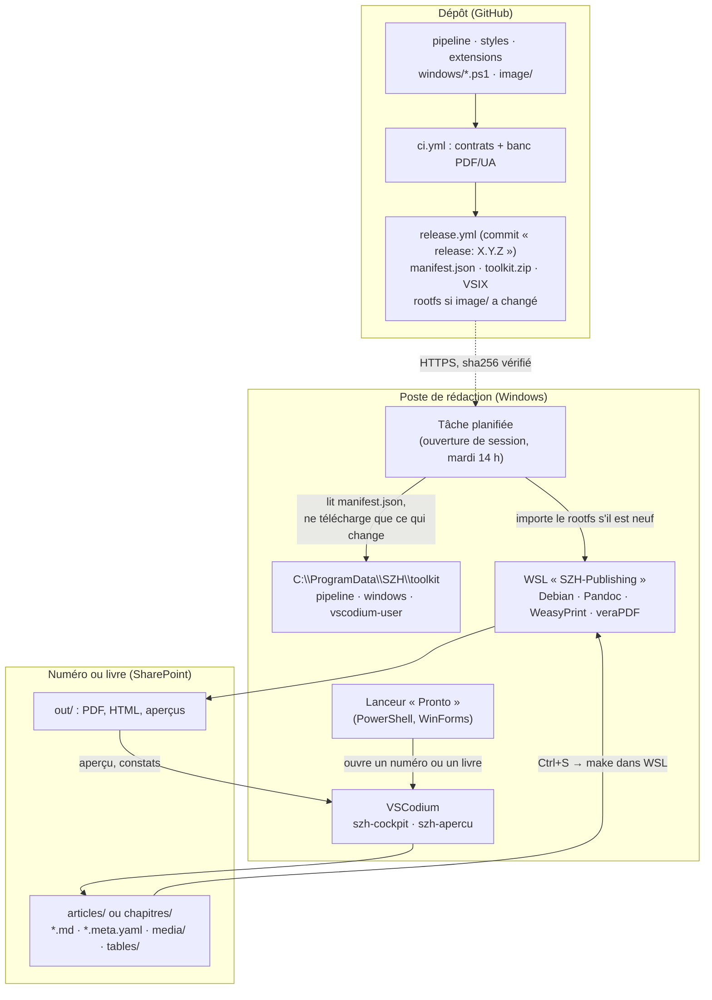

# Architecture

Pronto est la chaîne de publication des éditions SZH/CSPS : la Revue suisse de pédagogie
spécialisée, la Schweizerische Zeitschrift für Heilpädagogik et les livres. Les rédactions
écrivent en Markdown dans VSCodium ; à chaque enregistrement, une chaîne Pandoc → WeasyPrint
isolée dans une distribution WSL produit le PDF mis en page et balisé PDF/UA. L'outillage est
construit par GitHub Actions et déployé en silence sur les postes ; les numéros et les livres
vivent sur SharePoint.

Ce document décrit le dépôt couche par couche, avec le rôle de chaque module en une ligne.
Le détail d'un sujet vit dans le document qui lui est propre : l'index est
[`README.md`](README.md).

## Les trois mondes

| Monde | Où | Contenu | Qui le gère |
|---|---|---|---|
| Dépôt | GitHub | pipeline, maquette, extensions VSCodium, scripts Windows, image WSL | le mainteneur |
| Poste de rédaction | Windows | VSCodium, distribution `SZH-Publishing`, toolkit sous `C:\ProgramData\SZH` | la mise à jour automatique |
| Publications | SharePoint, sous une seule racine ([`EMPLACEMENTS.md`](EMPLACEMENTS.md)) | le contenu seul : articles, chapitres, métadonnées, PDF | les rédactions |

Il n'y a qu'une source de vérité, et aucune copie par numéro : le pipeline et la
configuration de l'éditeur vivent dans le toolkit du poste. Corriger un style ou un défaut,
c'est une release, pas des dossiers à retoucher un par un.

## Schéma

```mermaid
flowchart TB
    subgraph DEP["Dépôt (GitHub)"]
        SRC["pipeline · styles · extensions<br/>windows/*.ps1 · image/"]
        CI["ci.yml : contrats + banc PDF/UA"]
        REL["release.yml (commit « release: X.Y.Z »)<br/>manifest.json · toolkit.zip · VSIX<br/>rootfs si image/ a changé"]
        SRC --> CI --> REL
    end

    subgraph POSTE["Poste de rédaction (Windows)"]
        TACHE["Tâche planifiée<br/>(ouverture de session, mardi 14 h)"]
        TK["C:\\ProgramData\\SZH\\toolkit<br/>pipeline · windows · vscodium-user"]
        WSL["WSL « SZH-Publishing »<br/>Debian · Pandoc · WeasyPrint · veraPDF"]
        LAN["Lanceur « Pronto »<br/>(PowerShell, WinForms)"]
        VSC["VSCodium<br/>szh-cockpit · szh-apercu"]
        TACHE -->|"lit manifest.json,<br/>ne télécharge que ce qui change"| TK
        TACHE -->|"importe le rootfs s'il est neuf"| WSL
        LAN -->|"ouvre un numéro ou un livre"| VSC
    end

    subgraph PUB["Numéro ou livre (SharePoint)"]
        MD["articles/ ou chapitres/<br/>*.md · *.meta.yaml · media/ · tables/"]
        OUT["out/ : PDF, HTML, aperçus"]
    end

    REL -.->|"HTTPS, sha256 vérifié"| TACHE
    VSC --> MD
    MD -->|"Ctrl+S → make dans WSL"| WSL
    WSL --> OUT
    OUT -->|"aperçu, constats"| VSC
```

## Commun et distinct : revue, Zeitschrift, livre

Revue et livre ne sont pas deux programmes. Un chapitre se compile comme un article, passe
par le même socle de filtres et la même chaîne d'import, et le cockpit comme le lanceur
lisent une table de profils plutôt que de se dédoubler. Revue et Zeitschrift, elles, sont
le même produit : elles ne diffèrent que par un jeton (`revue:` d'`ausgabe.yaml`), d'où
viennent la langue par défaut, le nom et l'ISSN.

| Couche | Commun aux trois | Revue et Zeitschrift seulement | Livre seulement |
|---|---|---|---|
| Filtres de compilation | le socle de `filtres.mk` : contexte, niveaux, listes, tableaux, typographie, images, figures, numérotation, sections, citations, césure, exergue, notes | `maquette`, `titre-lignes`, `ressource`, `auteurs`, `rubrique` | `livre-titre`, `sauts-uniques`, `livre-sous-titre`, `livre-entete-image`, `livre-auteurs`, `livre-entete`, `qr` |
| Recettes make | l'import Word, `define weasy_ua`, la porte PDF/UA | `Makefile` : un PDF et un HTML par article, galley DOCX, pagination continue, Documentation Kirby | `profils/livre.mk` : fragments de chapitre, assemblage, PDF imprimeur, couverture, EPUB, HTML web |
| Python | import (`docx-*`, `pronto-*`, `import-medias.py`), `szh_commun.py`, portraits, contraste | `reimporter.py`, `pagination.py`, `documentation-kirby.py` | `livre-assembler.py`, `livre-epub-prepare.py`, `livre-scinder.py`, `livre-migrer-meta.py`, `couverture.py`, `cmjn.py`, `liens-courts.py` |
| Feuilles de style | `socle.css`, `partage-filtres.css`, `couleurs.css` | `print.css` | `styles/livre/*.css` |
| Cockpit | toute la mécanique : import, médias, tableaux, aperçu, contrôles, PDF/UA, co-édition, verrou, archivage | capacités `doi`, `ojs`, `traductions`, `documentation`, `pagination`, `reimport`, `envoiAuteur`… | capacités `horsSommaire`, `titreEnLignes`, `sortiesLivre`, `paletteLivre` |
| Lanceur | le socle `szh-common.ps1`, l'onglet de produit, l'archivage | `new-revue.ps1`, secrétariat (`secretariat = $true`) | `new-livre.ps1` |

La différence se décide une fois, à un seul endroit par couche : `szh-contexte.lua` pour les
filtres (`meta['szh-produit']`), la présence de `buch.yaml` pour make, `PROFILS` de
`lib/profil.js` pour le cockpit, `$SzhProduits` de `windows/szh-produits.ps1` pour le
lanceur. Ce qui ne figure pas dans cette table est commun.

---

## 1. Le pipeline

Tout ce qui compile vit dans `pipeline/`, tourne dans la WSL et s'invoque depuis le dossier
du numéro ou du livre : `make -f <toolkit>/pipeline/Makefile all`. Le `Makefile` ne contient
aucun chemin `/mnt/c` : il s'exécuterait tel quel dans un conteneur Linux.

### Recettes et chaînes de filtres

| Module | Rôle |
|---|---|
| `pipeline/Makefile` | la compilation d'un numéro : un PDF et un HTML par article, l'aperçu, le galley DOCX, l'import, la porte PDF/UA ; inclut `filtres.mk`, puis `profils/livre.mk` si `buch.yaml` est là |
| `pipeline/filtres.mk` | les chaînes de filtres Lua, déclarées une seule fois : le socle en tronçons, puis `CHAINE_ARTICLE`, `CHAINE_APERCU`, `CHAINE_CHAPITRE` et ses variantes aperçu et EPUB, composées par concaténation et `filter-out` |
| `define weasy_ua` (`Makefile`) | l'étape WeasyPrint, écrite une fois et appelée par l'article, le livre, le PDF imprimeur et la couverture : cascade PDF/UA-1 → balisé simple → nu, fichier temporaire, journal abrégé, constat `pdf-verrouille` |
| `define contexte_chapitre` (`profils/livre.mk`) | le préambule de chaque recette de chapitre : rang, couleur, onglet, métadonnées |
| `pipeline/profils/livre.mk` | le moteur livre ; décrit dans [`ARCHITECTURE-LIVRES.md`](ARCHITECTURE-LIVRES.md) |
| `pipeline/verifier-ua.sh` | la porte PDF/UA-1 : garde-fous d'outillage, veraPDF, traduction par `rapport-ua.py` ; appelée par `make verifier-ua` et par le cockpit |
| `pipeline/import-docx.sh` | la chaîne d'import d'un Word en article ou en chapitre ; son en-tête décrit l'ordre des étapes |

L'ordre du socle est le même dans toutes les chaînes, par construction :
`test/js/chaines-filtres.test.js` le vérifie. L'en-tête de `filtres.mk` dit, filtre par
filtre, ce qui casse si on le déplace, et liste les écarts entre un chapitre et un article.

### Les filtres Lua

Chaque chaîne s'ouvre sur `szh-contexte.lua`, qui fixe une fois `meta.lang`,
`meta['szh-produit']` (`revue`, `zeitschrift` ou `livre`) et `meta['szh-unite']` (`article`
ou `chapitre`). Les filtres suivants relisent ce contexte au lieu de refaire leur cascade.
La langue suit un seul ordre : la fiche `<slug>.meta.yaml`, puis le jeton de revue, puis le
`lang:` du numéro ou de `buch.yaml`, puis le français ; seules fr, de et it sont acceptées.

| Filtre | Rôle |
|---|---|
| `szh-commun.lua` | la bibliothèque partagée, chargée par `dofile` : `calculer_contexte`, `langue_de`, `slug_article`, `a_classe`, `texte`, `lire_cle`, `parse_scalar`, et l'émetteur de constats `constat()` |
| `szh-lire-config.lua` | lit une clé d'un YAML par le lecteur de pandoc (`pandoc lua`) : make lit une clé exactement comme pandoc la relira |
| `szh-contexte.lua` | le contexte de composition, en tête de chaque chaîne |
| `szh-niveaux.lua` | normalise les niveaux de titre du corps (pas de saut, RGAA 9.1) |
| `szh-listes-serrees.lua` | resserre les listes dont chaque item tient en un paragraphe |
| `szh-tabelle-inclure.lua` | réinjecte `tables/table-NN.html` à la place de sa référence |
| `szh-tabelle-scope.lua` | pose `scope` sur les en-têtes des tableaux écrits en Markdown (RGAA 5.7) |
| `szh-typographie.lua` | la typographie maison, selon la langue ([`TYPOGRAPHIE.md`](TYPOGRAPHIE.md)) |
| `szh-metafichier.lua` | remplace une image native Word (`.emf`, `.wmf`) par un repère visible |
| `szh-grille.lua` | compose une grille de plusieurs images en une seule figure |
| `szh-figure.lua` | construit les `Figure` que le lecteur de l'aperçu ne fait pas |
| `szh-numerotation.lua` | numérote figures et tableaux, pose alternatives et crédits ; constat `figure-sans-alt` |
| `szh-tableau-boite.lua` | enveloppe chaque tableau dans une boîte qui ne se coupe pas, sans quoi le balisage tombe |
| `szh-legende-avant.lua` | place la légende avant l'image dans l'ordre de lecture |
| `szh-sections.lua` | numérote les titres du corps dans le texte |
| `szh-citations.lua` | réinsère la bibliographie détachée, l'ancre et lie les appels |
| `szh-cesure.lua` | soustrait les noms propres à la césure, en français |
| `szh-exergue.lua` | masque l'exergue au lecteur d'écran dans le publié (`aria-hidden`) |
| `szh-notes.lua` | rend les notes imprimables en pied de page |
| `szh-maquette.lua` | revue : variables de couverture et d'en-tête courant, nom et ISSN |
| `szh-titre-lignes.lua`, `szh-titre-metriques.lua` | revue : le titre de couverture coupé en escalier, et la table de largeurs qui le mesure |
| `szh-auteurs.lua` | revue : le bloc des auteur·e·s |
| `szh-ressource.lua`, `szh-rubrique.lua` | revue : fiches et rubriques de la Documentation |
| `szh-livre-*.lua`, `szh-sauts-uniques.lua` | livre : titre, sous-titre, auteur·e·s et encadré FALC d'un chapitre, sauts de ligne uniques |
| `szh-qr.lua`, `szh-qr-commun.lua`, `szh-qr-lister.lua` | livre : QR vectoriel et cliquable, sa construction, et la liste des URL pour Shlink |
| `szh-sourcepos.lua`, `szh-ancres.lua`, `szh-apercu-lecteur-ecran.lua` | aperçu seulement : forme de l'arbre sous `sourcepos`, identifiants des titres, encadré « ce qu'un lecteur d'écran reçoit » |
| `szh-galley-docx.lua` | nettoie le galley Word de l'export OJS |
| `szh-styles-corps.lua`, `szh-meta.lua`, `szh-legendes.lua`, `szh-titres.lua`, `szh-biblio-detacher.lua`, `szh-tabelle-reference.lua`, `szh-attributs-sains.lua` | import : les filtres que `import-docx.sh` passe sur un Word, dans cet ordre |

### Python et scripts

Tout le Python de production tourne dans la WSL, sur le Python 3.13 de Debian et deux
environnements de l'image : `/opt/weasyprint` et `/opt/portraits`.

| Module | Rôle |
|---|---|
| `szh_commun.py` | ce que les scripts partagent : `avertir`, `formater_avertissement`, `lire_yaml`, slug, écriture atomique, chargeur des modules à tiret |
| `docx-meta.py` | lecteur des Word hérités : métadonnées, auteur·e·s et photos, étendue de la bibliographie |
| `pronto-lire.py`, `pronto_docx.py`, `pronto_modele.py` | lecteur des Word au gabarit « Pronto — modèle d'article » ; `--reconnaitre` décide du lecteur |
| `docx-tables.py`, `docx-titres.py`, `docx-styles-corps.py` | tableaux en HTML, titres déduits, styles de corps du gabarit |
| `docx-controle-import.py` | le filet de l'import : rien du Word ne doit se perdre en chemin |
| `conversion_odt.py` | `.odt` ⇄ `.docx` par LibreOffice sans interface, avant tout lecteur |
| `import-medias.py`, `cmyk-rgb.py`, `portraits.py` | fin d'import : photos rangées et détourées, images inutilisées retirées, JPEG CMJN en RVB |
| `reimporter.py` | remplace le corps d'un article par un Word corrigé sans perdre le travail de la rédaction |
| `accent-css.py`, `apca.py` | couleur annuelle en variables CSS, contraste APCA |
| `pagination.py`, `verifier-numerotation.py` | folios continus d'un numéro ; parité de numérotation entre deux versions linguistiques |
| `documentation-kirby.py` | arborescence Kirby de la Documentation → Markdown ([`FORMAT-DOCUMENTATION-KIRBY.md`](FORMAT-DOCUMENTATION-KIRBY.md)) |
| `rapport-ua.py` | traduit le rapport de veraPDF pour la rédaction, en fr et en de |
| `livre-*.py`, `couverture.py`, `cmjn.py`, `liens-courts.py` | le moteur livre ([`ARCHITECTURE-LIVRES.md`](ARCHITECTURE-LIVRES.md)) |

### Le nettoyeur de manuscrit

Le nettoyeur prépare un manuscrit d'auteur avant l'import : il le remet au gabarit, contrôle
la bibliographie APA, la typographie et le lexique, et annote le Word en révisions suivies.
Il tourne entièrement dans la WSL ; le lanceur l'appelle par l'onglet « Preprocessing ».
CLI : `manuscrit-nettoyer.py`, modules `manuscrit_*.py`, règles Vale dans `pipeline/vale/`.
Son contrat est [`ARCHITECTURE-nettoyeur-manuscrit.md`](ARCHITECTURE-nettoyeur-manuscrit.md).

### Styles et gabarits

Les feuilles s'empilent par des `--css=` successifs, sans `@import`, dans un ordre porteur :
`socle.css` (polices, jetons), la feuille de sortie (`print.css` ou `styles/livre/*.css`),
`partage-filtres.css` (le balisage posé par les filtres communs), puis la couleur annuelle.
`couleurs-reference.json` est la seule table des couleurs de la maison, lue par `cmjn.py`,
`couverture.py` et le cockpit. Les gabarits pandoc sont dans `pipeline/templates/`. Le détail
est dans [`SORTIES.md`](SORTIES.md).

### Ce que la chaîne relève, et par où cela remonte

La chaîne relève autant qu'elle produit : appel de citation sans référence, tableau sans
en-tête, langue d'article absente, image sans alternative, PDF non conforme… Le chemin de
retour tient en trois pièces.

1. Les tâches de `vscodium-user/tasks.json` lancent
   `bash -c "set -o pipefail; make -j2 -O … 2>&1 | tee .szh-journal.log"`. Le journal vit à
   la racine du numéro, hors de `out/` que `tout-exporter` supprime ; `pipefail` garde le
   code de sortie de make. `-j2` suit les deux cœurs que `.wslconfig` accorde à la WSL ;
   `-O` met la sortie de chaque cible en tampon, sans quoi les messages de deux articles
   s'entrelacent et le cockpit les attribue au mauvais. `test/js/contrats.test.js` refuse
   un `-j` sans `-O`.
2. `lib/journal.js` traduit le journal en constats : un code, un ton, une clé d'i18n,
   l'unité concernée. Une ligne non reconnue est jetée, sauf si elle porte « ⚠ » ou « ✗ »
   sous un préfixe de la maison.
3. `lib/controles-hote.js` range les constats par source, pose le compteur de la barre
   d'état et remplit la vue « Contrôles de la compilation ».

Le format à codes est le seul que le pipeline pose exprès pour l'interface :

    [<source>-<ton>] <code> | <champ> | … | <phrase fr> | [de] <phrase de>

`<source>` est la famille de contrôle (`import`, `meta`, `citations`, `livre`…), `<ton>`
vaut `blocage` (la compilation s'arrête), `avertissement` ou `info`. Le code est stable :
c'est de lui que viennent le ton et la clé d'i18n. Les champs suivants sont nommés
(`article « <slug> »`, `appel « (Sen, 2001) »`) et la prose n'est qu'un repli d'affichage.
Jamais de « ⚠ » sur ces lignes : `lireRapportImport()` les classerait en échec. Côté Lua,
seule `constat()` de `szh-commun.lua` écrit ces lignes ; côté Python,
`szh_commun.formater_avertissement`. `test/js/journal-codes.test.js` tient la liste des codes
connus et interdit le retour à la reconnaissance de phrases, qui ne subsiste qu'en repli
pour le `Makefile`, `rapport-ua.py` et `szh-niveaux.lua`.

La validation PDF/UA d'après compilation suit un chemin à part : `lib/pdfua-hote.js` relance
`verifier-ua.sh` dans la WSL après chaque compilation réussie, garde son verdict par empreinte
de PDF dans `.szh-pdfua.json` et fournit ses constats (source `pdfua`) directement à la vue.

---

## 2. Le cockpit (`vscodium-extension/szh-cockpit`)

Une seule extension sert les deux profils : elle reconnaît le dossier ouvert à la présence
d'`ausgabe.yaml` ou de `buch.yaml` et se présente en conséquence. Du CommonJS chargé tel
quel, sans étape de build. La liste de tous les modules, un par ligne, est dans
[`../vscodium-extension/szh-cockpit/README.md`](../vscodium-extension/szh-cockpit/README.md),
que `test/js/contrats.test.js` garde complète. Une seconde extension, `szh-apercu`, ouvre le
PDF à droite après compilation.

### `extension.js` ne fait que câbler

`extension.js` porte `activate()`, le câblage des modules par leurs blocs `configurer()`,
le fournisseur de l'arbre latéral (`FournisseurRevue`) et le flux compiler / ouvrir une unité.
Aucun panneau n'y est créé : chaque formulaire vit dans son module.

### Le motif `lib/*-hote.js`

Une zone de l'interface est un module `lib/<zone>-hote.js` qui suit toujours le même motif :

- il fait ses propres `require`, `vscode` compris, et requiert directement les modules de
  `lib/` dont il a besoin ;
- il déclare `let ctx = { … }`, des rappels vers l'hôte aux défauts inoffensifs, et
  `configurer(n)` qui les remplace ; il rappelle l'hôte par `ctx.xxx()`, jamais par
  `require('../extension')` ;
- son état est privé ; l'état partagé entre zones vit dans `lib/session.js`, derrière des
  accesseurs nommés ;
- il possède son panneau, créé par `panneauUnique()`.

Les modules hôtes : `accueil-hote`, `controles-hote`, `coedition-hote`,
`documentation-hote`, `import-hote`, `import-verif-hote`, `medias-hote`, `metadonnees-hote`,
`pagination-hote`, `pdfua-hote`, `reglages-hote`, `table-hote`, `traduction-hote`,
`vue-articles-hote`, `vue-ensemble-hote`, ainsi que `cycle-vie.js` et `apercu.js`, qui
suivent le même motif ; `accueil-hote` et `coedition-hote` n'ont besoin d'aucun rappel, donc
d'aucun `configurer()`. Les autres modules de `lib/` sont purs ou presque : sans `vscode`,
souvent sans disque, exercés directement par `node --test`.

### Profils et capacités

`lib/profil.js` est la table des profils, `revue` et `livre` : fichier de configuration,
dossier et mot des unités, clé d'ordre, dépôt Word, cible make, clé de contexte
(`szh.estRevue`, `szh.estLivre`). Elle porte aussi `capacites`, la seule réponse à la
question « cette fonction existe-t-elle dans ce profil ? » :

| Revue seulement | Livre seulement |
|---|---|
| `doi`, `ojs`, `traductions`, `documentation`, `pagination`, `reimport`, `envoiAuteur`, `pdfArticle`, `vueFiches`, `typeArticle`, `licence`, `motsCles`, `tutoriel` | `horsSommaire`, `titreEnLignes`, `sortiesLivre`, `paletteLivre` |

Chaque capacité est posée en contexte VS Code `szh.peut.<nom>` (`contextes()`), relue par les
`when` de `package.json`, par les panneaux (`lib/panneaux.js`), par l'arbre et par les
webviews, qui reçoivent la table. `profils.courant()` rend le profil du dossier ouvert ; les
`profilCourant()` locaux des modules ne font que lui déléguer. La Zeitschrift est le profil
`revue`.

### Les libellés : `T()` et `TP()`

`lib/i18n.js` porte tous les textes fr et de du cockpit. `T(cle)` rend le texte dans la
langue de l'interface ; `TP(cle, profil)` rend la variante `cle.livre` quand elle existe, sinon
`T(cle)`. La revue est le profil de base : ses textes sont les clés nues. La langue de
l'interface se résout par une cascade décrite dans [`MAINTENANCE.md`](MAINTENANCE.md#la-langue-de-linterface).

### Les webviews (`media/`)

Les formulaires sont des pages statiques `media/<page>.{html,css,js}`, assemblées par
`lib/webviews/util.js` : libellés résolus à l'assemblage (`%%SZH:clé%%` → `TP()`), langue du
document posée d'après l'interface, nonce et CSP stricte. Aucune donnée n'entre dans le
gabarit : tout passe par `postMessage`, dont les types sont la table `MSG` de
`lib/messages.js`, recopiée pour le navigateur dans `media/_messages.js`.
`lib/webviews/panneau.js` (`panneauUnique()`) tient le singleton de chaque panneau, son
`reveal`, sa fermeture, le mode « Trad » ([`TRADUCTION.md`](TRADUCTION.md)) et la poignée
`PRET`.

Les pages suivent un design atomique de fait, sans cadre :

| Niveau | Fichiers | Ce qu'il porte |
|---|---|---|
| Jetons et atomes | `_design.css`, `_commun.js` | jetons tirés des couleurs de l'éditeur et de l'échelle de `print.css` ; `SZH.poser`, `SZH.icone`, `SZH.notif`, `SZH.modale`, `SZH.autoEnregistrement`… |
| Molécules partagées | `_auteurs.*`, `_fiches.*`, `_numero.*`, `_liste.css` | la fiche d'auteur·e, la carte de métadonnées d'article, le formulaire du numéro, la liste de cartes |
| Pages | `metadata-*`, `medias-article`, `table-editor`, `documentation`, `articles`, `vue-ensemble`, `traduction`, `settings`, `import-verif`, `suggestion`, `nouveautes` | une vue, son script et ses ajustements |

`test/js/webviews.test.js` rend chaque page dans un DOM minimal, et `test/js/hote.test.js`
active l'extension sur un faux `vscode` (`test/js/hote-factice.js`) puis ouvre chaque panneau.

### Les gabarits Twig

Courriels (`mail-templates/`), exports du secrétariat (`export-templates/`) et feuille de
vérification (`print-templates/`) sont des gabarits Twig rendus par un seul moteur,
`lib/gabarits.js`. Le lanceur Windows passe par ce même moteur, exécuté par le Node de
VSCodium (`outils/rendre-gabarit.js`).

---

## 3. Le lanceur Windows (`windows/`)

Le lanceur « Pronto » est une fenêtre WinForms à onglets : Revue, Zeitschrift, Book,
Preprocessing, Export et secrétariat, Paramètres, Journal. Il liste les numéros, en crée,
archive, ouvre VSCodium sur un dossier et porte les outils qui ne sont pas des produits.
PowerShell 5.1 seulement : pas de `?.`, `??`, `?:`, `&&` ni `||`. Les `.ps1` sont en CRLF,
BOM UTF-8 et `\n` final.

### Le socle en étoile

`szh-common.ps1` est le seul fichier qu'un script dot-source. Il charge lui-même, dans
l'ordre de leurs dépendances, ses fils :

| Fil | Rôle |
|---|---|
| `szh-textes.ps1` | la table des textes fr, de, en de tous les scripts (données pures) |
| `szh-ancrage.ps1` | trouve l'ancrage SharePoint `Daten_Allgemein - General`, d'où dérive tout le reste |
| `szh-rapport.ps1` | écrivain PowerShell des rapports d'erreur ([`RAPPORTS-ERREUR.md`](RAPPORTS-ERREUR.md)) |
| `szh-produits.ps1` | `$SzhProduits`, les emplacements, l'identité d'un numéro ou d'un livre, les liens `szh://` |
| `szh-checkin.ps1` | l'inventaire mensuel des postes, un CSV par machine |
| `szh-compteurs.ps1` | écrivain PowerShell des compteurs d'usage |
| `szh-shell.ps1` | identité de barre des tâches, raccourcis, lancement de VSCodium, `Invoke-SzhNodeCockpit` |
| `szh-migration.ps1` | migration de l'arborescence du dossier de test |
| `szh-epinglage.ps1` | épinglage hors ligne des dossiers OneDrive |

Le socle porte aussi le manifest, les téléchargements, le mutex de poste et le remplacement
atomique du toolkit. `szh-taches.ps1` (tâche planifiée et cadence), `szh-versions.ps1`
(sélecteur de version) et `szh-desinstallation.ps1` (plan de désinstallation) sont chargés
seulement par les scripts qui en ont besoin.

### La table des produits

`$SzhProduits` (`szh-produits.ps1`) porte une entrée par produit, `revue`, `zeitschrift` et
`livre` : jeton, onglet, fichier manifeste (`ausgabe.yaml` ou `buch.yaml`), fonction d'état,
icône, clés de texte, formulaire de création, nom du raccourci, prise en charge par le
secrétariat. `$SzhOrdreOnglets` fixe l'ordre des onglets de produit. Le code lit la table au
lieu de tester un littéral de produit.

### Les scripts

| Script | Rôle |
|---|---|
| `open-revue.ps1` | point d'entrée, appelé sans console par `hidden.vbs` (raccourci, protocole `szh:`) |
| `open-produit.ps1` | la fenêtre, l'inventaire des produits et leurs onglets |
| `lanceur-secretariat.ps1`, `lanceur-preproc.ps1` | les onglets Export et secrétariat et Preprocessing ; chacun expose `New-SzhPage<X>($contexte)` |
| `open-livre.ps1` | enveloppe gardée pour d'anciens épinglages |
| `open-md.ps1` | ouverture d'un `.md` par double-clic |
| `new-revue.ps1`, `new-livre.ps1` | création d'un numéro ou d'un livre depuis le gabarit |
| `archive-revue.ps1` | en cours ⇄ archives, pour un numéro ou un livre |
| `bootstrap.ps1` | préparation d'un poste, une fois, en administrateur |
| `update-launcher.ps1`, `update.ps1` | passe silencieuse de la tâche planifiée, puis mise à jour |
| `diagnostic.ps1` | l'état d'un poste et d'un compte, en une page |
| `uninstall.ps1` | désinstallation, `-Simuler` d'abord |
| `patch-icone.ps1`, `icone.py`, `icone-pronto.py` | icônes de l'application |

### Node du cockpit, appelé par le lanceur

La logique lourde du lanceur est en JavaScript, dans le cockpit : exports du secrétariat
(`outils/secretariat-cli.js`), moisson des auteur·e·s (`outils/auteurs-cli.js`), rendu des
gabarits (`outils/rendre-gabarit.js`). `Invoke-SzhNodeCockpit` (`szh-shell.ps1`) est le seul
lancement de Node du dépôt PowerShell : il exécute l'outil avec le Node qu'embarque VSCodium
(`ELECTRON_RUN_AS_NODE=1`), lit la sortie standard ligne à ligne en JSON Lines, et lit
l'erreur standard en parallèle pour ne jamais se bloquer.

---

## 4. Le déploiement

| Élément | Rôle |
|---|---|
| `.github/workflows/ci.yml` | à chaque push : contrats (`node --test`, ubuntu et windows), banc `test/` recompilé et porte PDF/UA (job `pdf-ua`) |
| `.github/workflows/release.yml` | après un `ci` vert sur un commit `release: X.Y.Z …` : pose le tag, construit VSIX et toolkit, publie le `manifest.json`, reconstruit le rootfs si `image/` a changé |
| `manifest.json` | versions et sha256 de tous les assets ; la mise à jour du poste ne télécharge que ce qui a changé |
| `image/Containerfile`, `image/build-rootfs.sh` | le rootfs Debian : Pandoc, WeasyPrint et ses environnements Python figés, veraPDF et son runtime taillé, Vale, profils ICC ; la même image part sur GHCR |
| `image/patch-weasyprint.sh` | applique les correctifs de WeasyPrint de la version installée : un fichier par fonctionnalité dans `image/patches/weasyprint-<version>/` ; échoue si la version n'a pas de dossier |
| `image/patches/amont/` | pour chaque correctif, ce qu'en sait l'amont, une démo avant/après et un texte prêt pour une issue |
| `windows/vsix.lock`, `windows/apps.lock` | extensions tierces et applications épinglées, avec leurs empreintes |
| `vscodium-user/` | réglages, raccourcis, tâches et extraits de code posés dans le profil VSCodium |
| `revue-template/`, `livre-template/` | les gabarits d'un numéro et d'un livre neufs |

On ne patche WeasyPrint qu'en dernier recours, après avoir épuisé le CSS, le HTML produit et
la configuration, et seulement avec l'accord de Robin. Chaque montée de version rejuge les
correctifs. La procédure de publication est dans [`DEVELOPPEMENT.md`](DEVELOPPEMENT.md#publier-une-version),
ce qu'il faut surveiller au long cours dans [`MAINTENANCE.md`](MAINTENANCE.md), et le modèle
de confiance dans [`SECURITE.md`](SECURITE.md).

## Choix structurants

- **Décider une fois, lire partout.** Une différence entre produits se pose dans une table
  (`PROFILS`, `$SzhProduits`, `filtres.mk`, `szh-contexte.lua`) et se lit ailleurs ; on ajoute
  des données aux tables qui existent plutôt qu'une architecture nouvelle.
- **Un seul moteur par fonction** : un moteur de gabarits, une cascade WeasyPrint, une
  déclaration des chaînes de filtres, un lancement de Node depuis PowerShell.
- **Reproductible et épinglé** : rootfs vérifié par sha256, dépendances Python figées,
  extensions épinglées avec leurs empreintes ; deux postes produisent le même PDF.
- **Sans administrateur après l'installation** : seul `bootstrap.ps1` en demande.
- **Portable en son cœur** : pipeline, image et l'essentiel du cockpit ne dépendent pas de
  Windows ; ce qu'il faudrait refaire pour Linux et macOS est dans
  [`MULTIPLATEFORME.md`](MULTIPLATEFORME.md).
