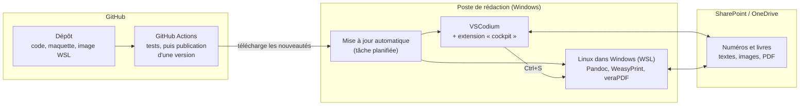
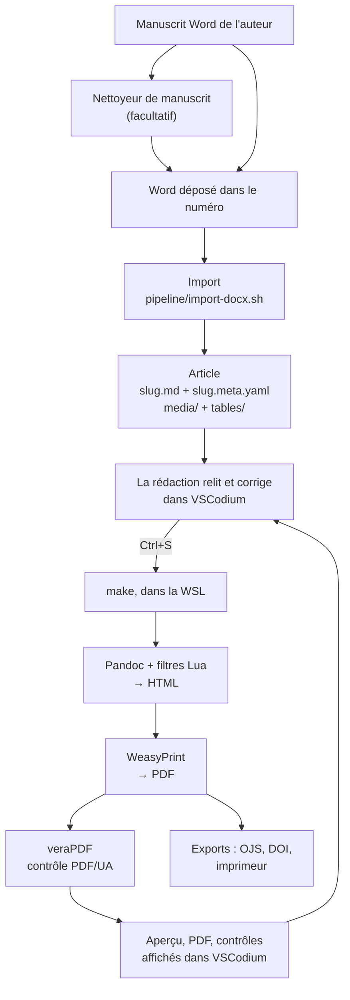
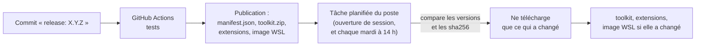
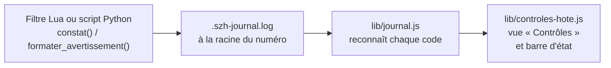
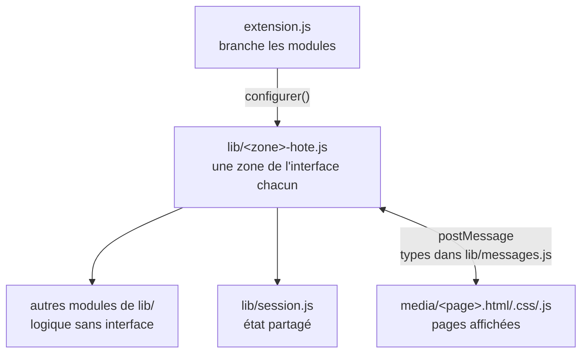

# Architecture de Pronto

Pronto est l'outil qui fabrique les publications des éditions SZH/CSPS : la *Revue suisse de
pédagogie spécialisée* (en français), la *Schweizerische Zeitschrift für Heilpädagogik* (en
allemand) et des livres.

Les rédactions travaillent dans l'éditeur VSCodium. Elles déposent les manuscrits Word d'un
numéro, Pronto les convertit en fichiers texte (Markdown), et chaque enregistrement produit le
PDF mis en page. Ce PDF est accessible : il respecte la norme PDF/UA-1, qui le rend lisible
par un lecteur d'écran.

Cette page donne la vue d'ensemble, puis décrit chaque partie du dépôt. Les mots propres à
Pronto sont expliqués à la fin, dans le [vocabulaire](#vocabulaire).

## Vue d'ensemble

Pronto vit à trois endroits.


```mermaid
flowchart LR
    subgraph GH["GitHub"]
        DEPOT["Dépôt<br/>code, maquette, image WSL"]
        CI["GitHub Actions<br/>tests, puis publication<br/>d'une version"]
        DEPOT --> CI
    end

    subgraph PC["Poste de rédaction (Windows)"]
        MAJ["Mise à jour automatique<br/>(tâche planifiée)"]
        VSC["VSCodium<br/>+ extension « cockpit »"]
        WSL["Linux dans Windows (WSL)<br/>Pandoc, WeasyPrint, veraPDF"]
        MAJ --> VSC
        MAJ --> WSL
        VSC -->|"Ctrl+S"| WSL
    end

    subgraph SP["SharePoint / OneDrive"]
        NUM["Numéros et livres<br/>textes, images, PDF"]
    end

    CI -->|"télécharge les nouveautés"| MAJ
    VSC <--> NUM
    WSL <--> NUM
```

| Endroit | Ce qu'on y trouve | Qui s'en occupe |
|---|---|---|
| GitHub | le code, la maquette, la recette de l'environnement Linux, les tests | le développeur |
| Le poste de rédaction | VSCodium, l'extension cockpit, l'environnement Linux `SZH-Publishing`, l'outillage copié dans `C:\ProgramData\SZH\toolkit` | la mise à jour automatique |
| SharePoint | le contenu seul : articles, chapitres, images, métadonnées, PDF ([`EMPLACEMENTS.md`](EMPLACEMENTS.md)) | les rédactions |

Le code n'est jamais copié dans un numéro. Corriger un style ou un défaut demande donc une
nouvelle version de Pronto, et non une retouche dossier par dossier.

## Le trajet d'un article


```mermaid
flowchart TD
    W["Manuscrit Word de l'auteur"]
    N["Nettoyeur de manuscrit<br/>(facultatif)"]
    D["Word déposé dans le numéro"]
    I["Import<br/>pipeline/import-docx.sh"]
    A["Article<br/>slug.md + slug.meta.yaml<br/>media/ + tables/"]
    E["La rédaction relit et corrige<br/>dans VSCodium"]
    M["make, dans la WSL"]
    H["Pandoc + filtres Lua<br/>→ HTML"]
    P["WeasyPrint<br/>→ PDF"]
    V["veraPDF<br/>contrôle PDF/UA"]
    X["Aperçu, PDF, contrôles<br/>affichés dans VSCodium"]
    EXP["Exports : OJS, DOI,<br/>imprimeur"]

    W --> N --> D
    W --> D
    D --> I --> A --> E
    E -->|"Ctrl+S"| M --> H --> P --> V --> X
    X --> E
    P --> EXP
```

1. **Préparer le manuscrit (facultatif).** Le nettoyeur remet un Word d'auteur au gabarit
   « Pronto – modèle d'article », contrôle la bibliographie et la typographie, et note ses
   corrections en révisions suivies. Voir
   [`ARCHITECTURE-nettoyeur-manuscrit.md`](ARCHITECTURE-nettoyeur-manuscrit.md).
2. **Importer.** `pipeline/import-docx.sh` lit le Word et crée le dossier de l'article : le
   texte en Markdown, la fiche de métadonnées en YAML, les images et les tableaux. Deux
   lecteurs existent : `pronto-lire.py` pour un Word rempli dans le gabarit Pronto,
   `docx-meta.py` pour les autres.
3. **Compiler.** À chaque `Ctrl+S`, VSCodium lance `make` dans la WSL. Pandoc transforme le
   Markdown en HTML en passant par une suite de filtres Lua (typographie, numérotation des
   figures, bibliographie…). WeasyPrint met le HTML en page et produit le PDF. veraPDF
   vérifie ensuite la conformité PDF/UA.
4. **Relire.** Le cockpit affiche l'aperçu, le PDF et la liste des problèmes relevés.
5. **Exporter.** Les exports partent vers OJS (la plateforme en ligne de la revue), vers
   l'enregistrement des DOI et vers l'imprimeur.

Un chapitre de livre suit le même trajet qu'un article.

## Comment un poste se met à jour


```mermaid
flowchart LR
    C["Commit « release: X.Y.Z »"] --> CI["GitHub Actions<br/>tests"]
    CI --> R["Publication :<br/>manifest.json, toolkit.zip,<br/>extensions, image WSL"]
    R --> T["Tâche planifiée du poste<br/>(ouverture de session,<br/>et chaque mardi à 14 h)"]
    T -->|"compare les versions<br/>et les sha256"| D["Ne télécharge<br/>que ce qui a changé"]
    D --> K["toolkit, extensions,<br/>image WSL si elle a changé"]
```

La procédure complète, et ce qu'il faut faire quand une mise à jour échoue, sont dans
[`MAINTENANCE.md`](MAINTENANCE.md). Publier une version est décrit dans
[`DEVELOPPEMENT.md`](DEVELOPPEMENT.md#publier-une-version).

## Comment un problème remonte à l'écran

Quand la compilation relève un problème (citation sans référence, image sans texte
alternatif, PDF non conforme…), elle écrit une ligne dans un journal. Le cockpit lit ce
journal et affiche le problème dans la vue « Contrôles de la compilation ».


```mermaid
flowchart LR
    F["Filtre Lua ou script Python<br/>constat() / formater_avertissement()"]
    J[".szh-journal.log<br/>à la racine du numéro"]
    JS["lib/journal.js<br/>reconnaît chaque code"]
    VUE["lib/controles-hote.js<br/>vue « Contrôles »<br/>et barre d'état"]
    F --> J --> JS --> VUE
```

Chaque ligne suit ce format :

    [<source>-<gravité>] <code> | <champ> | … | <phrase fr> | [de] <phrase de>

- `<source>` est la famille du contrôle : `import`, `meta`, `citations`, `livre`…
- `<gravité>` vaut `blocage` (la compilation s'arrête), `avertissement` ou `info`.
- `<code>` est un identifiant stable. Le cockpit en tire le message à afficher, dans la langue
  de l'interface.

Seules deux fonctions écrivent ces lignes : `constat()` dans `szh-commun.lua` pour les filtres
Lua, et `formater_avertissement()` dans `szh_commun.py` pour Python. La liste des codes
connus est tenue par `test/js/journal-codes.test.js`.

Le contrôle PDF/UA a son propre chemin : `lib/pdfua-hote.js` relance
`pipeline/verifier-ua.sh` après chaque compilation réussie et garde le verdict dans
`.szh-pdfua.json`.

## Revue, Zeitschrift et livre

Revue et Zeitschrift sont le même produit dans deux langues. Seule la clé `revue:` du fichier
`ausgabe.yaml` du numéro les distingue ; elle donne la langue, le nom et l'ISSN.

Le livre partage tout le reste : un chapitre se compile comme un article, avec les mêmes
filtres et le même import. Ce qui diffère est décidé dans une table, à un seul endroit par
partie du code :

| Partie | Où se décide la différence |
|---|---|
| Filtres Lua | `pipeline/filters/szh-contexte.lua` (`meta['szh-produit']`) |
| Compilation (`make`) | la présence d'un fichier `buch.yaml` dans le dossier |
| Cockpit | `PROFILS` dans `lib/profil.js` |
| Lanceur Windows | `$SzhProduits` dans `windows/szh-produits.ps1` |

Ce qui est propre à chacun :

| Partie | Revue et Zeitschrift | Livre |
|---|---|---|
| Filtres Lua | `maquette`, `titre-lignes`, `ressource`, `auteurs`, `rubrique` | `livre-titre`, `livre-sous-titre`, `livre-entete`, `livre-entete-image`, `livre-auteurs`, `sauts-uniques`, `qr` |
| Compilation | `Makefile` : un PDF et un HTML par article, galley Word pour OJS, pagination continue, Documentation | `profils/livre.mk` : chapitres, assemblage, PDF imprimeur, couverture, EPUB, HTML web |
| Python | `reimporter.py`, `pagination.py`, `documentation-kirby.py` | `livre-*.py`, `couverture.py`, `cmjn.py`, `liens-courts.py` |
| Feuilles de style | `print.css` | `styles/livre/*.css` |
| Cockpit | DOI, OJS, traductions, Documentation, pagination, réimport, envoi à l'auteur… | hors-sommaire, titre en lignes, sorties du livre, palette du livre |

Le moteur livre est décrit dans [`ARCHITECTURE-LIVRES.md`](ARCHITECTURE-LIVRES.md).

---

## Les parties du dépôt

### 1. La compilation (`pipeline/`)

Tout ce qui compile est dans `pipeline/` et tourne dans la WSL. On compile depuis le dossier
du numéro ou du livre :

```sh
make -f <toolkit>/pipeline/Makefile all
```

Le `Makefile` ne contient aucun chemin Windows : il tournerait tel quel dans un conteneur
Linux.

| Fichier | Rôle |
|---|---|
| `Makefile` | compile un numéro : PDF et HTML de chaque article, aperçu, galley Word, import, contrôle PDF/UA |
| `filtres.mk` | les listes de filtres Lua de chaque sortie (article, aperçu, chapitre, EPUB). Son en-tête explique l'ordre des filtres |
| `define weasy_ua` (dans `Makefile`) | l'appel à WeasyPrint, commun à toutes les sorties. Il essaie PDF/UA-1, puis un PDF balisé simple, puis un PDF sans balisage |
| `profils/livre.mk` | la compilation des livres |
| `verifier-ua.sh` | le contrôle PDF/UA par veraPDF ; `rapport-ua.py` traduit son rapport en fr et en de |
| `import-docx.sh` | l'import d'un Word ; son en-tête décrit les étapes |

`test/js/chaines-filtres.test.js` vérifie que les filtres communs sont dans le même ordre
partout.

#### Les filtres Lua (`pipeline/filters/`)

Chaque liste de filtres commence par `szh-contexte.lua`. Il fixe une fois la langue
(`meta.lang`), le produit (`revue`, `zeitschrift` ou `livre`) et l'unité (`article` ou
`chapitre`). Les filtres suivants relisent ces valeurs.

La langue se cherche dans cet ordre : la fiche de l'article, puis le produit, puis la clé
`lang:` du numéro ou du livre, puis le français. Seuls le français, l'allemand et l'italien
sont acceptés.

| Filtre | Rôle |
|---|---|
| `szh-commun.lua` | fonctions partagées par les autres filtres : contexte, langue, dates, lecture de clés, et `constat()` qui signale un problème |
| `szh-lire-config.lua` | lit une clé d'un fichier YAML, pour `make` |
| `szh-date-apercu.lua` | calcule la date imprimée d'une fiche, pour l'aperçu |
| `szh-contexte.lua` | fixe langue, produit et unité |
| `szh-niveaux.lua` | corrige les niveaux de titre (pas de saut de niveau) |
| `szh-listes-serrees.lua` | resserre les listes courtes |
| `szh-tabelle-inclure.lua` | insère les tableaux de `tables/` à leur place |
| `szh-tabelle-scope.lua` | marque les cellules d'en-tête des tableaux écrits en Markdown |
| `szh-typographie.lua` | applique la typographie maison selon la langue ([`TYPOGRAPHIE.md`](TYPOGRAPHIE.md)) |
| `szh-metafichier.lua` | remplace une image Word `.emf` ou `.wmf` par un repère visible |
| `szh-grille.lua` | regroupe plusieurs images en une figure |
| `szh-figure.lua` | construit les figures pour l'aperçu |
| `szh-numerotation.lua` | numérote figures et tableaux, pose textes alternatifs et crédits, signale une image sans texte alternatif |
| `szh-tableau-boite.lua` | empêche un tableau d'être coupé d'une façon qui casserait son balisage |
| `szh-legende-avant.lua` | place la légende avant l'image dans l'ordre de lecture |
| `szh-sections.lua` | numérote les titres |
| `szh-citations.lua` | insère la bibliographie et relie chaque appel de citation à sa référence |
| `szh-cesure.lua` | empêche la césure des noms propres, en français |
| `szh-exergue.lua` | cache l'exergue au lecteur d'écran dans la version publiée |
| `szh-notes.lua` | place les notes en bas de page |
| `szh-maquette.lua` | revue : couverture, en-têtes de page, nom et ISSN |
| `szh-titre-lignes.lua`, `szh-titre-metriques.lua` | revue : coupe le titre de couverture en lignes, à l'aide d'une table de largeurs |
| `szh-auteurs.lua` | revue : le bloc des auteurs et autrices |
| `szh-ressource.lua`, `szh-rubrique.lua` | revue : fiches et rubriques de la Documentation |
| `szh-livre-*.lua`, `szh-sauts-uniques.lua` | livre : titre, sous-titre, auteurs, encadré FALC, sauts de ligne |
| `szh-qr.lua`, `szh-qr-commun.lua`, `szh-qr-lister.lua` | livre : codes QR cliquables et liste de leurs adresses |
| `szh-sourcepos.lua`, `szh-ancres.lua`, `szh-apercu-lecteur-ecran.lua` | aperçu seulement : lien entre aperçu et texte source, ancres des titres, encadré « ce qu'entend un lecteur d'écran » |
| `szh-galley-docx.lua` | nettoie le Word envoyé à OJS |
| `szh-styles-corps.lua`, `szh-meta.lua`, `szh-legendes.lua`, `szh-titres.lua`, `szh-biblio-detacher.lua`, `szh-tabelle-reference.lua`, `szh-attributs-sains.lua` | import : les filtres que `import-docx.sh` applique à un Word, dans cet ordre |

#### Python et scripts (`pipeline/`)

Tout le Python de production tourne dans la WSL, avec le Python 3.13 de Debian et deux
environnements de l'image : `/opt/weasyprint` et `/opt/portraits`.

| Fichier | Rôle |
|---|---|
| `szh_commun.py` | fonctions partagées : messages d'avertissement, lecture YAML, slug, écriture sûre d'un fichier |
| `ooxml_lecture.py` | lecture d'un `.docx` : styles, paragraphes, images |
| `docx-meta.py`, `heritage_meta.py` | lecteur des Word hors gabarit : métadonnées, auteurs, photos, bibliographie |
| `pronto-lire.py`, `pronto_docx.py`, `pronto_modele.py` | lecteur des Word remplis dans le gabarit Pronto ; `pronto_modele.est_gabarit()` reconnaît un tel document |
| `docx-tables.py`, `docx-titres.py`, `docx-styles-corps.py` | tableaux en HTML, titres repérés par leur mise en forme, styles de paragraphe du gabarit |
| `docx-controle-import.py` | vérifie que rien du Word ne s'est perdu à l'import |
| `conversion_odt.py` | convertit `.odt` et `.docx` par LibreOffice |
| `import-medias.py`, `cmyk-rgb.py`, `portraits.py` | fin d'import : range les photos, détoure les portraits, convertit les images CMJN en RVB |
| `reimporter.py` | remplace le texte d'un article par un Word corrigé, en gardant le travail de la rédaction |
| `accent-css.py`, `apca.py` | couleur de l'année en CSS, calcul de contraste |
| `pagination.py`, `verifier-numerotation.py` | numéros de page continus dans un numéro ; même numérotation dans les deux langues |
| `documentation-kirby.py` | convertit la Documentation (format Kirby) en Markdown ([`FORMAT-DOCUMENTATION-KIRBY.md`](FORMAT-DOCUMENTATION-KIRBY.md)) |
| `manuscrit-nettoyer.py`, `manuscrit_*.py` | le nettoyeur de manuscrit ; règles Vale dans `pipeline/vale/` |
| `livre-*.py`, `couverture.py`, `cmjn.py`, `liens-courts.py` | le moteur livre |

#### Styles (`pipeline/styles/`) et gabarits (`pipeline/templates/`)

Les feuilles de style sont passées à Pandoc l'une après l'autre, et l'ordre compte :

1. `socle.css` : polices et valeurs communes ;
2. la feuille de la sortie : `print.css` pour la revue, `styles/livre/*.css` pour le livre ;
3. `partage-filtres.css` : le style des éléments créés par les filtres communs ;
4. la couleur de l'année.

`couleurs-reference.json` est l'unique table des couleurs de la maison. Le détail des sorties
est dans [`SORTIES.md`](SORTIES.md).

### 2. Le cockpit (`vscodium-extension/szh-cockpit/`)

Le cockpit est l'extension VSCodium qui ajoute la barre latérale « Pronto » : import, aperçu,
métadonnées, images, tableaux, contrôles, exports. C'est du JavaScript (CommonJS) chargé tel
quel, sans compilation. Une seconde extension, `szh-apercu`, affiche le PDF.

Le cockpit reconnaît un numéro à son fichier `ausgabe.yaml`, un livre à son `buch.yaml`. La
liste de tous ses modules est dans
[`szh-cockpit/README.md`](../vscodium-extension/szh-cockpit/README.md).


```mermaid
flowchart TD
    EXT["extension.js<br/>branche les modules"]
    HOTES["lib/&lt;zone&gt;-hote.js<br/>une zone de l'interface chacun"]
    PURS["autres modules de lib/<br/>logique sans interface"]
    SES["lib/session.js<br/>état partagé"]
    WV["media/&lt;page&gt;.html/.css/.js<br/>pages affichées"]
    EXT -->|"configurer()"| HOTES
    HOTES --> PURS
    HOTES --> SES
    HOTES <-->|"postMessage<br/>types dans lib/messages.js"| WV
```

- **`extension.js`** démarre l'extension et branche les modules entre eux. Il ne crée aucun
  panneau.
- **Un module par zone de l'interface** : `lib/<zone>-hote.js` (import, médias, métadonnées,
  contrôles, PDF/UA, moisson…). Chacun reçoit de `extension.js`, par sa fonction
  `configurer()`, les fonctions dont il a besoin pour appeler le reste. Son état lui est
  propre ; l'état partagé est dans `lib/session.js`.
- **Les autres modules de `lib/`** n'utilisent pas l'API de VSCodium, ou très peu. On les teste
  directement avec `node --test`.
- **Les pages** (`media/`) sont du HTML, du CSS et du JavaScript simples, sans framework.
  Elles échangent avec leur module par messages, dont les types sont listés dans
  `lib/messages.js`. Chaque panneau est ouvert par `panneauUnique()`
  (`lib/webviews/panneau.js`), qui garantit qu'il n'existe qu'une fois.

**Revue ou livre.** `lib/profil.js` décrit les deux profils, et pour chacun les fonctions
disponibles (`capacites`). Chaque capacité devient un contexte VSCodium `szh.peut.<nom>`, que
`package.json` utilise pour montrer ou cacher les commandes. La Zeitschrift utilise le profil
`revue`.

**Les textes de l'interface** sont tous dans `lib/i18n.js`, en français et en allemand.
`T(cle)` rend un texte dans la langue de l'interface ; `TP(cle, profil)` rend la variante
propre au livre quand elle existe.

**Les gabarits Twig** (courriels, exports du secrétariat, feuille de vérification) sont rendus
par `lib/gabarits.js`. Les scripts Windows passent par ce même moteur.

**L'Accueil** est la page qui s'ouvre quand on lance Pronto : produits, création d'un numéro
ou d'un livre, secrétariat, journal, nettoyeur de manuscrit, réglages. Il est porté par
`lib/accueil-hote.js` et les modules `accueil-*.js`.

**Les tests** : `test/js/webviews.test.js` affiche chaque page dans un faux navigateur, et
`test/js/hote.test.js` démarre l'extension sur un faux VSCodium (`test/js/hote-factice.js`).

### 3. Les scripts Windows (`windows/`)

Le raccourci « Pronto » lance `open-revue.ps1`. Celui-ci fait les tâches de démarrage du
poste, puis ouvre VSCodium sur l'Accueil, ou sur le numéro désigné par un lien `szh://`. Les
autres scripts installent, mettent à jour, créent, archivent et diagnostiquent.

Tous les scripts sont en PowerShell 5.1, sans les opérateurs de PowerShell 7 (`?.`, `??`,
`?:`, `&&`, `||`). Les fichiers `.ps1` sont en CRLF, UTF-8 avec BOM.

| Script | Rôle |
|---|---|
| `open-revue.ps1` | le raccourci « Pronto » ; `-Versions` ouvre la fenêtre « Changer de version… », qui sert à réparer un poste |
| `open-md.ps1` | ouvre un `.md` par double-clic |
| `new-revue.ps1`, `new-livre.ps1` | créent un numéro ou un livre |
| `archive-revue.ps1` | déplace un numéro ou un livre entre « en cours » et « archives » |
| `bootstrap.ps1` | installe un poste, une fois, en administrateur |
| `update-launcher.ps1`, `update.ps1` | la mise à jour, lancée par la tâche planifiée |
| `diagnostic.ps1` | l'état d'un poste sur une page |
| `uninstall.ps1` | désinstalle ; `-Simuler` montre ce qui serait supprimé |

`szh-common.ps1` est le seul fichier que les scripts chargent. Il charge à son tour les
fichiers `szh-*.ps1` : textes, emplacements SharePoint, rapports d'erreur, table des produits,
inventaire des postes, raccourcis, etc.

### 4. L'environnement Linux (`image/`)

La WSL `SZH-Publishing` est une Debian préparée par `image/Containerfile` et
`image/build-rootfs.sh` : Pandoc, WeasyPrint et ses dépendances Python figées, veraPDF, Vale,
profils de couleur. Toutes les versions sont épinglées, pour que deux postes produisent le
même PDF.

WeasyPrint est corrigé par quelques patchs, un par fonctionnalité, dans
`image/patches/weasyprint-<version>/`. On ne patche qu'en dernier recours, après avoir essayé
le CSS et le HTML. `image/patches/amont/` documente chaque patch pour le proposer aux auteurs
de WeasyPrint.

Changer quoi que ce soit dans `image/` reconstruit l'image à la version suivante. La
procédure est dans [`MAINTENANCE.md`](MAINTENANCE.md).

### 5. Les moissonneurs (`moissonneurs/`)

Les moissonneurs cherchent des nouveautés pour la rubrique Documentation : interventions
parlementaires (`parlement/`) et projets de recherche (`recherche/`). Ils ne créent pas de
fiche : ils déposent des propositions, que la rédaction accepte ou refuse dans le cockpit.
Ils tournent dans la WSL, lancés depuis le cockpit ou en ligne de commande. Voir
[`moissonneurs/LISEZMOI.md`](../moissonneurs/LISEZMOI.md),
[`FORMAT-PROPOSITIONS.md`](FORMAT-PROPOSITIONS.md) et [`FORMAT-MOISSONS.md`](FORMAT-MOISSONS.md).

### 6. La publication (`.github/workflows/`)

| Fichier | Rôle |
|---|---|
| `ci.yml` | à chaque push : tests sous Ubuntu et Windows, compilation du banc d'essai, contrôle PDF/UA |
| `release.yml` | après un `ci.yml` réussi sur un commit `release: X.Y.Z` : pose le tag, construit les extensions et le toolkit, publie `manifest.json`, reconstruit l'image si `image/` a changé |
| `manifest.json` | versions et empreintes sha256 de tout ce qui est publié |
| `windows/vsix.lock`, `windows/apps.lock` | versions et empreintes des extensions et applications tierces |
| `vscodium-user/` | réglages, raccourcis et tâches installés dans VSCodium |
| `revue-template/`, `livre-template/` | modèles d'un numéro et d'un livre neufs |

### 7. Les tests (`test/`)

Voir [`test/README.md`](../test/README.md) et [`DEVELOPPEMENT.md`](DEVELOPPEMENT.md).

---

## Principes de conception

- **Une décision, un endroit.** Ce qui distingue revue et livre est écrit dans une table
  (`PROFILS`, `$SzhProduits`, `filtres.mk`, `szh-contexte.lua`) que le reste du code lit.
- **Un seul outil par tâche** : un moteur de gabarits, un appel à WeasyPrint, une liste des
  filtres.
- **Reproductible** : l'image et les dépendances sont épinglées et vérifiées par sha256.
- **Sans droits d'administrateur** après l'installation : seul `bootstrap.ps1` en demande.
- **Portable** : la compilation, l'image et l'essentiel du cockpit ne dépendent pas de
  Windows. Ce qu'il faudrait refaire pour Linux et macOS est dans
  [`MULTIPLATEFORME.md`](MULTIPLATEFORME.md).

## Vocabulaire

| Mot | Sens |
|---|---|
| numéro | un numéro de la revue : un dossier sur SharePoint, avec un fichier `ausgabe.yaml` |
| produit | `revue` (français), `zeitschrift` (allemand) ou `livre` |
| profil | `revue` ou `livre`, dans le cockpit ; la Zeitschrift utilise le profil `revue` |
| slug | le nom de dossier d'un article, qui sert aussi de nom à ses fichiers |
| fiche | le fichier `<slug>.meta.yaml` d'un article : titre, auteurs, résumé, mots-clés… |
| gabarit Pronto | le modèle Word « Pronto – modèle d'article », que remplissent les auteurs |
| toolkit | l'outillage de Pronto copié sur le poste, dans `C:\ProgramData\SZH\toolkit` |
| WSL | Windows Subsystem for Linux : un Linux qui tourne dans Windows. Pronto y installe la distribution `SZH-Publishing` |
| image, rootfs | le système Linux complet de la WSL, construit par `image/` et publié avec chaque version qui le modifie |
| cockpit | l'extension VSCodium de Pronto |
| Accueil | la page du cockpit qui s'ouvre au lancement de Pronto |
| aperçu | la version HTML de l'article affichée à côté du texte ; elle n'est jamais publiée |
| constat | un problème relevé par la compilation et affiché dans la vue « Contrôles » |
| galley | le fichier d'un article déposé sur OJS (PDF, HTML ou Word) |
| verrou | un numéro gelé : ses fichiers sont en lecture seule jusqu'à ce qu'on le déverrouille |
| moissonneur | programme qui cherche des nouveautés pour la Documentation |
| proposition | une nouveauté trouvée par un moissonneur, en attente de la décision de la rédaction |
| PDF/UA | la norme d'accessibilité des PDF visée par Pronto ([`ACCESSIBILITE.md`](ACCESSIBILITE.md)) |
