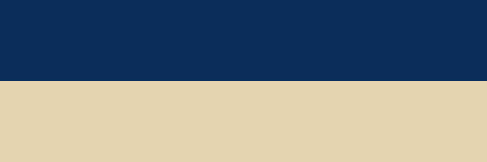

Cet article n'existe que pour l'épreuve : c'est la version française de la paire, dans un
numéro dont la revue est la Zeitschrift — le corps est donc dans une autre langue que la
revue, et `lang: fr` de la fiche doit l'emporter sur le `lang: de` du numéro.

**Divergence voulue** : la deuxième figure y est *sans légende*, là où la version allemande
lui en donne une. Le compteur de figures s'arrête donc à 1 ici et va à 2 là-bas, pour le
même article — c'est exactement l'écart que `make verifier-numerotation` doit signaler.
Ne pas « réparer » cette légende : c'est le cas que le corpus doit tenir.

# Situation de départ

Les niveaux de titre sautent à dessein : après ce niveau vient un quatrième, sans
troisième entre les deux. `szh-niveaux.lua` compacte les niveaux réellement présents en
2, 3, 4 — sans trou, comme l'exige le RGAA 9.1.

#### Niveau sauté

Ce titre est un quatrième niveau dans la source (`####`), après un premier (`#`). Au rendu
il doit être un deuxième rang, donc `<h3>`, et porter le numéro 1.1.

# Tableaux

Le premier tableau a une légende et une rangée d'en-tête. Le second n'a **ni légende ni
rangée d'en-tête** : il ne consomme aucun numéro, et un lecteur d'écran n'y trouve aucun
intitulé de colonne.

::: {.szh-tabelle src="tables/table-01.html"}
:::

::: {.szh-tabelle src="tables/table-02.html"}
:::

# Figures

La première figure porte une légende et une source : le crédit s'imprime « Source : » avec
son espace fine insécable (U+202F), qui doit se retrouver telle quelle dans la couche texte
du PDF, et non dégradée en espace ordinaire.

{alt="Deux bandes horizontales : bleu foncé et sable" source="Banc d'essai"}

{.szh-hors-figure alt="Trois bandes horizontales : sable, bleu ciel, blanc cassé" copyright="© SZH"}

# Discussion

Les noms de la bibliographie portent des diacritiques polonais, turcs et serbes. Les
ancrages des renvois doivent être identiques des deux côtés, dans le corps et dans la liste
(Zieliński, 2024 ; Şahin, 2023 ; Đurić, 2022).

# Références

Đurić, M. (2022). Inkluzivno obrazovanje u praksi. *Nastava i Vaspitanje, 71*(2), 145–162.

Şahin, A. (2023). Kaynaştırma uygulamalarında öğretmen tutumları. *Eğitim ve Bilim, 48*(3),
211–229.

Zieliński, P. (2024). Edukacja włączająca w szkole podstawowej. *Kwartalnik Pedagogiczny,
69*(1), 33–51.
