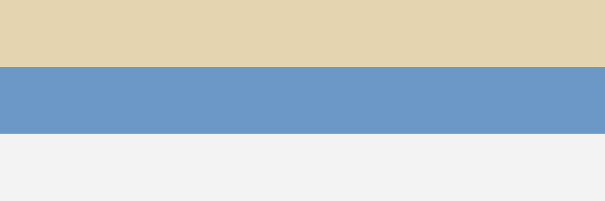

Dieser Artikel dient allein der Prüfung: er ist die deutsche Fassung des Paares, in der
Sprache der Zeitschrift. Sein französisches Gegenstück `participation-fr` trägt absichtlich
eine Bildlegende weniger — `make verifier-numerotation` muss diese Abweichung melden.

# Ausgangslage

Die Titelstufen dieses Artikels springen mit Absicht: nach dieser Stufe folgt eine vierte,
ohne dass eine dritte dazwischenliegt. `szh-niveaux.lua` verdichtet die tatsächlich
vorhandenen Stufen zu 2, 3, 4 — ohne Lücke, wie es RGAA 9.1 verlangt. Ohne diese
Verdichtung stünde hier ein `<h2>` und danach unmittelbar ein `<h4>`.

#### Übersprungene Stufe

Diese Stufe ist im Quelltext eine vierte (`####`), nach einer ersten (`#`). Im Rendering
muss sie als zweite Stufe erscheinen, also `<h3>`, und ihre Nummer muss 1.1 lauten — nicht
1.0.1.

# Tabellen

Die erste Tabelle hat eine Legende und eine Kopfzeile: sie wird nummeriert und ihre
Struktur liest sich von selbst. Die zweite hat **weder Legende noch Kopfzeile** — sie
verbraucht deshalb keine Nummer, und ein Screenreader findet in ihr keine Spaltenüberschrift.
Genau das soll die Kette bemerken.

::: {.szh-tabelle src="tables/table-01.html"}
:::

::: {.szh-tabelle src="tables/table-02.html"}
:::

# Abbildungen

Die erste Abbildung trägt eine Legende und eine Quelle; das französische Gegenstück
schreibt dort « Source : » mit schmalem geschützten Leerzeichen.

{alt="Zwei waagrechte Streifen: dunkelblau und sandfarben" source="Prüfkorpus"}

{alt="Drei waagrechte Streifen: sandfarben, hellblau, gebrochenes Weiss" copyright="© SZH"}

# Diskussion

Die Namen in der Literaturliste tragen polnische, türkische und serbische Diakritika. Die
Anker der Verweise müssen auf beiden Seiten identisch sein — im Text und in der Liste
(Zieliński, 2024; Şahin, 2023; Đurić, 2022).

# Literatur

Đurić, M. (2022). Inkluzivno obrazovanje u praksi. *Nastava i Vaspitanje, 71*(2), 145–162.

Şahin, A. (2023). Kaynaştırma uygulamalarında öğretmen tutumları. *Eğitim ve Bilim, 48*(3),
211–229.

Zieliński, P. (2024). Edukacja włączająca w szkole podstawowej. *Kwartalnik Pedagogiczny,
69*(1), 33–51.
