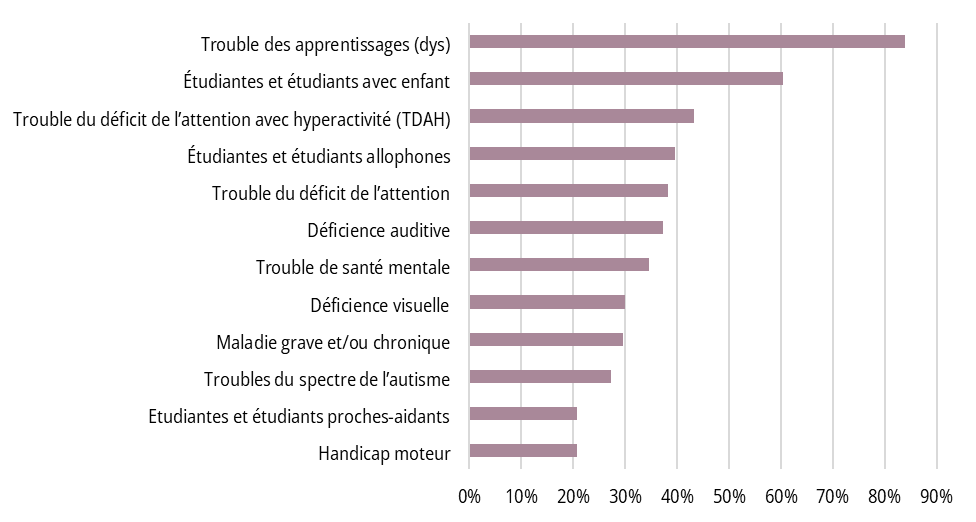

# Introduction 

En Suisse, le nombre d'étudiantes et étudiants dans l'enseignement supérieur, que ce soit à l'Université ou dans les Hautes Écoles, a plus que doublé depuis 2000 (Office fédéral de la statistique, 2025). Cette augmentation engendre une plus grande diversité de profils étudiants, incluant des personnes ayant des besoins éducatifs particuliers (BEP). Ces dernières présentent des troubles (comme les troubles des apprentissages, le trouble de l'attention avec ou sans hyperactivité, les troubles du spectre de l'autisme ou des troubles de la santé mentale), des déficiences (motrices ou sensorielles), des pathologies graves ou chroniques ou encore rencontrent des situations de vie particulières susceptibles d'entraver les apprentissages (telles que l'expérience migratoire, la non-maitrise de la langue d'enseignement, la parentalité ou le rôle de proches aidantes). Dans une précédente étude (Martin et al., 2025a), nous avons mis en évidence que les étudiantes et étudiants s'auto-identifiant comme présentant des BEP expriment des attentes d'amélioration concernant l'accompagnement pédagogique ainsi que les aides et aménagements proposés, tout en reconnaissant les efforts significatifs déployés dans leurs contextes de formation.

L'augmentation de la diversité étudiante et des besoins spécifiques qui l'accompagnent questionne les pratiques enseignantes : quelles modalités pédagogiques pourraient permettre au plus grand nombre d'étudiantes et étudiants de réaliser les apprentissages visés ? Le champ de la pédagogie se saisit de cette interrogation en partant du postulat que la diversité est désormais la norme dans l'enseignement (Meyer et al., 2014). Deux approches théoriques permettent de soutenir la diversité et l'inclusion : la Conception universelle de l'apprentissage (CUA) (PCUA, s.d.) et l'approche du Modèle de développement humain -- Processus de production du handicap (MDH-PPH) (RIPPH, 2025). La CUA (Rose & Meyer, 2002) promeut des pratiques pédagogiques flexibles adaptées à la diversité des apprenantes et apprenants en offrant des moyens variés de représentation, d'expression et d'engagement. Le MDH-PPH (Fougeyrollas et al., 1998 ; Fougeyrollas, 2010) permet de comprendre les situations de handicap rencontrées par les étudiantes et étudiants comme le produit de l'interaction entre leurs caractéristiques personnelles et les obstacles présents dans leur environnement de formation. Cette approche met ainsi en lumière l'importance d'adapter les contextes pour favoriser la pleine participation sociale. Il ne s'agit pas de diminuer les exigences en termes de développement des compétences académiques et professionnelles dans l'enseignement supérieur, mais de proposer un environnement d'apprentissage inclusif favorisant l'atteinte des objectifs visés par les plans d'études (CAST, 2024).

Il ne s'agit pas de diminuer les exigences en termes de développement des compétences académiques et professionnelles dans l'enseignement supérieur, mais de proposer un environnement d'apprentissage inclusif favorisant l'atteinte des objectifs visés par les plans d'études

Où le corps enseignant se situe-t-il concrètement dans ces questionnements pédagogiques ? Quelle importance accorde-t-il aux pratiques pédagogiques inclusives pertinentes dans le contexte de la formation professionnalisante de niveau supérieur ? Lesquelles implémente-t-il déjà, que ce soit lors de la planification des enseignements, de l'animation des cours ou encore de l'évaluation des apprentissages ? Quels freins et besoins identifie-t-il pour la mise en œuvre de pratiques pédagogiques favorisant l'inclusion ? La présente étude a été guidée par ces questionnements.

# Méthode

## Population

L'étude a recueilli le point de vue d'enseignantes et enseignants de la HES-SO sur leurs pratiques d'enseignement inclusives. Elle est complémentaire à une précédente étude menée du point de vue d'étudiantes et d'étudiants de la HES-SO sur le même thème (Martin et al., 2025a). Sur 428 personnes qui ont entamé l'enquête en ligne, 217 l'ont complétée. Les présentes analyses portent sur ces 217 réponses. Parmi les personnes répondantes se trouvaient 44 % de femmes et 46 % d'hommes ; 10 % n'ont pas souhaité répondre. 21 % enseignaient depuis 5 ans ou moins, 25 % depuis 5 à 10 ans, 35 % depuis 10 à 20 ans et 19 % depuis plus de 20 ans. Concernant les niveaux d'enseignement, 10 % dispensaient des cours en propédeutique, 76 % au Bachelor en première année, 78 % au Bachelor en deuxième année, 76 %, au Bachelor en troisième année, 28 % au Master première année, 20 % au Master en deuxième année et 12 % à d'autres niveaux (postgrade, formation continue, etc.). Les personnes répondantes étaient issues de 25 des 28 Hautes écoles de la HES-SO représentant les six domaines de formation suivants : (1) Design et Arts visuels, (2) Économie et Services, (3) Ingénierie et Architecture, (4) Musique et Arts de la scène, (5) Santé et (6) Travail social. Les filières de formation les plus représentées étaient les suivantes : Travail social (17 % des participantes et participants), Soins infirmiers (16 %), Économie d'entreprise (8 %).

Sur l'ensemble des personnes ayant répondu au questionnaire, 54 % avaient connaissance de l'existence d'un service de soutien aux apprentissages proposé aux étudiantes et étudiants à BEP au sein de leur Haute école

Sur l'ensemble des personnes ayant répondu au questionnaire, 54 % avaient connaissance de l'existence d'un service de soutien aux apprentissages proposé aux étudiantes et étudiants à BEP au sein de leur Haute École et 93 % avaient déjà été confrontées à des étudiantes et étudiants présentant des BEP dans le cadre de leur activité professionnelle. La Figure 1 détaille les situations d'étudiantes et étudiants rencontrées, de la plus courante à la plus rare.

{width="6.247818241469816in" height="3.3402777777777777in" alt="Trouble des apprentissages (dys) : 84% Étudiantes et étudiants avec enfant : 60% Trouble du déficit de l’attention avec hyperactivité (TDAH) : 43% Étudiantes et étudiants allophones : 40% Trouble du déficit de l’attention : 38% Déficience auditive : 37% Trouble de santé mentale : 35% Déficience visuelle : 30% Maladie grave et/ou chronique : 29% Troubles du spectre de l’autisme : 27% Etudiantes et étudiants proches-aidants : 21% Handicap moteur : 21%"}

## Procédure

Un mailing contenant l'enquête en ligne pour les enseignantes et enseignants de la HES-SO a été transmis par le rectorat de la HES-SO aux 28 Hautes Écoles, qui l'ont diffusé. Les personnes intéressées ont pu, avant d'accéder au questionnaire en ligne, prendre connaissance des objectifs de l'étude et donner leur consentement à l'utilisation des données dans le cadre de l'enquête. Le questionnaire, hébergé sur *LimeSurvey*, nécessitait environ 20 minutes pour être complété. Le protocole de l'étude a été approuvé par la [Commission d'éthique de la recherche sur l'être humain du Canton de Vaud](https://www.cer-vd.ch/).

## Collecte des données

L'enquête comprenait un questionnaire de 72 items répartis en 5 sections : (1) informations démographiques (Haute École et filière d'étude, etc.), (2) connaissances des aménagements proposés et situations rencontrées, (3) évaluation de l'importance perçue de pratiques pédagogiques inclusives et de la fréquence de leur mise en œuvre, (4) freins à la mise en place de pratiques pédagogiques inclusives et besoins recensés, (5) accessibilité numérique des enseignements. Il comprenait des questions ouvertes et des questions fermées. Cet article se centre sur les réponses aux questions fermées des sections (1) à (4). Le questionnaire a été élaboré par les autrices de l'étude en s'appuyant notamment sur le questionnaire de Kennel et al. (2021) et sur l'approche de la CUA (CAST, 2024), adapté au contexte de la HES-SO et aux objectifs de l'étude. Le questionnaire est disponible par le lien suivant : <https://osf.io/gj346>.

# Résultats

## Quelles sont les pratiques pédagogiques inclusives *jugées importantes* par les enseignantes et enseignants ?

Les Tableaux 1, 2 et 3 exposent l'importance qu'accordent les enseignantes et enseignants interrogés à un certain nombre de pratiques pédagogiques inclusives. Une liste de 49 items était proposée et il s'agissait d'indiquer si la pratique citée était considérée comme importante, pas importante ou si la personne interrogée était sans avis. Pour une meilleure lisibilité des 49 items concernés, ces derniers sont organisés selon trois catégories : (1) la planification des enseignements, (2) l'animation des cours et (3) l'évaluation des apprentissages. Cette catégorisation permet d'apporter des éclairages concrets sur la pratique enseignante.

::: {.szh-tabelle src="tables/table-01.html"}
:::

Note : les résultats correspondent au pourcentage du total des répondantes et répondants

Le Tableau 1 indique que les enseignantes et enseignants interrogés estiment majoritairement (plus de 80 %) que la priorité est de fournir les supports de cours et ressources pédagogiques accessibles en ligne. L'accompagnement personnalisé des étudiantes et étudiants à BEP, via des temps d'échange, est également largement plébiscité, tout comme l'accessibilité des locaux. Entre 60 % et 79 % des personnes répondantes soulignent l'importance d'adapter les supports d'apprentissage, de transmettre le plan du cours à l'avance et de partager leurs notes et schémas. L'accompagnement global via des permanences proposées aux étudiantes et étudiants pour répondre à leurs questions au sujet de la matière enseignée est aussi valorisé. Les pratiques estimées comme importantes par 40 % à 59 % des enseignantes et enseignants interrogés incluent des adaptations spécifiques aux BEP, un allègement des horaires, l'enregistrement des cours, et la création d'espaces d'échange. Les pratiques jugées importantes par une minorité des enseignantes et enseignants ayant répondu au questionnaire (moins de 20 %) concernent la réduction de la charge de travail pour toutes et tous, y compris pour les étudiantes et étudiants à BEP.

::: {.szh-tabelle src="tables/table-02.html"}
:::

Note : les résultats correspondent au pourcentage du total des répondantes et répondants

La grande majorité des enseignantes et enseignants a estimé important l'ensemble des pratiques pédagogiques inclusives de la catégorie « animation des cours » (Tableau 2) : favoriser la participation des étudiantes et étudiants ; proposer des rappels de la matière enseignée en début de cours et une synthèse des éléments importants en fin de cours ; faire des liens entre la matière enseignée et les objectifs visés ; proposer des modalités pédagogiques diversifiées et enrichir les ressources pédagogiques du cours par des supports visuels.

::: {.szh-tabelle src="tables/table-03.html"}
:::

Note : les résultats correspondent au pourcentage du total des répondantes et répondants

Selon le Tableau 3, un pourcentage élevé des personnes répondantes juge important, dans le cadre des évaluations des apprentissages, l'autorisation de soumettre les travaux (p. ex., dossiers) par voie électronique ainsi que l'usage d'outils numériques comme les correcteurs orthographiques. Accorder plus de temps et adapter les conditions d'examen (salle, casque, ordinateurs, etc.) spécifiquement pour les étudiantes et étudiants à BEP sont des mesures largement soutenues par les enseignantes et enseignants interrogés. Entre 60 % et 79 % des personnes interrogées appuient l'idée de diversifier les modes d'évaluation des apprentissages, de fournir des exemples d'examens réussis, et d'adapter les examens. Les pratiques considérées comme moyennement importantes (40 % à 59 %) concernent l'octroi de délais supplémentaires pour les travaux à domicile et la possibilité de proposer différents formats d'examen. Les pratiques estimées importantes par une minorité d'enseignantes et enseignants interrogés (moins de 40 %) sont la non-évaluation de l'orthographe sur demande des étudiantes et étudiants, le choix de la forme d'évaluation par les étudiantes et étudiants, et la prise en compte d'activités d'évaluation continues validées en cours de semestre dans la note finale.

## Quelles sont les pratiques pédagogiques inclusives *adoptées* par les enseignantes et enseignants ?

Les Tableaux 4, 5 et 6 présentent les pratiques pédagogiques inclusives fréquemment mises en œuvre par les enseignantes et enseignants interrogés. La même liste que précédemment était proposée et il s'agissait d'indiquer la fréquence de leur application : la plupart du temps, peu ou jamais. Pour faciliter la lecture, ces pratiques sont à nouveau organisées selon les trois mêmes catégories que précédemment et seul le pourcentage indiquant les pratiques les plus couramment mises en place a été retenu.

::: {.szh-tabelle src="tables/table-04.html"}
:::

Note : les résultats correspondent au pourcentage du total des répondantes et répondants

Les mesures les plus couramment mises en œuvre en termes de planification des enseignements (plus de 80 %) concernent la mise à disposition des supports de cours et documents en ligne, ainsi que les adaptations spécifiques pour les étudiantes et étudiants (Tableau 4). Entre 70 % et 79 % déclarent utiliser une plateforme numérique pour partager les ressources et communiquer, et fournir le plan du cours ainsi que les supports à l'avance. Les pratiques moyennement appliquées (40 % à 57 %) incluent l'invitation des étudiantes et étudiants à BEP à discuter de leurs besoins, la mise en ligne de notes et schémas ainsi que l'organisation de permanences. Moins de 39 % des personnes répondantes adaptent réellement leurs supports, offrent un soutien pédagogique ciblé, ou mettent en place un forum d'échange. Seuls 21 % du corps enseignant de notre étude permet l'enregistrement des cours ou l'échelonnement des formations. Très peu (moins de 20 %) proposent un glossaire, utilisent des outils pour l'accessibilité ou allègent les horaires et les charges de travail.

::: {.szh-tabelle src="tables/table-05.html"}
:::

Note : les résultats correspondent au pourcentage du total des répondantes et répondants

Le Tableau 5 indique que les mesures les plus mobilisées pendant l'animation des cours (plus de 80 %) consistent à encourager activement la participation des étudiantes et étudiants, à introduire chaque séance par un résumé du contenu à venir et à conclure par un récapitulatif. Entre 60 % et 79 % des personnes répondantes déclarent utiliser des supports visuels complémentaires (livres, vidéos, sites, etc.), faire le lien entre objectifs et contenus, varier les formats pédagogiques (classe inversée, travaux en groupe, etc.) et répéter les questions avant d'y répondre. Les pratiques moins répandues (moins de 39 %) incluent l'organisation de pauses régulières et l'utilisation de technologies interactives pour stimuler la participation. Enfin, la possibilité de suivre les cours à distance est très rarement mise en place (5 %).

::: {.szh-tabelle src="tables/table-06.html"}
:::

Note : les résultats correspondent au pourcentage du total des répondantes et répondants

Selon le Tableau 6, parmi les pratiques pédagogiques inclusives les plus mobilisées sur le plan de l'évaluation des apprentissages (plus de 80 %), figurent la soumission électronique des travaux et l'octroi de temps supplémentaire pour les examens. Entre 60 % et 79 % des personnes répondantes autorisent l'usage de technologies (dictionnaires, correcteurs) et présentent des exemples de questions d'examen. Les mesures moyennement mises en œuvre (40 % à 59 %) incluent la diversification des modalités d'évaluation pour démontrer la compréhension (oral, écrit, travaux à effectuer, etc.), la fourniture d'exemples de bonnes réponses, des conditions d'examen adaptées (p. ex., proposer un examen oral à la place d'un examen écrit) et des délais supplémentaires pour les étudiantes et étudiants à BEP. Les pratiques les moins appliquées (moins de 39 %) concernent la non-évaluation de l'orthographe sur demande, l'échelonnement des travaux, l'adaptation des modalités d'examen (oral/écrit) et les formats multiples. Seules de faibles proportions (entre 8 % et 14 %) autorisent les travaux supplémentaires comptabilisés dans la note finale, y compris pour les étudiantes et étudiants à BEP (p. ex., un travail écrit complémentaire).

## Quels sont les *freins* et les *besoins identifiés* par les enseignantes et enseignants pour la mise en œuvre de pratiques pédagogiques inclusives ?

Le Tableau 7 met en évidence deux principaux freins à la mise en place de pratiques inclusives : le manque de ressources (73 %) et de temps (69 %). Des préoccupations concernant l'équité au niveau des évaluations (59 %) et la possibilité d'atteindre les objectifs de formation (54 %) sont également largement partagées.

::: {.szh-tabelle src="tables/table-07.html"}
:::

Note : les résultats correspondent au pourcentage du total des répondantes et répondants

Le Tableau 8 expose quant à lui les ressources dont les enseignantes et enseignants auraient besoin afin de proposer des enseignements plus inclusifs. Les besoins prioritaires pour favoriser l'inclusion concernent surtout des moyens concrets : heures supplémentaires (69 %) et collaboration avec les responsables des aménagements (63 %). Des besoins en formation (44 %) et en soutien humain (assistantes et assistants, pairs, personnes expertes) sont également fortement exprimés.

::: {.szh-tabelle src="tables/table-08.html"}
:::

Note : les résultats correspondent au pourcentage du total des répondantes et répondants

# Discussion

Les résultats de cette étude mettent en évidence un écart parfois significatif entre l'importance accordée par des enseignantes et enseignants de la HES-SO à certaines pratiques pédagogiques inclusives et leur réelle mise en œuvre (voir Tableau 9 en [Annexe](#annexe)). Ce décalage s'observe notamment dans des pratiques considérées comme importantes, mais peu appliquées, telles que l'offre d'un soutien pédagogique spécifique pour les étudiantes et étudiants à BEP, la vérification de l'accessibilité des salles de cours ou encore l'échelonnement de la formation (ce dernier n'étant généralement pas du ressort du corps enseignant). Ces mesures présentent un écart supérieur à 50 %, ce qui souligne des zones de tension majeures entre intentions et pratiques. Des écarts notables mais plus modérés (entre 30 et 36 %) sont constatés pour des pratiques telles que l'adaptation du format des présentations de cours et des modalités d'évaluations, l'usage d'outils numériques accessibles ou la disponibilité pour répondre aux besoins spécifiques des étudiantes et étudiants. Finalement, deux mesures jugées moyennement importantes, la mise à disposition d'un glossaire et l'enregistrement des cours montrent également un écart moyen (entre 20 et 25 %).

Les écarts présentés ci-dessus traduisent souvent une volonté de faire, mais limitée par divers obstacles structurels et organisationnels

Les écarts présentés ci-dessus traduisent souvent une volonté de faire, mais limitée par divers obstacles structurels et organisationnels. Dans notre étude, les freins identifiés à la mise en œuvre concrète de pratiques inclusives sont principalement institutionnels : absence de directives claires assorties de mesures concrètes pour les accompagner (heures contractualisées, reconnaissance institutionnelle, ressources financières, etc.), manque de collaboration avec les services dédiés, manque de soutien pédagogique, ainsi que des peurs liées à la normalisation des adaptations (effet domino, complexification des dispositifs, etc.). Ces constats rejoignent ceux de la littérature (Kennel et al., 2021 ; Segon et al., 2017), qui insistent sur l'importance d'un cadre de gouvernance clair, soutenant et cohérent. Les enseignantes et enseignants expriment également des besoins concrets : du temps dédié, des formations ciblées sur les pratiques inclusives, un soutien pédagogique continu ainsi qu'un dialogue plus structuré avec les directions et le corps étudiant.

Un deuxième niveau d'analyse indique que certaines pratiques bénéficient d'une forte cohérence entre leur importance perçue et leur mise en œuvre concernant : la planification des enseignements (mise en ligne de documents de cours, mise à disposition à l'avance du plan du cours, etc.) ; l'enseignement (rappels réguliers des notions importantes, modalités interactives, supports visuels inclusifs, etc.) ; et l'évaluation des apprentissages (mise à disposition d'exemples de questions d'examen, temps supplémentaire pour les personnes ayant des BEP, possibilité de rendre les travaux par voie électronique, etc.). Ces éléments témoignent d'une volonté réelle d'inclusion, dès lors que les mesures sont perçues comme réalisables et suffisamment encadrées.

La présente étude met en relief une sensibilité marquée du corps enseignant de la HES-SO vis-à-vis de l'inclusion dans les enseignements ainsi qu'un certain nombre de pratiques pédagogiques inclusives déjà largement appliquées

Enfin, certaines mesures, jugées peu importantes et peu mises en œuvre (moins de 20 %), concernent principalement des ajustements perçus comme radicaux, tels que la réduction de la charge de travail ou l'évaluation différenciée de l'orthographe. Ces données révèlent un consensus sur les limites acceptables des pratiques pédagogiques inclusives, notamment en lien avec la crainte d'un impact sur la qualité de la formation, l'égalité de traitement ou l'atteinte des compétences professionnelles visées.

Par ailleurs, il convient de souligner que les résultats de cette étude reposent sur des données déclaratives, susceptibles de refléter davantage des intentions que des pratiques réelles. Une approche complémentaire, mobilisant des observations sur le terrain et des entretiens, permettrait d'affiner l'analyse des pratiques effectives. De plus, la mise en regard avec les besoins exprimés par les étudiantes et étudiants serait précieuse pour identifier les convergences et les divergences entre le corps enseignant et le corps étudiant, et ajuster les priorités institutionnelles en faveur d'une culture inclusive partagée. Ce dernier aspect fera l'objet d'un prochain article.

# Conclusion : vers des pratiques pédagogiques plus inclusives ?

La présente étude met en relief une sensibilité marquée du corps enseignant de la HES-SO vis-à-vis de l'inclusion dans les enseignements ainsi qu'un certain nombre de pratiques pédagogiques inclusives déjà largement appliquées. Elle révèle également des écarts parfois notables entre l'importance accordée à certaines pratiques pédagogiques inclusives et leur mise en œuvre effective, qui demeure à ce jour encore en développement. Ce second constat appelle une action collective, car l'inclusion ne peut reposer uniquement sur les épaules du corps enseignant. Elle requiert également l'engagement coordonné des directions, des responsables de filière, des services de soutien, mais aussi des étudiantes et étudiants.

Il ne s'agit pas de proposer des formations « au rabais », mais bien de diversifier les chemins pour atteindre les objectifs d'apprentissage et les compétences visées par les cursus de formation

L'un des enjeux clés soulevés par cette recherche consiste à rappeler que l'inclusion ne s'oppose pas aux exigences académiques ni aux attentes envers les étudiantes et les étudiants. Il ne s'agit pas de proposer des formations « au rabais », mais bien de diversifier les chemins pour atteindre les objectifs d'apprentissage et les compétences visées par les cursus de formation. Nous avons dans ce sens constaté que des pratiques perçues comme plus radicales suscitaient peu l'adhésion du corps enseignant.

Les résultats de cette étude mettent en lumière plusieurs pistes d'action concrète à destination, notamment des directions des Hautes Écoles pour soutenir les pratiques pédagogiques inclusives dans l'enseignement supérieur.

-   Maintenir et valoriser les pratiques pédagogiques déjà en place, notamment la mise à disposition des supports de cours et l'adaptation des examens pour les étudiantes et étudiants à BEP.

-   Encourager les pratiques faciles à mettre en œuvre, comme les rappels en début de cours, les synthèses en fin de séance ou l'usage de supports visuels.

-   Renforcer la formation continue sur les besoins éducatifs particuliers et les pratiques pédagogiques inclusives.

-   Développer une politique institutionnelle claire, avec des lignes directrices, des ressources dédiées, une communication efficace et des personnes référentes.

-   Favoriser la flexibilité des cursus et modalités d'évaluation, en maintenant des standards académiques exigeants.

Pour les personnes désireuses d'approfondir cette thématique, un ouvrage issu de la recherche présentée dans cet article -- *[Diversité et réussite dans l'enseignement supérieur : Conseils pour la communauté étudiante, enseignante et les directions](https://www.hetsl.ch/organisation/egalite-et-diversite/apprentissages-et-diversite)* -- propose des pistes de réflexion et d'action pratiques destinées à l'ensemble des actrices et acteurs de l'enseignement supérieur (Martin et al., 2025b).

::: {.szh-biblio src="03-martin.biblio.md"}
:::

# Annexe

Les pratiques pédagogiques inclusives sont organisées en trois catégories (Planifier les enseignements, Animer les cours et Évaluer les apprentissages). Les colonnes 2 et 3 reprennent les résultats présentés dans les Tableaux 1 à 6 et la dernière colonne indique, en ordre décroissant, le pourcentage d'écart entre les pratiques jugées importantes par les personnes et la fréquence à laquelle elles les appliquent.

::: {.szh-tabelle src="tables/table-09.html"}
:::

Note : les résultats correspondent au pourcentage du total des répondantes et répondants
