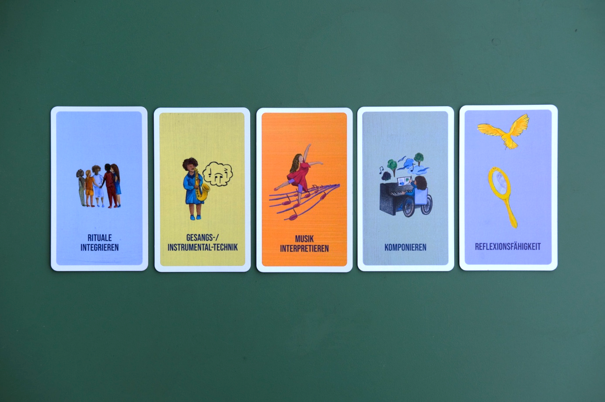

# Partizipation durch You «C» Cards

Partizipation bezeichnet die aktive Einmischung und Einflussnahme auf die Gestaltung des eigenen Lernens und der Lernumgebung (Kärtner et al., 2023). Gerade in spezialisierten Bildungsbereichen wie dem Musikunterricht kann Partizipation die intrinsische Motivation und das Wohlbefinden der Lernenden signifikant steigern (ebd.). Die Selbstbestimmungstheorie nach Decy und Ryan (1993) geht von drei grundlegenden psychologischen Bedürfnissen aus: Autonomie, Kompetenz und Bezogenheit. Werden diese untergraben, kann dies dazu führen, dass Lernende das Musizieren gänzlich aufgeben (Evans et al., 2012).

Die *You «C» Cards* sind aus der Reflexion über meine eigene Lernbiografie entstanden, die massgeblich durch meine Neurodivergenz (Aufmerksamkeitsdefizit-/Hyperaktivitätssyndrom \[ADHS\]) geprägt wurde. Besonders während meiner Grundschulzeit empfand ich den traditionellen Unterricht oft als ein Labyrinth voller Hindernisse, in dem ich Anweisungen befolgen musste, deren Sinn und Zweck mir nicht immer klar waren. In meiner musikalischen Ausbildung fehlte mir das Gefühl der Autonomie und Kompetenz, da ich oft einfach Verbesserungsvorschläge aufzunehmen hatte. Durch die vielen Lösungsvorschläge, die nicht meinen eigenen Gedanken entsprangen, fühlte ich mich oft nicht gut genug. Ich sah deshalb die Notwendigkeit, ein didaktisches Werkzeug zu schaffen, welches die psychologischen Grundbedingungen nach Autonomie, Kompetenz und Bezogenheit systematisch unterstützt. Das «C» im Namen steht für *can, choose, create* und *construct.* Das Konzept wurde in interdisziplinärer Zusammenarbeit mit Fachpersonen aus der Musikpädagogik, der Heilpädagogik und der Psychologie entwickelt.

# Fundierung, Didaktik und Design

Die *You «C» Cards* sind ein Set aus 80 farbig illustrierten Piktogrammkarten. Jede Karte enthält jeweils einen Begriff (entweder eine Kompetenz oder eine Tätigkeit) und eine ansprechende grafische Darstellung dieses Begriffs. Die grafischen Darstellungen sind klar, reduziert und diversitätsfreundlich gestaltet. Die Karten sind in zwei Hauptkategorien aufgeteilt:

-   *Kompetenzkarten* (zielorientiert) machen Lernziele und Lernfelder sichtbar, zum Beispiel Selbstständigkeit, Motivation und Reflexionsfähigkeit. Die Begriffe orientieren sich an der Lernzieltaxonomie nach Krathwohl (2002) und den revidierten Kompetenzfeldern nach Cincera (2023). Die Lernzieltaxonomie nach Krathwohl (2002) beschreibt die affektive Dimension des Lernens und umfasst Stufen von der blossen Wahrnehmung über das aktive Reagieren und Bewerten bis hin zur Integration von Werten in die eigene Persönlichkeit. Die revidierten Kompetenzfelder nach Cincera (2023) strukturieren Bildung für nachhaltige Entwicklung in miteinander verknüpfte Wissens-, Handlungs-, Bewertungs- und Reflexionskompetenzen, die Lernende zur aktiven und verantwortungsvollen Mitgestaltung befähigen.

-   *Aktionskarten* (prozessorientiert): Sie bieten konkrete Handlungsmöglichkeiten und Werkzeuge (z. B. das eigene Lernen organisieren, eine Atemübung machen).

Die Begriffe sind unterschiedlich komplex und bedürfen teilweise der Auseinandersetzung und Klärung. Natürlich gibt es immer Interpretationsspielraum und viele Möglichkeiten, individuelle Favoriten zusammenzustellen.

{width="6.299172134733158in" height="2.925462598425197in"}

# Inklusiver Mehrwert in neurodivers-sensitiven Settings

## Visuelle Kommunikation und Neurodivergenz (*Picture Learning*)

Die visuelle und reduzierte Gestaltung der *You «C» Cards* ist gezielt auf die Anforderungen neurodivers-sensitiver Lehr- und Lernsettings ausgerichtet:

-   *Orientieren statt überfordern:* Wenn Schüler:innen sich auf zu viele Dinge gleichzeitig konzentrieren sollen, führt das häufig zu Überforderung und Frustration. Visuelle Hilfsmittel haben sich in der Heilpädagogik seit Langem etabliert (Golombek, 2021). Gerade bei Neurodivergenz, beispielsweise ADHS oder Autismus-Spektrum, wirkt sich eine klare, aber flexible Unterrichtsstruktur positiv aus (Boerger, 2023). Der Fokus wird klar gesetzt und es kann sensibler auf Bedürfnisse eingegangen werden. Die Karten schaffen Orientierung und vermitteln Stabilität und Sicherheit.

-   *Reduktion kognitiver Last:* Jede Karte fokussiert auf einen einzelnen Begriff beziehungsweise ein Thema und hat eine klare, reduzierte Illustration. Dies ist relevant, da Bilder zwar das Erinnern fördern (Reid, 1990), aber nicht unbedingt das Verständnis steigern. Tatsächlich können Bilder, wenn sie nicht gut strukturiert sind, eine zusätzliche kognitive Belastung erzeugen (Florax & Ploetzner, 2010). Die reduzierte Gestaltung der *You «C» Cards* wirkt dieser Überforderung entgegen.

-   *Barrieren abbauen:* Visuelle Hilfsmittel machen Inhalte zugänglicher und helfen, Missverständnisse zu vermeiden (Golombek, 2021). Lernende mit eingeschränkten sprachlichen Fähigkeiten können durch die Kombination von Kompetenz- und Aktionskarten aktiv am Unterrichtsgeschehen teilnehmen und Entscheidungen treffen. Durch die Nutzung von Piktogrammen, die mit Systemen wie METACOM kombinierbar sind, können auch Lernende mit eingeschränkten sprachlichen Fähigkeiten teilhaben und Entscheidungen treffen.

**Strukturierte Entscheidungsfindung und Autonomie**

Die *You «C» Cards* fördern die Autonomie, indem sie Entscheidungsoptionen visualisieren. Dies ist für die Partizipation von zentraler Bedeutung.

-   *Partizipationsstufen:* Das Modell von Kärner et al. (2023) ist ein Stufenmodell, das die Einflussmöglichkeiten von Lernenden auf ihren Lernprozess hierarchisch ordnet. Es reicht von der Nicht-Partizipation (Fremdbestimmung) bis hin zur Selbstorganisation. Innerhalb dieses Modells werden verschiedene Qualitäten der Beteiligung wie Anhörung, Einbeziehung, Mitbestimmung und Selbstbestimmung unterschieden, um den Grad der aktiven Mitwirkung an Lernzielen, Inhalten und Methoden präzise zu definieren. Die *You «C» Cards* unterstützen die Lernenden dabei, die unteren Stufen des Partizipationsmodells von Kärner et al. (2023) -- die Nicht-Partizipation und die Scheinbeteiligung -- zu überwinden.

-   *Analogie zur Unterstützten Entscheidungsfindung:* Dieser Ansatz steht im Einklang mit aktuellen Bemühungen wie dem *Supported Decision Making*, das Menschen mit Behinderungen befähigen soll, selbst zu entscheiden (Niediek, 2016). Im Rahmen des La Trobe-Modells geht es darum, den Willen und die Präferenzen der Person für die Entscheidung zu verstehen (Tschanz, 2025). Die *You «C» Cards* leisten dies im pädagogischen Kontext, indem sie Optionen sichtbar machen und die Schüler:innen Lernfelder und Lernformen nach ihren Interessen auswählen können.

-   *Ressourcenorientierung:* Das Konzept lenkt den Fokus bewusst auf die Ressourcen und Stärken. Dies ist aus ethischer Sicht notwendig, da erfahrungsgemäss leider oft ein defizitorientierter Blick auf Lernsettings vorherrscht. Indem die Karten Selbstbestimmung ermöglichen, steigern sie das Selbstvertrauen und das Gefühl von Kompetenz.

Die Karten bieten Lehrpersonen einen einfachen Weg, Inklusion zu unterstützen. Lehrpersonen können ihre bewährten Methoden beibehalten. Gleichzeitig können sie den Lernenden mehr Orientierung und einen klaren Fokus bieten, wodurch inklusives Arbeiten ohne grossen Mehraufwand möglich wird.

# Nutzen und Herausforderungen der You «C» Cards

Die *You «C» Cards* eignen sich besonders für den individuellen Instrumental- und Vokalunterricht, aber auch für Gruppen und inklusive Settings. Zur Zielgruppe gehören Lernende aller Altersstufen und Niveaus, wobei das visuelle System besonders neurodivergenten Menschen durch die klare Strukturierung von Inhalten Orientierung bietet. Um eine kognitive Überforderung zu vermeiden, wird im Unterricht meist eine gezielte Vorauswahl einiger Karten zur Verfügung gestellt, anstatt das gesamte Set von 80 Karten zu nutzen. Wie die Abfolge in Abbildung 1 verdeutlicht, kann so beispielsweise eine transparente Lektionsstruktur -- vom rituellen Einstieg über einen technischen Fokus bis hin zum partizipativen Hauptteil -- geschaffen werden. In einem oder mehreren flexiblen Abschnitten wählen die Schüler:innen eigenständig passende Karten, was ihre Selbstwirksamkeit und Motivation nachhaltig fördert. Karten zur Reflexion oder Repertoirepflege helfen dabei, den individuellen Lernweg sowie die erzielten Erfolge bewusst wahrzunehmen.

Menschen sind unterschiedlich, daher treffen diese Karten und Bilder möglicherweise nicht den persönlichen Geschmack aller. Zudem sind die You «C» Cards auf sehende Menschen ausgelegt und somit nicht komplett inklusiv. Ebenfalls empfiehlt sich ein sensibler Umgang mit der Menge an Auswahl/Informationen. Jede Person hat ihre individuellen Möglichkeiten und Vorlieben, um weder unter- noch überfordert zu sein. Da die Verwendung der Karten jedoch im Allgemeinen, Kommunikation, Transparenz und Partizipation fördert, gibt es auch mehr Raum, um Bedürfnisse auszudrücken und falls nötig Änderungs- oder Anpassungsvorschläge zu machen.

# Konkrete Anwendungsbeispiele der You «C» Cards

Die Lehrperson legt den gesamten Unterrichtsablauf als Kartenreihe auf den Tisch. Dabei baut sie flexible Teile ein, bei denen es Auswahlmöglichkeiten gibt. Die Lehrperson trifft die Vorauswahl anhand der lang- und kurzfristigen Unterrichtsziele, die im Idealfall mit den Schüler:innen gemeinsam festgelegt wurden. Diese flexible, aber sichtbare Struktur dient beiden Seiten als Anker und wirkt präventiv gegen Überforderung, da der Fokus klar kommuniziert ist. Im Folgenden werden drei konkrete Anwendungsbeispiele der *You «C» Cards* vorgestellt.

-   Für Moira, eine Schülerin im Autismus-Spektrum, legt die Lehrperson fünf Karten auf den Tisch: die Kompetenzkarten «Kommunikation», «Instrument verstehen» und «Musik interpretieren» sowie eine Auswahl an Aktionskarten (z. B. Improvisieren und Rhythmusspiele). Diese klar ersichtliche Struktur und die Möglichkeit zur Mitbestimmung geben Moira Sicherheit und tragen dazu bei, Stress zu reduzieren. Zu Beginn der Lektion kann die Schülerin den Ablauf mit der Lehrperson zusammen anschauen und Reihenfolge und Schwerpunkte beeinflussen. Sie weiss so bereits, was in etwa auf sie zukommt und sie kann ihre Gedanken dazu äussern.

-   Nachdem Kai Rhythmus und Melodie beherrscht, wählt Kai mithilfe der Aktionskarten selbst zwei Vertiefungen, beispielsweise «Dynamik ausarbeiten» und «Klangfarben suchen». Die Karten ermöglichen es Kai, Lernfelder nach den eigenen Interessen auszuwählen und den Lernweg bewusster wahrzunehmen. Dies stärkt Selbstwirksamkeit und Motivation.

-   Die Schlagzeugschülerin Eva entdeckt durch die Karten ihr grosses, bisher unentdecktes Interesse am Komponieren. Die Lehrperson kann Evas Begabung gezielt fördern und sie dabei begleiten. So erkennt Eva mit der Zeit zunehmend, welche Möglichkeiten und Lernwerkzeuge ihr zur Verfügung stehen und wie sie diese selbstständig und effektiv einsetzen kann. Mit den Karten können Lehrperson und Schülerin den Fokus auf die Ressourcen und Stärken lenken.

Erste explorative Befunde aus einer Pilotanwendung mit Schüler:innen im individuellen Musikunterricht (N = 7, erhoben mittels eines angepassten SRQ-A Fragebogens, basierend auf Ryan & Deci, 1989) zeigen vielversprechende Tendenzen:

-   *Partizipation und Autonomie:* Die grosse Mehrheit der Schüler:innen, die über ein Jahr lang regelmässig Unterricht mit den *You «C» Cards* hatten (N = 6), stimmte zu, dass sie öfter selbst auswählen können, wie sie arbeiten wollen, und mehr Möglichkeiten haben, eigene Ideen einzubringen.

-   *Kompetenz und Transparenz:* Die Schüler:innen stimmten ebenfalls sehr stark zu, dass sie ihren Lernweg besser wahrnehmen können.

Diese deskriptiven Daten legen nahe, dass die Piktogramm-Karten die Bedürfnisse nach Autonomie und Kompetenz bedienen und Partizipationseffekte nutzen. Dies kann wiederum die akademische Selbstwirksamkeit fördern. Die Karten sind somit ein wirksames Unterrichtswerkzeug, um Ziele klarer und nachvollziehbarer zu machen.

# Fazit und Ausblick

Das innovative Piktogramm-Kartenset *You «C» Cards* wurde konzipiert, um dem individuellen Instrumental- und Vokalunterricht eine transparente Struktur zu geben. Es soll die Partizipation und die psychologischen Grundbedürfnisse der Lernenden aktiv unterstützen (Schneiter, 2026). Die Karten leisten einen Beitrag zu mehr inklusiven Lernsettings, zunächst für die musikalische Ausbildung. Eine Weiterentwicklung oder eine Übertragung auf andere Bereiche ist jedoch durchaus denkbar. Ziel ist, dass sich das Projekt in vielen Unterrichtszimmern etabliert und dazu beiträgt, offene und neurodivers-sensitive Lernsettings zu schaffen.

Die *You «C» Cards* sind ab Januar 2026 erhältlich und richten sich an Musikschulen, integrative Bildungsangebote sowie alle, die mit Gruppen oder Einzelpersonen musikalisch arbeiten. Sie eignen sich für alle Altersgruppen und Niveaus.

Erhältlich unter: [You «C» Cards \| Duo Ayumé](https://www.duo-ayume.com/de/webinar-registration)

::: {.szh-biblio src="02-schneiter.biblio.md"}
:::
