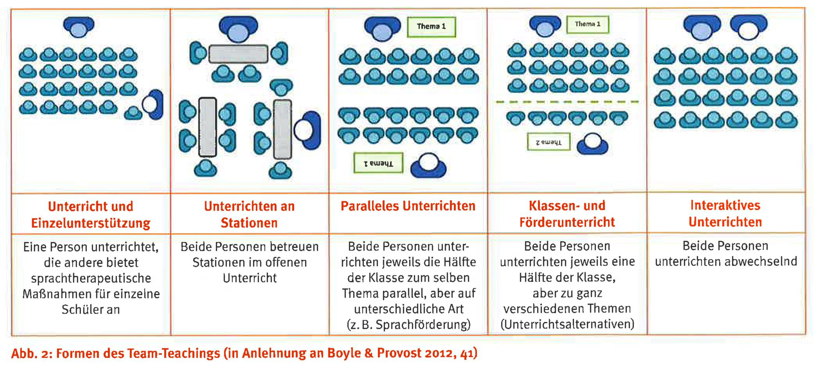

# Ausgangslage

Schüler:innen mit Sprach-, Sprech- und Kommunikationsauffälligkeiten sehen sich mit diversen Herausforderungen konfrontiert. Deswegen sind sie oftmals nicht in der Lage, die sprachlichen und curricularen Anforderungen des Unterrichts zu meistern (Archibald, 2017). Sie müssen daher umfassend unterstützt werden. Die *Deutsche Gesellschaft für Phoniatrie und Pädaudiologie* empfiehlt für den Schulkontext sprachunterstützende Massnahmen auf drei Ebenen (DGPP, 2022):

-   Die erste Ebene wird als *Sprachbildung* bezeichnet und richtet sich an alle Kinder, auch solche ohne Entwicklungsprobleme. Hierzu gehört sprachsensibler Unterricht, bei dem fachliches und sprachliches Lernen miteinander verknüpft werden (Woerfel & Gisau, 2018).

-   Die zweite Ebene umfasst Massnahmen der *Sprachförderung*, welche sich an Kinder mit einem Risiko für sprachlich bedingte Lernschwierigkeiten richtet. In der Sprachförderung wird eine Anreicherung des sprachlichen Inputs verfolgt, um zu verhindern, dass sich die sprachlichen Lernschwierigkeiten verfestigen.

-   Kinder mit diagnostizierbaren Sprachentwicklungsstörungen profitieren vermutlich noch nicht von dieser Anreicherung des Inputs. Sie benötigen intensive und individuelle therapeutische Massnahmen. Diese *Sprachtherapie* wird der dritten Ebene zugeordnet (DGPP, 2022).

Die Sprachtherapie kann *isoliert* (räumlich, zeitlich und inhaltlich vom Unterricht getrennt) umgesetzt werden. Sie kann *additiv* zum Unterricht stattfinden (während des Unterrichts, aber nicht mit diesem verknüpft) und sie kann in den Unterricht *integriert* werden (Artikulationsübungen bei der Buchstabeneinführung, Reflexionen morpho-syntaktischer Regeln, Aufbau eines Fachwortschatzes u. v. m.; DGPP, 2022). Gemäss den Reviews von McGinty und Justice (2006) sowie von Cirrin et al. (2010) kann die unterrichtsintegrierte Sprachtherapie im Vergleich zur isolierten Sprachtherapie und zur additiven Sprachtherapie eine vielfach höhere Wirkung erzielen, vor allem, wenn sie im Teamteaching umgesetzt wird.

Gemäss einer Befragung von Schweizer Logopäd:innen arbeiten diese jedoch kaum im Teamteaching (Blechschmidt et al., 2013). Die Häufigkeitsangaben zu verschiedenen Teamteaching-Formen (vgl. Abb. 1) schwanken zwischen *selten* bis *nie*. Nur *Unterricht und Einzelunterstützung,* was eher als additive Sprachtherapie aufzufassen ist, wird etwas häufiger angegeben. Dies gilt in ähnlicher Weise auch für Regellehrpersonen und Schulische Heilpädagog:innen: Teamteaching wird von ihnen im Vergleich zu anderen Kooperationsformen eher selten umgesetzt (Luder, 2021).

{width="6.333333333333333in" height="2.6555555555555554in" alt="Es wird zwischen 6 verschiedenen Formen des Teamteachings unterschieden: - Unterricht und Einzelunterricht - Unterrichten an Stationen - Paralleles Unterrichten - Klassen- und Förderunterricht - Interaktives Unterrichten"}

Die Umsetzung der unterrichtsintegrierten sprachunterstützenden Massnahmen sowie weiterer sprachunterstützender Massnahmen setzt spezifische Kenntnisse und Kompetenzen voraus, die nicht von einer Person allein beherrscht werden können. Es braucht daher unterschiedliche Fachkräfte mit je spezifischen Kenntnissen und Kompetenzen, die aufeinander abgestimmt werden müssen (Mahlau, 2018).

In der Regelschule unterstützen neben den Regellehrpersonen auch Schulische Heilpädagog:innen und Logopäd:innen die Kinder mit Sprach-, Sprech- und Kommunikationsauffälligkeiten auf ihre jeweils eigene Art (Widmer-Wolf, 2018). Ob, wie intensiv und wie häufig die verschiedenen Berufsgruppen kooperieren, wird von unterschiedlichen Faktoren bedingt: Die zeitlichen und räumlichen Ressourcen, die Aufgaben, Kompetenzen und Verantwortung der Akteur:innen sowie die gemeinsamen Erfahrungen und Haltungen des Schulteams als Ganzes beeinflussen die Häufigkeit und Intensität von Kooperationen (Huber & Ahlgrimm, 2012). Die Schulleitung schliesslich ist in der Position, diese verschiedenen Bedingungen verändern, also auch verbessern zu können. Somit ist das Handeln der Schulleitung eine wesentliche Voraussetzung, um kooperationsförderliche Bedingungen zu schaffen.

In der Studie «Sprachunterstützende Massnahmen in Schweizer Schulen. Studie zur Kooperation multiprofessioneller Teams in integrativen Settings» oder kurz: «SpriCH» wurden zwischen März und Juni 2022 im Kanton Bern insgesamt 317 Regellehrpersonen, Schulische Heilpädagog:innen und Logopäd:innen (vgl. Tab. 1) online befragt. Es wurden unter anderem folgende Fragen gestellt:

-   Welche Teamteaching-Formen werden von welcher Berufsgruppe wie häufig umgesetzt?

-   Welche weiteren sprachunterstützenden Massnahmen werden neben den unterrichtsintegrierten sprachunterstützenden Massnahmen umgesetzt?

-   Welche Räumlichkeiten werden genutzt, wenn die sprachunterstützenden Massnahmen nicht unterrichtsintegriert sind?

-   Wie wird das Handeln der Schulleitung im Kontext der multiprofessionellen Kooperation eingeschätzt?

-   Und wie zufrieden sind die drei Berufsgruppen mit der (Zusammen-)Arbeitssituation?

Diese Fragen werden hier basierend auf quantitativen Daten (unter Einbezug einzelner qualitativer Ergebnisse) deskriptiv beantwortet.

::: {.szh-tabelle src="tables/table-01.html"}
:::

# Methode

Wie häufig Teamteaching umgesetzt wird, wurde unter Zuhilfenahme der Formen des Teamteachings nach Reber und Blechschmidt (2014, vgl. Abb. 1) erfragt. Dabei konnten die Antworten auf folgender fünfstufiger Skala angegeben werden: 0 = nie; 1 = ein- bis zweimal pro Schuljahr; 2 = ein- bis zweimal pro Monat; 3 = ein- bis zweimal pro Woche und 4 = (fast) jeden Tag.

Für die Erhebung der weiteren sprachunterstützenden Massnahmen (neben den unterrichtsintegrierten) wurde eine kleine Auswahl vorgegeben. Neben den Optionen *sprachunterstützende Massnahmen in Gruppen, sprachunterstützende Massnahmen im Einzelsetting, Sprachbeobachtung/-diagnostik* und *DaZ-Unterricht* (Deutsch als Zweitsprache) gab es noch die Möglichkeit, eine eigene Antwort einzugeben.

Ganz ähnlich wurde auch in Bezug auf die weiteren genutzten Räumlichkeiten (nebst dem Klassenzimmer) verfahren. Neben den Optionen *im Gang, im Gruppenraum, in einem separaten Arbeitszimmer* und *ausserhalb der Schule* bestand auch hier die Möglichkeit, eine eigene Antwort einzugeben.

Das Handeln der Schulleitung wurde basierend auf dem Fragebogen von Drossel (2015) über acht Items erhoben, die beantwortet werden konnten auf einer vierstufigen Skala (0 = trifft nicht zu bis 3 = trifft zu).

Basierend auf dem Fragebogen von Blechschmidt et al. (2013) wurde die Zufriedenheit mit der Arbeitssituation über sieben Items eingeschätzt, wiederum auf einer Skala von 0 = trifft nicht zu bis 3 = trifft zu.

# Ergebnisse

## Häufigkeit der Teamteaching-Formen

Laut der Befragung ist die am häufigsten praktizierte Teamteaching-Form *Unterricht und Einzelunterstützung* (vgl. Abb. 2). Dies geschieht im Schnitt mehrmals pro Monat. Die zweithäufigste Teamteaching-Form ist der *Klassen- und Förderunterricht. Interaktives Unterrichten* wird am wenigsten häufig praktiziert (im Schnitt mehrmals im Jahr). Bei allen erfragten Teamteaching-Formen geben Schulische Heilpädagog:innen die höchsten Werte an und Logopäd:innen die niedrigsten. Letztere vermerken bei allen Teamteaching-Formen, dass sie diese «nie» bis «ein- bis zweimal pro Jahr» praktizieren. Den höchsten Wert erreichen die Logopäd:innen (wie die anderen beiden Berufsgruppen auch) bei «Unterricht und Einzelunterstützung».

Abbildung 2: Häufigkeitsangaben zu den Team-Teaching-Formen der verschiedenen Berufsgruppen

Skala: 0 = nie; 1 = ein- bis zweimal pro Jahr; 2 = ein- bis zweimal pro Monat; 3 = ein- bis zweimal pro Woche und 4 = (fast) jeden Tag

## Weitere genutzte Räumlichkeiten

Die Ergebnisse zur Frage, wo die verschiedenen sprachunterstützenden Massnahmen umgesetzt werden, wenn nicht im Klassenzimmer, können der Abbildung 3 entnommen werden. Welche Räume hier bevorzugt angegeben werden, unterscheidet sich stark zwischen den Berufsgruppen: Regellehrpersonen scheinen häufig Teile des sprachsensiblen Unterrichts auf den Gang (66,9 % der Antworten) beziehungsweise in einen Gruppenraum (63,4 %) zu verlegen. Schulische Heilpädagog:innen bevorzugen für die Sprachförderung deutlich den Gruppenraum (87,6 %). Logopäd:innen geben für die Umsetzung ihrer Sprachtherapie am häufigsten das separate Arbeitszimmer an (66,3 %). Bezüglich der genutzten Räumlichkeiten wurden diverse offene Antworten eingegeben. Bei den Regellehrpersonen zeigt sich dabei die Tendenz, Orte in der natürlichen Umgebung des Schulhauses zu nutzen (z. B. Wald, Schulgarten, draussen). Auch der Pausenplatz und die Bibliothek werden häufig als alternative Orte zur Umsetzung sprachsensiblen Unterrichts genannt. Bei den Schulischen Heilpädagog:innen gibt es keine klaren Tendenzen für alternative Orte. Bei den Logopäd:innen hingegen wird gelegentlich noch die Schulküche genannt, am häufigsten jedoch das freie Klassenzimmer beziehungsweise Arbeitszimmer, welches in einem anderen Schulhaus gelegen ist. Dies erklärt auch den hohen Anteil bei der Kategorie «ausserhalb der Schule», wie in der Abbildung 3 ersichtlich.

Abbildung 3: Angaben der verschiedenen Berufsgruppen zu den weiteren genutzten Räumlichkeiten in Prozent

## Weitere sprachunterstützende Massnahmen

Die Angaben zur Häufigkeit von sprachunterstützenden Massnahmen, die nicht im Unterricht umgesetzt werden, können der Abbildung 4 entnommen werden. Der sprachsensible Unterricht in Gruppen ist die am häufigsten genannte alternative Massnahme der Regellehrpersonen. Schulische Heilpädagog:innen hingegen geben diagnostische Tätigkeiten als häufigste alternative Massnahme an (64 %), wobei die Sprachförderung in Gruppen (61,8 %) und im Einzelsetting (59,6 %) dicht folgen. Bei den Logopäd:innen ist die Sprachtherapie im Einzelsetting die bevorzugte Arbeitsweise (89,5 %). Mit 86 Prozent ist die kollegiale Beratung ein weiteres wichtiges Arbeitsfeld, danach kommen mit 84,9 Prozent diagnostische Tätigkeiten. Der DaZ-Unterricht wird zu gleichen Teilen von Regellehrpersonen (30,3 %) und Schulischen Heilpädagog:innen (31,5 %) übernommen. Logopäd:innen tun dies nur in seltenen Ausnahmen (3,5 %). Bei den offenen Antworten gab es eine klare Tendenz zu beobachten: Logopäd:innen gaben in grosser Menge die Elternberatung als weiteres Handlungsfeld an. Bei anderen Massnahmen blieb es bei Einzelnennungen.

Abbildung 4: Angaben der verschiedenen Berufsgruppen zu den weiteren sprachunterstützenden Massnahmen (suM) in Prozent

## Wahrgenommenes Handeln der Schulleitung

Wie das Handeln der Schulleitung von den Regellehrpersonen, Schulischen Heilpädagog:innen und Logopäd:innen wahrgenommen wird, ist in Tabelle 2 ersichtlich. Die meisten Angaben liegen um den theoretischen Mittelwert von M = 1,5 oder sogar deutlich darunter. Das Bereitstellen von zeitlichen und räumlichen Ressourcen, Entlastungsmöglichkeiten und die Organisation gemeinsamer Weiterbildungen werden also von allen drei Berufsgruppen eher negativ eingeschätzt. Man muss jedoch die zum Teil hohen Standardabweichungen berücksichtigen. So scheint es hier sehr unterschiedliche Wahrnehmungen zu geben. Eine Ausnahme bilden die letzten zwei Items. Die Wertschätzung der Kooperation durch die Schulleitung sowie die Motivation zur Kooperation durch die Schulleitung werden durchaus positiv erlebt.

::: {.szh-tabelle src="tables/table-02.html"}
:::

Skala: 0 = trifft nicht zu; 1 = trifft eher nicht zu; 2 = trifft eher zu und 3 = trifft zu

## Zufriedenheit

Im Gegensatz zum wahrgenommenen Handeln der Schulleitung liegen die Zufriedenheitswerte deutlich über dem theoretischen Mittelwert von 1,5 (vgl. Tab. 3). Die drei Berufsgruppen sind gesamthaft betrachtet (sehr) zufrieden mit ihrer Arbeitssituation. Unterschiede zwischen den Gruppen bestehen jedoch bei einzelnen Items. So sind Regellehrpersonen am wenigsten zufrieden mit ihrem Gehalt. Die Zufriedenheit mit Zusammenarbeitsmöglichkeiten und der vorhandenen Vor- und Nachbereitungszeit schätzen Logopäd:innen am geringsten ein. Verhältnismässig niedrig sind die Zufriedenheitswerte aller drei Gruppen, wenn es um die räumlichen Ressourcen geht.

::: {.szh-tabelle src="tables/table-03.html"}
:::

Skala: 0 = trifft nicht zu; 1 = trifft eher nicht zu; 2 = trifft eher zu und 3 = trifft zu

# Diskussion

Bei der inklusiven Schulung von Kindern und Jugendlichen mit Sprach-, Sprech- und Kommunikationsauffälligkeiten sind unter anderem die Expertise von Regellehrpersonen, Schulischen Heilpädagog:innen und Logopäd:innen gefragt. Sprachunterstützende Massnahmen können dem sprachsensiblen Unterricht, der Sprachförderung und der Sprachtherapie zugeordnet werden. Um sprachunterstützende Massnahmen aufeinander abzustimmen, ist die Zusammenarbeit der genannten Berufsgruppen entscheidend. Teamteaching gilt als eine der anspruchsvollsten Kooperationsformen. Sie trägt jedoch entscheidend dazu bei, dass unterrichtsintegrierte sprachunterstützende Massnahmen ihre volle Wirkung erzielen können. Ob anspruchsvolle Kooperationsformen wie Teamteaching auch umgesetzt werden können, hängt bedeutend vom Handeln der Schulleitung ab.

Teamteaching trägt entscheidend dazu bei, dass unterrichtsintegrierte sprachunterstützende Massnahmen ihre volle Wirkung erzielen können.

Wie die Befragung von 317 Regellehrpersonen, Schulischen Heilpädagog:innen und Logopäd:innen aus dem Kanton Bern zeigt, wird Teamteaching eher selten umgesetzt. Vor allem Logopäd:innen verzeichnen hier tiefe Werte. Stattdessen bevorzugen sie die Sprachtherapie im Einzelsetting im separaten Arbeitszimmer. Auch die anderen Berufsgruppen arbeiten selten unterrichtsintegriert im Team. Stattdessen werden die sprachunterstützenden Massnahmen im Gang oder im Gruppenraum in Gruppen oder auch einzeln durchgeführt. Das Handeln der Schulleitung wird von allen hier befragten Berufsgruppen eher negativ wahrgenommen. Lediglich die Wertschätzung und die Motivation durch die Schulleitung werden etwas positiver eingeschätzt.

Auch in einigen Kommentaren wird die Bedeutung des Handelns der Schulleitung hervorgehoben: «Vieles hängt für mich von der Leitung, der Haltung und dem Wissen der Schulleitung ab -- dies fliesst in alle Bereiche», äussert sich eine Schulische Heilpädagogin. «Ohne regelmässigen Austausch mit der Schulleitung und ohne deren Unterstützung für mehr Kooperation ist es als einzelne Logopädin fast unmöglich, mehr Kooperation zu schaffen», äussert eine Logopädin.

Umso erstaunlicher sind die (fast) durchgehend hohen Bewertungen in der Zufriedenheit mit der Arbeitssituation. Selbst bei denjenigen Items, die im Verhältnis eher schlechter bewertet werden (Gehalt, Gelegenheiten zur Zusammenarbeit und ausreichend Vor- und Nachbereitungszeit) bewegen sich die Einschätzungen noch im positiven Bereich.

Diese grundsätzliche Zufriedenheit ist einerseits wertvoll, steht aber andererseits Veränderungen auch im Wege. Denn wenn man die Situation schätzt, wie sie ist, hat man wenig Gründe, etwas daran zu ändern. Änderungen wären aber durchaus angebracht. Dies ist kein Plädoyer dafür, dass sprachunterstützende Massnahmen nur noch unterrichtsintegriert umgesetzt werden sollten. Wie die Reviews von McGinty und Justice (2006) sowie von Cirrin et al. (2010) jedoch aufzeigen konnten, können unterrichtsintegrierte sprachunterstützende Massnahmen wesentlich wirksamer sein als die hier bevorzugten separativen Massnahmen in Einzelsettings. Es gilt also herauszufinden, wann und in welchen Situationen separative Massnahmen sinnvoll und wirksam sind und wann unterrichtsintegrierte Massnahmen angebracht sind. Für die Umsetzung von Letzterem bleibt es unerlässlich, kooperationsförderliche Bedingungen zu schaffen. Damit sind alle an der multiprofessionellen Kooperation beteiligten Personen angesprochen: Regellehrpersonen, Schulische Heilpädagog:innen und Logopäd:innen, die Schulleitungen wie auch politische Entscheidungsträger:innen. Ein erster Schritt könnte darin bestehen, die eigene Haltung zur Zusammenarbeit als auch diejenige zur Integration von sprachunterstützenden Massnahmen im Unterricht zu reflektieren. Denn diese können jederzeit unabhängig von den verfügbaren Ressourcen angepasst werden. Infolgedessen können auch die eigenen Praktiken geändert werden. Arbeiten die Fachkräfte nebeneinander statt miteinander, kann das Separationseffekte verstärken (Lüdtke, 2017). Gelingende Kooperationen jedoch führen zu inkludierenden Synergien (ebd.), zu Entlastung sowohl bezüglich des Arbeitsaufwands als auch bei der wahrgenommenen Verantwortung (Luder, 2021). Und letztlich dienen sie dem Wohle der Kinder.

::: {.szh-biblio src="02-till.biblio.md"}
:::
