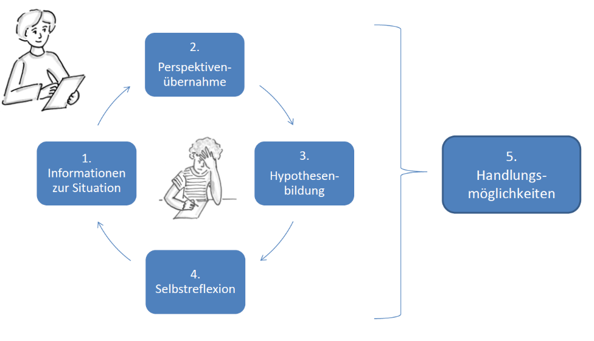

# Herausfordernde Unterrichtssituationen

Herausforderungen im Unterricht sind fester Bestandteil des Lehrberufs. Erfolgreich bewältigt, können Lehrpersonen diese als interessante Aufgabe wahrnehmen. Wiederkehrend schwierige Situationen können demgegenüber Stress und Überforderung auslösen und sich negativ auf die Selbstwahrnehmung sowie das Wohlbefinden der Lehrpersonen auswirken. Vielfältige Bedürfnisse in heterogenen Klassen können diese Belastungen verschärfen.

Das *Institut für Heilpädagogik* der *Pädagogischen Hochschule Bern* (*PHBern*) verwendet in der Aus- und Weiterbildung sowie Beratung den Begriff «Herausfordernde Unterrichtssituationen», der sowohl das Verhalten von Schüler:innen als auch die Interaktionen im Unterricht umfasst. Herausforderndes Verhalten wird als Abweichung von sozialen Normen verstanden, die als problematisch oder störend wahrgenommen wird. Solche Verhaltensweisen können sich im Sozialverhalten (z. B. Schlagen), psychisch-emotional (z. B. Wutausbrüche), im Leistungsbereich (z. B. Verweigerung), gegenüber Objekten (z. B. Zerstörung) oder als selbstverletzendes Verhalten zeigen (Theunissen, 2021). Derartige «Unterrichtsstörungen» sind «Ereignisse, die den Lehr-Lern-Prozess beeinträchtigen, unterbrechen oder unmöglich machen, indem sie die Voraussetzungen, unter denen Lehren und Lernen erst stattfinden kann, teilweise oder ganz ausser Kraft setzen» (Lohmann, 2023, S. 13). Einige Schüler:innen stören den Unterricht häufiger oder intensiver, was Lehrpersonen vor die Aufgabe stellt, mit dem als herausfordernd erlebten Verhalten und den damit verbundenen Emotionen umzugehen (Fatke, 2022). Unterrichtsstörungen allein diesen Schüler:innen zuzuschreiben, würde aber zu kurz greifen: Sie sind ein interaktionales Problem und müssen im Kontext von Unterricht und Klasse betrachtet werden (Wettstein & Scherzinger, 2019).

Das Anliegen von Aus- und Weiterbildung sowie Beratung ist es, Lehrpersonen ein «Instrument» an die Hand zu geben, das über kurzfristige Problemlösungen hinausgeht und auf verschiedene herausfordernde Situationen anwendbar ist.

# Der Kreislauf als verstehender Zugang

Die *PHBern* vermittelt den Kreislauf zur Bearbeitung von herausfordernden Unterrichtssituationen als verstehenden Zugang zu diesen Unterrichtssituationen. Er bietet eine Möglichkeit, die oft unverstandenen subjektiven Lebenswirklichkeiten und Verhaltensweisen von Menschen annäherungsweise zu erfassen und begründete Fördermassnahmen und Interaktionsangebote zu erarbeiten. Der Kreislauf versteht sich als übergeordnete, theoriegeleitete Analyse- und Reflexionsmethode, die sich durch eine explizite Perspektivenübernahme auszeichnet. Er wurde in Anlehnung an die Syndromanalyse nach Zimpel (z. B. 2013a; 2013b) im Rahmen der *PHBern* entwickelt, begrifflich und inhaltlich angepasst und in der praktischen Erprobung weiterentwickelt.

Die Syndromanalyse und ihr Kerngedanke -- das Verstehen aus der Logik des Subjekts -- gehen auf den russischen Neurobiologen Alexander R. Lurija zurück. Mitte der 1930er Jahre forschte er gemeinsam mit dem russischen Psychologen Lew Wygotski und bestätigte, dass menschliche Erkenntnisprozesse nicht nur kognitive, sondern auch soziale und kulturelle Einflüsse aufweisen. Lurija entwickelte die Syndromanalyse als Alternative zur normorientierten psychometrischen Diagnostik (Schablon, 2013). In der Heilpädagogik gewann die Syndromanalyse besonders durch die Arbeiten von Wolfgang Jantzen (z. B. 1990; 1994) und André F. Zimpel (z. B. 1994; 2013b) an Relevanz. Gemeinsam ist ihnen die Suche nach einer Methode, die eine theoretische und praktische Alternative und Ergänzung zur traditionellen Diagnostik bietet. Letztere nimmt Anomalien oder Einschränkungen meist als Abweichungen von einem vordefinierten Normalitätsideal wahr und lässt individuelle Gründe oder gesellschaftliche Bedingungen für ein Verhalten häufig unberücksichtigt. Im Gegensatz dazu erhebt die Syndromanalyse systematisch einzelne Fakten, gruppiert sie und setzt sie in Relation zu syndromspezifischen Besonderheiten (Schablon, 2013). Es gilt also, Ereignisse aus möglichst vielen unterschiedlichen Perspektiven zu betrachten. Zimpel proklamierte aus diesem Grund die «Systemische Syndromanalyse» (2013b).

Bei der Syndromanalyse gilt, Ereignisse aus möglichst vielen unterschiedlichen Perspektiven zu betrachten.

Als zentrale Anliegen erweisen sich folglich zwei Dinge: das Verstehen der syndromabhängigen Entwicklungslogik und das Anerkennen des Gegenübers als entwicklungsfähiges Subjekt. Dabei wird angenommen, dass allen menschlichen Verhaltens- und Ausdrucksformen immer ein Sinn innewohnt, der interpretativ erschlossen und entschlüsselt werden kann (Jantzen, 1996). Das Vorgehen dient somit der «Rekonstruktion der Subjektlogik» und bietet im Sinne des Zusammenspiels von Wahrnehmen, Verstehen, Erklären und Handeln einen methodischen Weg für die (heil-)pädagogische Unterstützung (Schablon, 2013, S. 167).

Die *PHBern* nutzte die Syndromanalyse zunächst in der Lehre in «Originalform» nach Zimpel (2013b) und später im Rahmen einer Kursreihe zu herausfordernden Unterrichtssituationen. Wiederholt zeigte sich, dass sowohl der zeitliche Aufwand als auch die Terminologie der Syndromanalyse gewisse Hürden aufwiesen. Der Begriff «Syndrom» schien zu einer individualtheoretischen Betrachtungsweise zu verleiten, die die Gründe für ein Verhalten beim Individuum verortet. Auch die Begriffe «Innensicht» und «Aussensicht» bedurften immer wieder der Klärung und der Begriff «Supersicht» erwies sich als zu abstrakt. Deshalb wurde der Kreislauf zur Bearbeitung von herausfordernden Unterrichtssituationen entwickelt.

# Die fünf Schritte des Kreislaufs

Der Kreislauf zur Bearbeitung von herausfordernden Unterrichtssituationen besteht aus fünf Teilschritten. Für jeden dieser Schritte wurden entsprechende Leitfragen angepasst und Grafiken erstellt, die möglichst genau auf den zentralen Inhalt des jeweiligen Arbeitsschrittes hinweisen. Um sich dem Verstehen der herausfordernden Situation zu nähern, werden *Informationen* *zur Situation* zusammengetragen, eine *Perspektivenübernahme* mit der Frage nach dem Sinn eines Verhaltens vorgenommen und *Hypothesen* zum Verstehen des Handelns entwickelt. Anschliessend werden die Auswahl der theoretischen Erklärungsgrundlagen sowie die eigene Haltung zum herausfordernden Verhalten *reflektiert* und darauf aufbauend (heil-)pädagogische *Handlungsmöglichkeiten* entwickelt (vgl. Abb. 1). Der Fokus liegt dabei auf den Möglichkeiten, die Lehrpersonen in der Gestaltung der Interaktion und der Lehr-Lernumgebung umsetzen können.

{width="6.302084426946632in" height="3.625in" alt="Der Kreislauf zur Bearbeitung von herausfordernden Unterrichtssituationen besteht aus den folgenden Schritten: 1. Informationen zur Situation, 2. Perspektivenübernahme, 3. Hypothesenbildung, 4. Selbstreflexion. Diese vier Schritte bilden gemeinsam einen Kreis. Der ganze Kreis resultiert in Schritt 5 \"Handlungsmöglichkeiten\""}

## 1. Informationen zur Situation

Im ersten Schritt werden möglichst objektive Informationen zur Situation aus der Beobachtungsperspektive gesammelt. Neben vorhandenen oder zu beschaffenden Informationen über die betreffende Person (z. B. schulische Entwicklungsberichte, vorliegende Diagnosen, medizinische Berichte, biografische Informationen) sind Informationen über die herausfordernde Situation wesentlich (vgl. Abb. 2). Für deren Erfassung ist eine interpretationsfreie und verhaltensnahe Beobachtung zentral. Diese kann methodisch durch aufwendige oder eher pragmatische Vorgehensweisen erreicht werden. Während in der Ausbildung die systematische Beobachtung auch anhand von Videoaufnahmen geübt wird, geht es in der Weiterbildung und Beratung eher darum, konkret beobachtbare Verhaltensweisen beschreibend und nicht interpretierend (!) zusammenzutragen, um so das herausfordernde Verhalten oder die herausfordernde Situation klar zu benennen. Ebenso wichtig ist die Dokumentation von Kompetenzen und Ressourcen. Wird diese Informationserhebung im Team durchgeführt, finden bereits wichtige Prozesse statt, da Wahrnehmungen benannt und miteinander abgeglichen werden.

::: {.szh-tabelle src="tables/table-01.html"}
:::

## 2. Perspektivenübernahme

Im zweiten Schritt erfolgt ein bewusster Perspektivenwechsel der beobachtenden Person. Sie setzt sich in die Sichtweise derjenigen Person (oder Personengruppe) hinein, deren herausfordernde Verhaltensweisen im Fokus stehen (vgl. Abb. 3). Dabei ist es hilfreich, aus der Perspektive der anderen Person «Ich-Sätze» zu formulieren. Ausgehend vom konstruktivistischen Ansatz, dass jedes Verhalten eines Menschen für ihn in seiner jeweiligen Situation subjektiv sinnvoll ist, bemüht sich die beobachtende Person um eine verstehende Perspektivenübernahme. Diesen kreativen Prozess setzt sie so lange fort, bis es ihr gelingt, die andere Person und ihr Verhalten respektvoll und wertschätzend zu betrachten. Dabei handelt es sich um eine begründete Rekonstruktion der Subjektlogik, die «immer nur eine Annäherung bleiben \[kann\]» (Wächter, 2013, S. 116). Aus systemischer Sicht kann herausforderndes Verhalten als Bewältigungsstrategie für eine schwierige Situation verstanden werden. Es ist daher essenziell, dieses Verhalten entsprechend als Kompetenz umzudeuten (Zimpel, 2013a).

::: {.szh-tabelle src="tables/table-02.html"}
:::

## 3. Hypothesenbildung

Im dritten Schritt werden die Erkenntnisse aus den beiden vorangegangenen Beobachtungsstandpunkten miteinander verknüpft, indem sie sowohl auf Stimmigkeit als auch auf Widersprüchlichkeiten geprüft werden (vgl. Abb. 4). Der Einbezug von theoretischen Konzepten und Modellen ist hier zentral. Für die beobachtende Person geht es darum, zu erschliessen, unter welchen Bedingungen sie dieses Verhalten erklären und wie sie daraus auf mögliche Entwicklungen schliessen kann. Sie braucht sowohl Erklärungswissen zu individuellen Lernvoraussetzungen (z. B. bei ADHS, Autismus, aggressivem Verhalten) als auch zum interaktionalen Zusammenspiel von Schüler:innen, Bezugspersonen und Lernumgebung. Auf dieser Grundlage erstellt sie Hypothesen im Sinne von Wenn-Dann-Formulierungen, die idealerweise positiv formuliert sind. Das «Wenn» bezieht sich dabei auf die Bedingungen, das «Dann» auf die daraus entstehenden Entwicklungsmöglichkeiten. Der Fokus ist dabei stärker auf die Möglichkeiten der Lehrpersonen und die Gestaltung der Lehr-Lernumgebung gerichtet als auf die innerpsychischen Bedingungen der Schüler:innen und die notwendigen, noch fehlenden Entwicklungsschritte.

::: {.szh-tabelle src="tables/table-03.html"}
:::

## 4. Selbstreflexion

Im vierten Schritt erfolgt die kritische Auseinandersetzung mit der eigenen Person in Bezug auf die vorliegende Situation (vgl. Abb. 5). Es ist zentral, ein Bewusstsein für die Subjektivität der eigenen Wahrnehmung zu erarbeiten und zu erfassen, dass die beobachtende Person immer auch Teil des Systems ist und mit ihrer eigenen Person auf dieses einwirkt. Der eigene Erklärungshorizont wird kritisch reflektiert, was auch die Auswahl der verwendeten Theorien für den Fall betrifft. Dies hilft, sich kritisch von der eigenen Rolle in der Situation zu distanzieren und zu reflektieren, inwieweit vorschnelle Projektionen wirken und zu wenig reflektierte Annahmen getroffen werden. Aus einer interaktionalen Perspektive ist es zentral, dass die eigenen Verhaltensweisen reflektiert werden. Im eigenen Verhalten liegen die meisten Handlungsmöglichkeiten.

::: {.szh-tabelle src="tables/table-04.html"}
:::

## 5. Handlungsmöglichkeiten

Im letzten Schritt werden entsprechende pädagogische Ideen und Handlungsmöglichkeiten entwickelt (vgl. Abb. 6). Dabei gilt: «Eine pädagogische Idee soll nicht überzeugen, sondern anstecken» (Macykowski, 2013, S. 141). Hier geht es darum, aus den bereits formulierten Hypothesen zwei bis drei konkrete nächste Handlungsschritte abzuleiten. Gemeinsames Handeln wird in der «Zone der nächsten Entwicklung» (Wygotski, 1987, S. 80) geplant, wobei individuelle Lernwege respektiert und akzeptiert werden. Es geht also nicht darum, das normabweichende Verhalten mit Massnahmen zu überwinden, sondern um die Entwicklung einer für die betreffende Person subjektiv sinnvollen Lebensperspektive. Diese wahrt bewusst die Achtung der Person und ihre individuellen Entwicklungsmöglichkeiten. Wichtig ist, dass die Handlungsmöglichkeiten sehr konkret benannt werden und unmittelbar im Alltag umsetzbar sind.

::: {.szh-tabelle src="tables/table-05.html"}
:::

Während der Umsetzung wird kontinuierlich beobachtet, wie sich das Verhalten und die Situation verändern. Bei positiver Entwicklung wird die Massnahme beibehalten und durch weitere Ideen ergänzt. Tritt keine oder nur geringe Verbesserung ein, beginnt der Kreislauf von neuem: Die Hypothesen werden überprüft, gegebenenfalls umformuliert oder ergänzt und neue Handlungsmöglichkeiten abgeleitet. Die aus dem Kreislauf gewonnenen Erkenntnisse können so über einen längeren Zeitraum für die theoriegeleitete Auseinandersetzung mit der herausfordernden Unterrichtssituation genutzt werden.

# Schlussfolgerungen

Die *PHBern* kann auf eine mehrjährige Erfahrung mit dem Kreislauf zur Bearbeitung von herausfordernden Unterrichtssituationen zurückblicken. Das Vorgehen hat sich sowohl in der Aus- als auch in der Weiterbildung bewährt. Fachpersonen können es zur Bearbeitung und Reflexion jeder herausfordernden Unterrichtssituation einsetzen. Je nach Ausgangslage und zur Verfügung stehender Zeit können sie das Verfahren ausführlich oder in pragmatisch reduzierter Form durchführen. Mögliche Grenzen des Verfahrens zeigen sich insbesondere bei sehr komplexen (z. B. gruppendynamischen) herausfordernden Unterrichtssituationen. Diese erfordern zusätzlich eine Vernetzung und Koordination auf verschiedenen Ebenen (z. B. mit Schulsozialarbeit, Schulleitung, Schulaufsicht sowie externen Fachstellen). Die Analyse und Reflexion mit dem Kreislauf kann durch den verstehenden Zugang wichtige Handlungsmöglichkeiten für die Interaktion zwischen Lehrpersonen und Schüler:innen im Unterricht aufzeigen. Die Erfahrungen machen deutlich, dass insbesondere die Phase der Perspektivenübernahme hierfür sehr entscheidend ist. Durch die Bearbeitung des Kreislaufs in einem Team, einer Ausbildungs- oder Supervisionsgruppe wird es auch belasteten Lehrpersonen möglich, sich von der herausfordernden Situation zu distanzieren. In der Reflexion können sie Unterstützung und Ermutigung erfahren und konkrete Lösungsideen erhalten beziehungsweise entwickeln. Es zeigt sich eindrücklich, dass durch die Perspektivenübernahme mögliche Motive der Schüler:innen für ihr Verhalten in den Blick kommen. Verständnis und Achtung für ihre teilweise grossen Kompensationsleistungen werden (wieder) möglich, auch wenn gezeigtes Verhalten unter Umständen nicht toleriert werden kann (z. B. aggressives Verhalten). Es kommen neue und ermutigende Ideen zur Veränderung der Situation in den Blick und das Handlungsrepertoire der Lehrpersonen erweitert sich. Durch den Beizug von theoretischem Wissen entsteht oft Handlungswissen, das sie auch für andere Situationen positiv nutzen können. Da die Arbeit mit dem Kreislauf häufig im Team stattfindet, können die Beteiligten bei der Umsetzung der Handlungsmöglichkeiten zudem überlegen, welche weiteren Personen zur Verbesserung der Situation beitragen könnten. Im Idealfall reduziert dies das Belastungsempfinden zusätzlich.

::: {.szh-biblio src="03-schindler.biblio.md"}
:::
