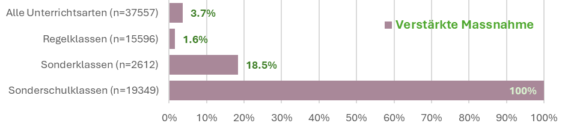
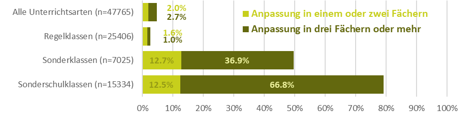
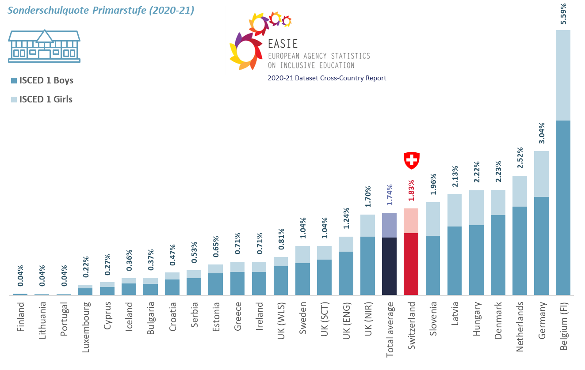
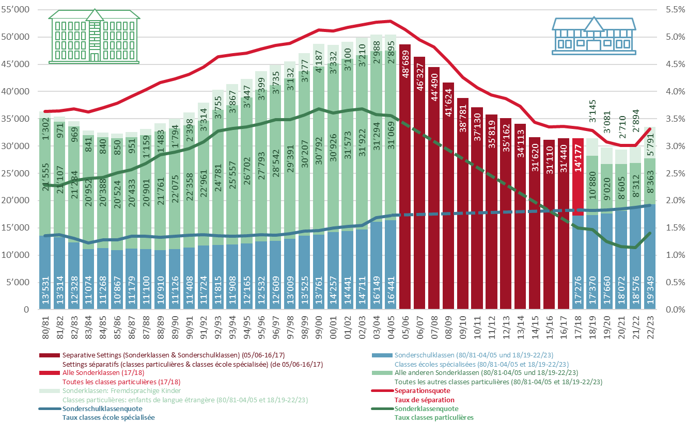
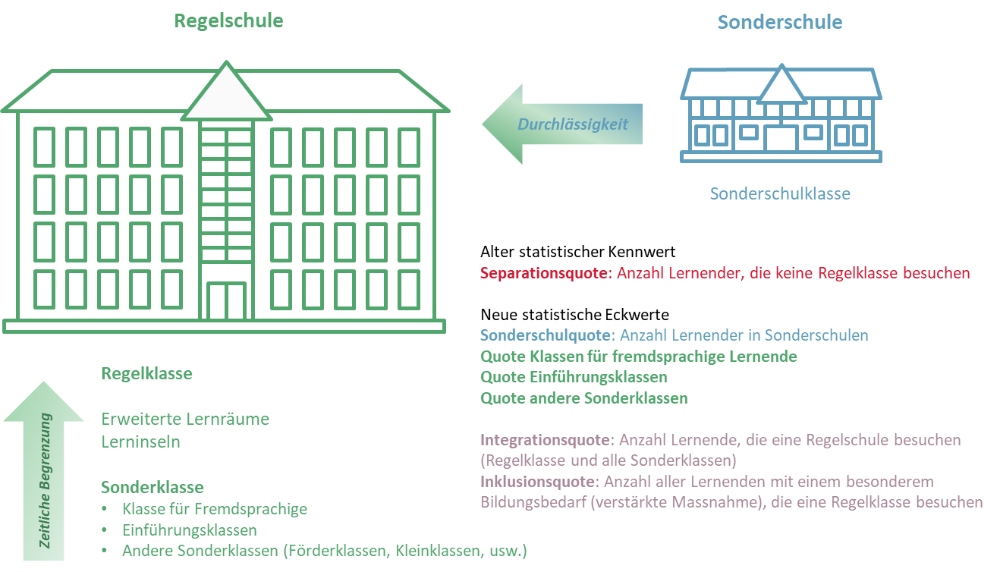
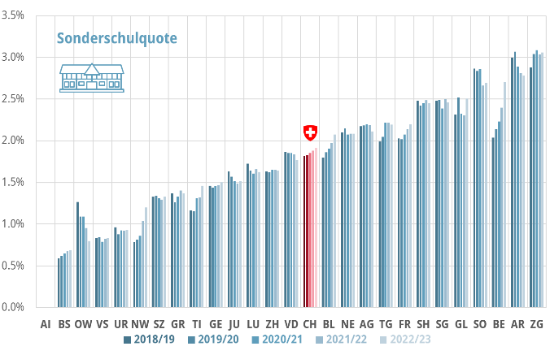
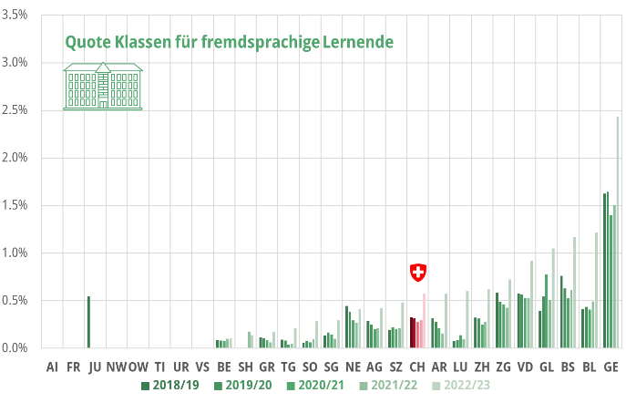
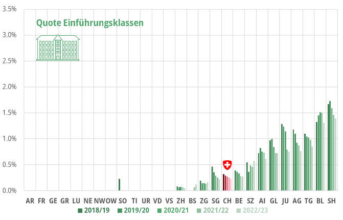
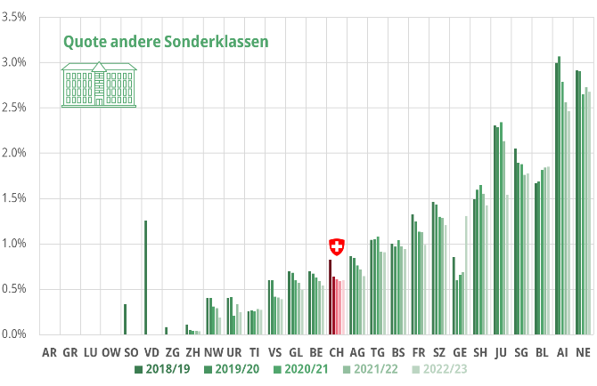
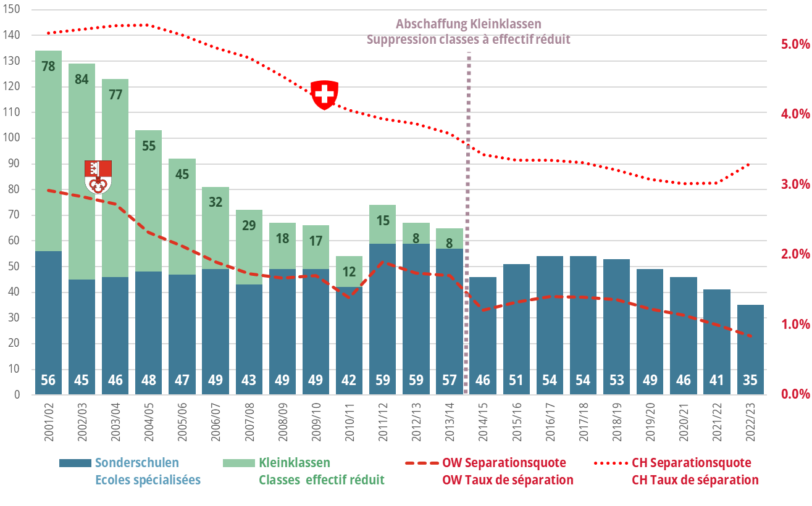

# Einleitung

In letzter Zeit wird viel über die integrative Schule in der Schweiz diskutiert und gestritten. Für die einen ist die integrative Schule gescheitert, für die anderen ist sie ein wichtiges Instrument zur Stärkung der Bildungsgerechtigkeit oder sogar für eine inklusive Gesellschaft. In diesen oft sehr emotional geführten Debatten gehen Fakten häufig verloren. Um dieser Entwicklung entgegenzuwirken, hat das SZH im Frühjahr 2024 ein Faktenblatt herausgegeben zum Stand der schulischen Integration in der Schweiz (Lanners et al., 2024). Es beinhaltet einen Überblick über die internationalen, nationalen und interkantonalen rechtlichen Grundlagen, fasst den Stand der Forschung zusammen und beschreibt Wege, wie die Zusammenarbeit zwischen Regel- und Sonderpädagogik verbessert werden kann. Mein Referat am 13. Schweizer Kongress für Heilpädagogik zum Thema der zehnjährigen Umsetzung der Behindertenrechtskonvention (BRK) in der Schweiz diskutierte die gleiche Thematik anhand von Daten und zeigte einige *good practice-*Beispiele von integrativen Schulen in der Schweiz (Lanners, 2024a). Dieser Artikel beschäftigt sich mit der neuen schweizerischen Statistik der Sonderpädagogik, die seit dem Schuljahr 2017/18 besteht (Bula et al., 2019). Schliesslich sind Zahlen enorm wichtig, um emotionale Diskussionen zu objektivieren. Zudem fokussiert der Beitrag auf das Prinzip «Integration vor Separation», welches die kantonale Bildungspolitik seit dem Sonderpädagogik-Konkordat von 2007 leitet. Und die BRK fordert, dass Menschen mit Behinderungen nicht aufgrund von Behinderung vom allgemeinen Bildungssystem ausgeschlossen werden dürfen. Ein separates Schulsystem für Kinder mit Behinderungen ist in der BRK nicht vorgesehen.

# Die modernisierte Statistik der Sonderpädagogik

Die neue Statistik der Sonderpädagogik unterscheidet drei Dimensionen: Unterrichtsart, sprich den Schulungsort (Regelklasse, Sonderklasse in einer Regelschule oder Sonderschulklasse), Erhalt von verstärkten Massnahmen sowie Anpassung des Lehrplans, also der Lernziele.

::: {.szh-tabelle src="tables/table-01.html"}
:::

Eine verstärkte Massnahme wird bei einem nachgewiesenen besonderen Bildungsbedarf aufgrund einer Beeinträchtigung oder Behinderung zugesprochen. Sie ist in einer Regelklasse, in einer Sonderklasse oder in einer Sonderschulklasse möglich. Der Besuch einer Sonderschulklasse gilt per se als verstärkte Massnahme, weil dies zu einschneidenden Konsequenzen in der Bildungsbiografie führt (Art. 5 al. 2 lit. d. Sonderpädagogik-Konkordat).

{width="6.256944444444445in" height="1.4046062992125985in"}

Im Schuljahr 2022/23 nahmen 37 557 Lernende der obligatorischen Schule eine verstärkte Massnahme in Anspruch. Der Anteil Schüler:innen mit einem besonderen Bildungsbedarf variiert naturgemäss stark nach Unterrichtsart, von durchschnittlich 1,6 Prozent in einer Regelklasse, über 18,5 Prozent in einer Sonderklasse hin zu 100 Prozent in einer Sonderschulklasse (vgl. Abb. 1). Eine Quote von 1,6 Prozent Lernende mit einer verstärkten Massnahme ergibt rund einen Lernenden mit besonderem Bildungsbedarf pro 60 Schüler:innen einer Regelklasse. Rund 41,5 Prozent der Lernenden mit einem besonderen Bildungsbedarf besuchten 2022/23 eine Regelklasse, 7 Prozent eine Sonderklasse und 51,5 Prozent eine Sonderschulklasse. Somit liegt die Inklusionsquote, also der Anteil der Lernenden mit besonderem Bildungsbedarf, welche eine Regelklasse besuchen, bei 41,5 Prozent. Die Integrationsquote, also der Anteil Lernender mit besonderem Bildungsbedarf, welche in einer Regel- oder Sonderklasse einer Regelschule beschult wird, liegt bei 48,5 Prozent.

Eine Anpassung der Lernziele in einem oder mehreren Fächern ist unabhängig sowohl von der Unterrichtsart als auch vom Erhalt einer verstärkten Massnahme.

{width="4.649305555555555in" height="1.1461143919510062in"}

Rund 2,6 Prozent der Lernenden einer Regelklasse verfügen über eine Lernzielanpassung in einem oder zwei Fächern (1,6 %) oder dann in drei und mehr Fächern (1 %, vgl. Abb. 2). Dies entspricht einem Lernenden auf rund 40 Schüler:innen. Es erscheint logisch, dass Lernende mit besonderem Bildungsbedarf einen Anspruch haben auf individualisierte oder angepasste Lernziele in einem oder mehreren Fächern. Bei den mehr als 20 Prozent der Lernenden einer Sonderschule, die keine Anpassung der Lernziele benötigen, stellt sich aber die Frage, warum sie überhaupt eine Sonderschulklasse besuchen. Die Kosten, die für den Besuch einer Sonderschulklasse anfallen, liegen ein Vielfaches über jenen einer Regelschulklasse. Die gleiche Frage drängt sich auf bei den Lernenden in einer Sonderklasse.

# Die Schweiz im internationalen Vergleich

Wie andere Nachbarländer mit einer langen Tradition der Heil- oder Sonderpädagogik und der Sonderschulen kennt die Schweiz im internationalen Vergleich eine hohe Separationsquote. Die *European Agency for Special Needs and Inclusive Education* (EA, 2022, S. 9) spricht dann von «Separation», wenn ein Schulkind weniger als 80 Prozent der Schulzeit in einer Regelklasse mit seinen Peers aus der Nachbarschaft verbringt. Laut Statistik der *European Agency* *for Special Needs and Inclusive Education* (EA, 2024) liegt die Schweiz bei der Sonderschulquote auf Primarstufe (ISCED 1) auf Rang 18 der insgesamt 25 Regionen, die in dieser Statistik aufgelistet sind (vgl. Abb. 3). Interessant ist die hohe Quote in Flandern (Belgien). Ein Grund ist hier die noch bestehende geschlechtergetrennte Beschulung. Weiter weist die Statistik auch auf eine Bildungsungerechtigkeit hin: In allen Ländern werden Knaben häufiger in Sonderschulen beschult als Mädchen (vgl. dazu auch Lanners, 2021).

{width="5.960416666666666in" height="3.7756944444444445in"}

Abbildung 3: Die Sonderschulquote im internationalen Vergleich (European Agency, 2024, S. 56 & 66)

# Die Entwicklung der Integration und der Separation in den letzten vier Jahrzehnten

Bis zum Schuljahr 2004/05 wurden noch vier Unterrichtsarten unterschieden: Regelklassen, Klassen für Lernende mit Lernschwierigkeiten, Klassen für fremdsprachige Lernende sowie Sonderschulklassen (Gerlings & Mühlemann, 2006). Weil die Erhebungen im Bildungsbereich modernisiert worden sind (BFS, 2007 & 2009), wurden zwischen 2005/06 und 2016/17 nur globale Daten zum «besonderen Lehrplan» (sprich zur Separation) publiziert, ohne nach Schulorten zu unterscheiden (Bula et al., 2019). Wurden im Schuljahr 1980/81 etwas mehr als 36 000 Lernende (3,6 % von rund einer Million Schüler:innen) in separativen Settings beschult, sind es heute bei einer praktisch gleich hohen Schüler:innenschaft der obligatorischen Schule rund 33 500 Lernende (3,3 %). Gibt es hier nur wenig Veränderungen oder gar einen Stillstand seit 1980/81? Abbildung 4 präsentiert ein differenzierteres Bild.

{width="6.103472222222222in" height="3.7904713473315836in"}

Die Sonderklassen in den Regelschulen folgen einer dynamischen Entwicklung, denn sie reagieren auf Veränderungen in der Gesellschaft. Migrationswellen scheinen hier eine Rolle zu spielen, wie es der Anstieg der Lernenden in Klassen für Fremdsprachige im 2022/23 vermuten lässt (Ukraine-Krieg). Im Jahr 2004/05, als die Schweiz die höchste Separationsquote (5,3 %) kannte, besuchten 31 000 Lernende eine Sonderklasse (3,3 %) und 2900 Lernende eine Klasse für Fremdsprachige. Heute (2022/23) sind es 8400 Lernende in einer Sonderklasse (0,8 %) und 5800 in einer Klasse für Fremdsprachige (0,6 %). Letztere Zahl hat sich verdoppelt im Vergleich zum Vorjahr. In den letzten 18 Jahren ist die Anzahl der Lernenden in Sonderklassen (ohne die Klassen für Fremdsprachige) um 73 Prozent gesunken.

Bedenklich ist der Anstieg der Lernenden in Sonderschulen. Besuchten 1980/81 rund 15 000 Kinder und Jugendliche eine Sonderschule (1,4%), sind es heute knapp 19 500 Lernende (1,9 %). Dies entspricht einer Steigerung von 43 Prozent in 42 Jahren. Wenn seit 1980/81 kontinuierlich mehr Lernende eine Sonderschule besuchen, dann hat sich die Bewegung «Integration vor Separation» im Bereich der Sonderschulen verschlechtert und dies lange vor dem Sonderpädagogik-Konkordat und der Kantonalisierung der Sonderpädagogik. Diese negative Entwicklung ist zum grossen Teil bedingt durch sehr unterschiedliche Organisationsformen der beiden Schultypen. Abgesehen von den Privatschulen sind die Regelschulen öffentlich-rechtliche Einrichtungen, finanziert von den Gemeinden und/oder den Kantonen. Die Sonderschulen sind hauptsächlich private Institutionen. Bis zur Einführung der Invalidenversicherung (IV) im Jahr 1960 gab es in der Schweiz nur wenige Schulen für Kinder und Jugendliche mit einer Beeinträchtigung. Interessant ist, dass damals ein Teil der obligatorischen Bildung durch eine Sozialversicherung des Bundes finanziert werden sollte und nicht durch die Kantone, in deren Kompetenzbereich die obligatorische Bildung seit der Bundesverfassung von 1874 liegt (EDK, 2024). Da die IV den Kantonen kein Geld überweisen kann, gründeten betroffene Eltern private Vereine oder Stiftungen, um in den Genuss der IV-Gelder zu kommen. Dieses Zwei-Säulen-System behindert bis heute die Weiterentwicklung einer integrativen Schule. Die Ressourcen der Sonderschulen fehlen in der Regelschule. Hier muss die Zusammenarbeit verstärkt werden, damit ein Ressourcentransfer zu Gunsten einer inklusiven Bildung stattfinden kann. Ein erster Schritt wäre zum Beispiel, eine Sonderschulklasse in eine Regelschule zu integrieren, anstatt eine Sonderschule zu vergrössern. Einige Kantone gehen diesen Weg. So kann die Sonderschule ein Teil der Regelschule werden und die Regelschule profitiert vom Fachwissen der Sonderschulen (Lanners, 2024b).

# Neue Indikatoren für Integration und Separation

Integrative Schule bedeutet nicht, dass alle Lernende, unabhängig von ihren Bedürfnissen, in der gleichen Klasse sind. Inklusive Bildung heisst eine Schule für alle, die sich folgendermassen definieren lässt (Lanners et al., 2024, S. 1):

Eine «Schule für Alle» bedeutet, dass jede Schülerin und jeder Schüler zusammen mit den Geschwistern und Nachbarskindern die Schule des Wohnquartiers respektive des Dorfes besucht und dort eine Antwort auf seine Bedürfnisse erhält:

-   Integration in eine Regelklasse (mit oder ohne Unterstützung),

-   zeitlich begrenzte Unterstützung ausserhalb der Regelklasse (individuell oder in kleinen Gruppen, z. B. erweiterte Lernräume, Lerninseln) oder

-   (partielle) Beschulung in einer Sonderklasse mit Teilnahme am allgemeinen Schulleben (Pausen, Feste u.v.m.).

Weil seit der Einführung des nationalen Finanzausgleichs und der Aufgabenteilung zwischen Bund und Kantonen (NFA; KdK, 2024) im Jahr 2008 Daten fehlen, konnte in den letzten Jahren «nur» eine Separationsquote berechnet werden. Diese bildet die heutige Realität schlecht ab und führt ungewollt zu vielen Verwirrungen in der Gesellschaft und auch in der Politik. Die Separationsquote entspricht dem Anteil der Lernenden, die keine Regelklasse besuchen. Nach fünf Jahren konsolidierten kantonalen Daten der neuen Statistik der Sonderpädagogik können differenzierte neue Quoten berechnet werden (vgl. Abb. 5). Wie bereits oben beschrieben, wird nun unterschieden zwischen Integrationsquote (Anzahl Lernende, welche eine Regelschule besuchen) und Inklusionsquote (Anzahl Lernende mit einer verstärkten Massnahme, welche eine Regelklasse besuchen). Diese beiden Quoten können durch weitere neue statistische Kennwerte ergänzt werden. Heute lassen sich vier neue belastbare Quoten berechnen:

1.  die Sonderschulquote (separative Sonderschulklasse)

2.  Quote einer integrativen Sonderklasse im Regelschulhaus (Klasse für fremdsprachige Lernende)

3.  Quote einer integrativen Sonderklasse im Regelschulhaus (Einführungsklasse)

4.  Quote andere Sonderklasse, wie Kleinklassen oder Förderklassen.

Eine Verabschiedung der viel zu globalen Separationsquote führt zu neuen, differenzierteren Erkenntnissen über die obligatorische Bildung in der Schweiz.

Gemäss dem Sonderpädagogik-Konkordat gilt der Grundsatz «Integration vor Separation». Ziel ist eine schnelle Rückkehr in eine Regelklasse (zeitliche Begrenzung der Massnahmen dank einer regelmässigen Evaluation der besonderen Bildungsbedürfnisse) sowie eine mögliche Reintegration aus einer Sonderschule in eine Regelschule (Durchlässigkeit).

{width="5.957872922134733in" height="3.408333333333333in"}

Die differenzierte Auswertung der Daten zur Sonderpädagogik der letzten fünf Jahre zeigt interessante Entwicklungen im Spannungsfeld zwischen Integration und Separation. Schweizweit steigt die Sonderschulquote langsam, aber kontinuierlich (vgl. Abb. 6). Interessant ist, dass einige Kantone dennoch eine andere Entwicklung kennen. In den Kantonen Obwalden, Jura, Luzern, Neuenburg, Aargau, Solothurn oder Appenzell Ausserrhoden sinkt die Quote der Sonderschulungen im gleichen Zeitraum.

{width="6.222222222222222in" height="4.0256944444444445in"}

Abbildung 6: Sonderschulquote

{width="6.190184820647419in" height="3.986084864391951in"}

Bei den Klassen für fremdsprachige Lernende (vgl. Abb. 7) zeigen sich zwei Entwicklungen. Mit der Flüchtlingswelle aufgrund des Ukraine-Kriegs (Schuljahr 2022/23) stieg die Zahl der Lernenden, die eine Sonderklasse für Fremdsprachige besuchen. Andere Kantone, die das Angebot «Sonderklassen für Fremdsprachige» nicht mehr haben, versuchten, die geflüchteten Lernenden aus der Ukraine in Regelklassen zu integrieren. Zurzeit wissen wir noch nicht, welche der beiden Massnahmen, homogene oder heterogene Klassen, die besten Ergebnisse erzielt. Wir befinden uns hier im Spannungsfeld zwischen Angebot und Nachfrage sowie beim Thema der Tragfähigkeit von integrativen Schulen.

Sowohl bei den Quoten der Einführungsklassen (vgl. Abb. 8) und jenen der anderen Sonderklassen wie Klein- oder Förderklassen (vgl. Abb. 9) zeigt sich eine generelle Abnahme dieser Schulformen in den Kantonen. Klein- oder Förderklassen existieren in vielen Kantonen wie Basel-Stadt oder Zürich: Nicht nachvollziehbar sind somit die Initiativen in den Kantonen Basel-Stadt und Zürich zur Wiedereinführung von diesen Sonderklassen.

{width="6.207791994750656in" height="3.9862707786526683in"}

{width="6.192437664041995in" height="4.008695319335083in"}

Die Zahlen des Kantons Obwalden geben eine Antwort auf eine weit verbreitete Angst, nämlich dass eine Reduktion der Sonderklassen zu einer Erhöhung der Sonderschulungen führt. Das Gegenteil scheint der Fall zu sein (vgl. Abb. 10): Im Kanton Obwalden ging die Abschaffung der Kleinklassen vor zehn Jahren mit einer grösseren Tragfähigkeit der Regelschule einher. Lernende, die vorher in einer Sonderschule waren, besuchen jetzt häufiger eine Regelklasse. Die Zahlen aus kleinen Kantonen sowie allgemein kleine Zahlen sind immer mit Vorsicht zu betrachten. Der beobachtete Trend in Obwalden ist jedoch interessant.

{width="6.185487751531059in" height="3.857296587926509in"}

# Schlussfolgerungen

Mit dem Interkantonalen Sonderpädagogik-Konkordat haben sich die Kantone für das Prinzip «Integration vor Separation» entschieden. Ziel ist, dass alle Lernende zusammen mit ihren Geschwistern und den Nachbarskindern die Schule des Quartiers besuchen und dort eine Antwort auf ihre Bildungsbedürfnisse erhalten. Seit dem Jahr 2007 ist die Integrationsquote in der Schweiz gestiegen. Mehr Schüler:innen mit einem nachgewiesenen besonderen Bildungsbedarf besuchen eine Regelklasse oder Sonderklasse einer Regelschule. Leider ist gleichzeitig aber auch die Sonderschulquote gestiegen: Immer mehr Lernende der obligatorischen Schule verbringen ihre Bildungszeit in einer Sonderschule, mit schwerwiegenden Folgen für ihre Bildungsbiografien.

Nach fünf Jahren sind leider noch keine Längsschnittanalysen im Bereich Sonderpädagogik möglich. Im Bildungsbereich (ausserhalb der Sonderpädagogik) werden solche Längsschnittanalysen mit Verknüpfungen anderer Datenbanken des Bundes anhand der Alters- und Hinterbliebenen-Versicherungs-Nummer (AHVN13) gemacht und regelmässig publiziert (BFS, 2022). Zurzeit fehlen noch Daten zu den Bereichen, in denen ein besonderer Bildungsbedarf der Lernenden vorliegt. Eine solche Zusatzerhebung ist geplant und sollte nächstes Jahr in eine Pilotphase eintreten. Liegen ausreichend Daten vor, können dann auch die individuellen Bildungswege der Lernenden mit besonderem Bildungsbedarf nachverfolgt werden.

Bis dahin werden leider noch ein paar Jahre vergehen. In der Zwischenzeit können wir uns an bestehenden Studien orientieren, die Längsschnittanalysen mit weniger grossen Datenmengen durchführen, wie zum Beispiel die Forschung an der Universität St. Gallen (Balestra et al., 2022). Sallin (2023, S. 1), der auch aus dem Team aus St. Gallen kommt, gelangt im Bereich integrative Schule zu folgender Schlussfolgerung:

Inklusive Schulen mit vielfältigen Klassen schneiden hinsichtlich schulischer Leistung und Arbeitsmarktintegration für die gesamte Schülerpopulation generell besser ab als jede Form der Segregation. Dies gilt für Schülerinnen und Schüler mit besonderen Bedürfnissen genauso wie für begabte Schülerinnen und Schüler, und dies in verschiedenen Klassenraumzusammensetzungen. Meine Ergebnisse verdeutlichen, dass eine inklusive Schule, obwohl sie nicht immer für jede/n vorteilhaft ist, die optimale und gerechteste Option ist, wenn alle Interessen gleichwertig berücksichtigt werden.

Der alltägliche Umgang mit Heterogenität im Klassenzimmer und im Schulhaus ist schliesslich für alle Lernenden eine wichtige überfachliche Kompetenz, um sich in einer immer komplexer werdenden inklusiven Gesellschaft zurechtzufinden.

::: {.szh-biblio src="09-lanners.biblio.md"}
:::
