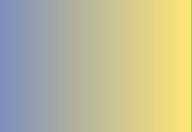

# Theoretische Konzepte und Vorannahmen

Dieses Kapitel trägt die Abbildungen. Es prüft, ob die Nummerierung über Kapitelgrenzen
hinweg richtig weiterläuft und ob eine Bildunterschrift niemals allein auf einer Seite
stehen bleibt.

## Teilhabe

In einschlägigen Handbüchern der Heil- und Sonderpädagogik wird Teilhabe als
mehrdimensionaler Begriff geführt. Der folgende Absatz ist bewusst lang, damit der
Blocksatz und die Silbentrennung eine Zeile finden, an der sie sich beweisen müssen:
Bildungsverwaltungsvorschriften, Zusammenarbeitsvereinbarungen und
Arbeitsplatzanpassungen.

{alt="Vier farbige Balken übereinander" copyright="© SZH" source="Prüfband"}

## Autismus

Nach der Abbildung geht der Text weiter. Die Nummer der nächsten Abbildung muss zwei
lauten, nicht eins — ein Zähler, der beim Kapitelwechsel zurückspringt, ist der Fehler,
den dieser Band fangen soll.

{alt="Drei waagerechte Streifen in einem hochformatigen Rahmen" copyright="© Prüfband"}

### Eine dritte Ebene

Die Nummerierung dieser Überschrift muss « 2.2.1 » lauten: Kapitelnummer, Abschnitt,
Unterabschnitt.

| Spalte A | Spalte B |
|---|---|
| eins | zwei |
| drei | vier |

: Eine kleine Tabelle, damit die Tabellennummerierung ebenfalls geprüft wird.

## Ergänzende Materialien

Ein Beispielbild ohne Informationsgehalt, rein dekorativ platziert:

{alt=""}

Zwei Ansichten nebeneinander, als Tafel gelesen:

::: {.szh-grille disposition="2"}
{alt="Farbverlauf, erste Ansicht" copyright="© Prüfband"}
{alt="Farbverlauf, zweite Ansicht"}
:::

Die folgende Tabelle trägt eine Langbeschreibung (`data-alt`), die nirgends sonst im Text
erscheint:

::: {.szh-tabelle src="tables/table-01.html"}
:::

Der Befund stützt sich auf zwei Quellen (Bovey, 2022; vgl. Kunz, 2016).

::: {.szh-biblio src="02-konzepte.biblio.md"}
:::
